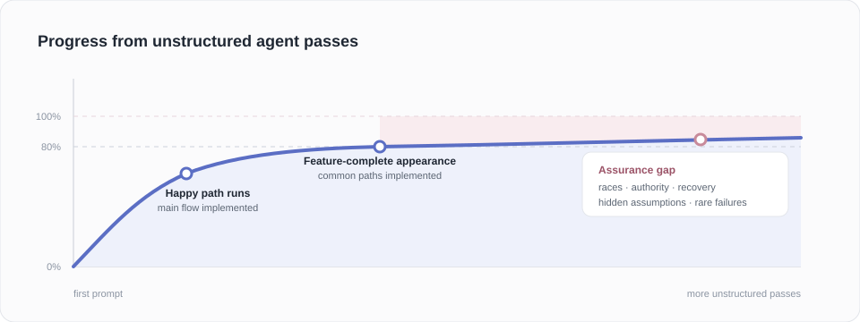
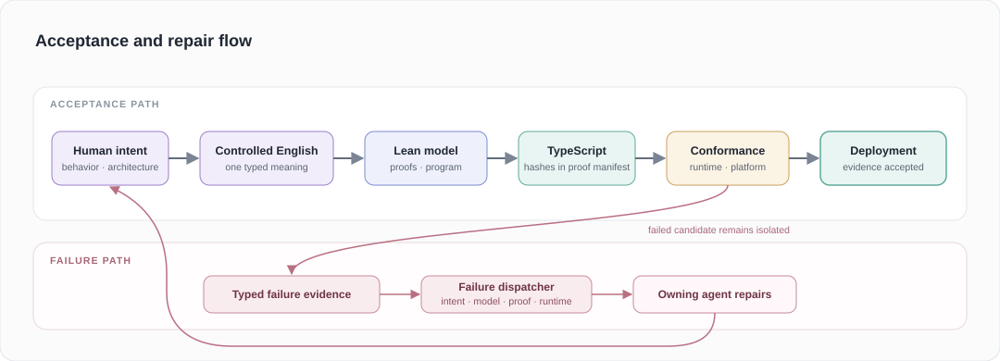
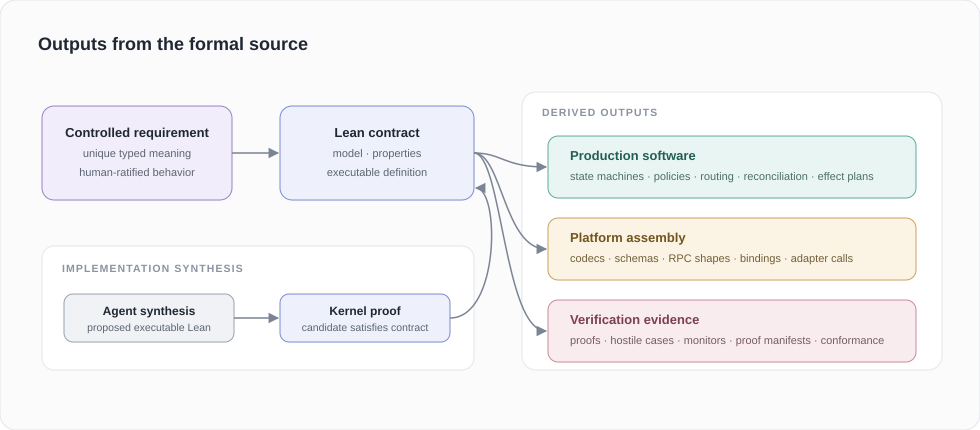
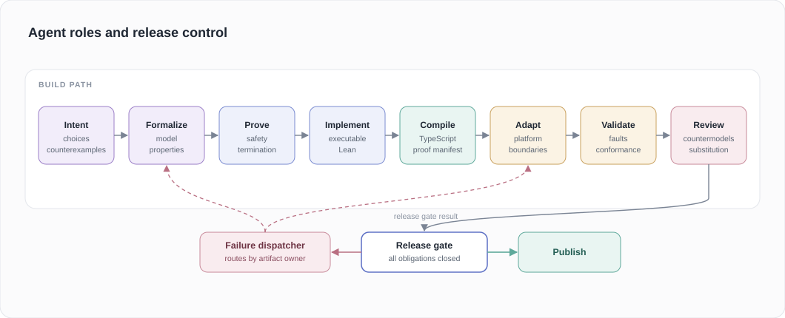
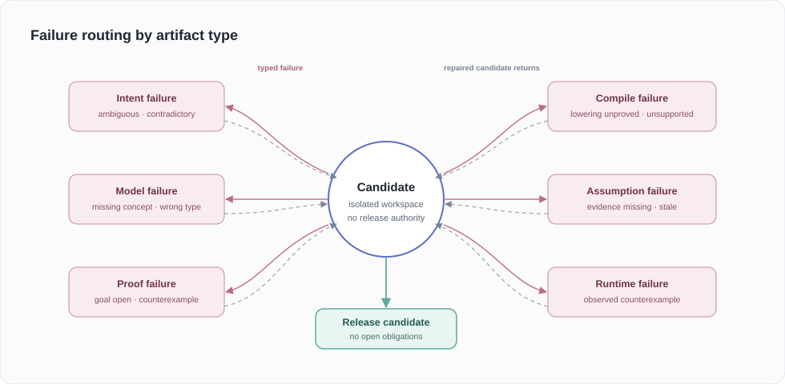
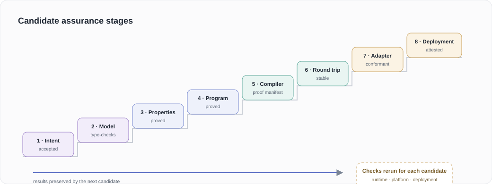
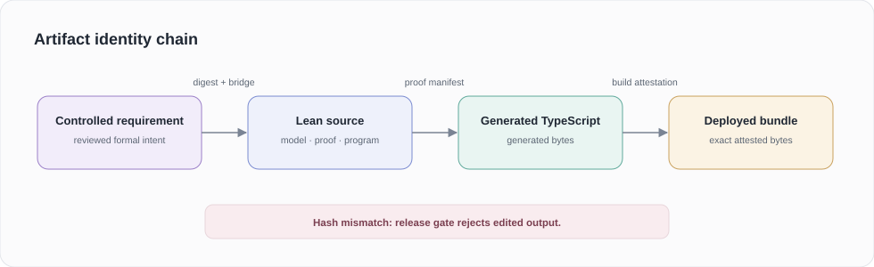
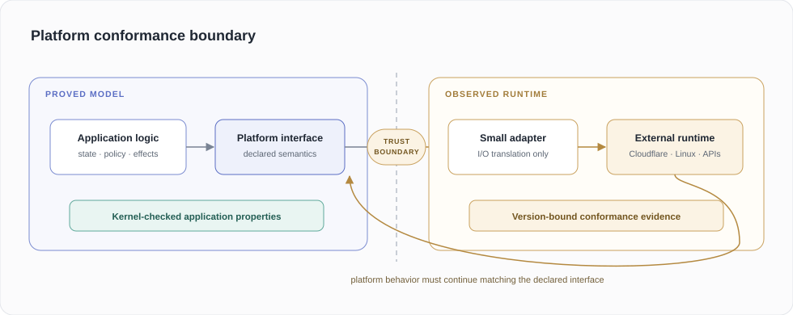
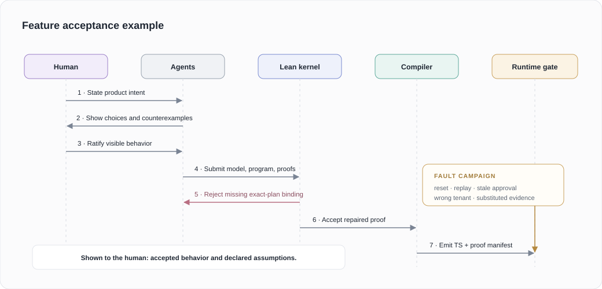

# A verified software development workflow

## Why progress slows after the demo

Building the first version with an AI agent is the easy part. In one sitting, you can get the data model, API, UI, and a working demo.

The trouble starts when you ask it to survive real use. A process dies halfway through a write, the same request arrives twice, or a revoked permission remains in a cache. A system that mishandles these cases can look finished, but users cannot depend on it.



Early progress is easy to observe, while remaining work concentrates in failures that are hard to see:

- ambiguous requirements;
- invalid state transitions;
- partial error handling;
- concurrency and recovery races;
- authorization gaps;
- duplicated sources of truth;
- platform behavior outside tests;
- unsafe migrations;
- performance and resource limits;
- assumptions that code never states.

More passes help, but the model carries the same blind spots into code, tests, and review. An edit can reopen a property that worked before.

As the remaining failures become rarer, unstructured progress slows.

## A workflow that can keep improving

Humans specify product intent, architecture, examples, constraints, and accepted risks. Agents do the formalization and engineering work.

### What if humans don't have to review any code?

Humans review intent, architecture, examples, assumptions, and visible behavior.

Lean makes this possible behind the interface. Agents and gates use it; humans stay with intent and behavior.



The diagram shows a failure that changes the controlled requirement. Other failures return to the model, proof, compiler, or adapter.

Agents are untrusted. They propose and repair artifacts; mechanical gates accept or reject each candidate.

## What the workflow produces

The formal source defines runtime behavior and the checks applied to it.



The production output includes policies, state machines, codecs, routing, reconciliation, and effect plans. Shared adapters perform platform I/O.

The assurance output includes proofs, hostile generators, mutation obligations, conformance scenarios, proof manifests, and runtime monitors.

The system does not publish placeholder scaffolding. An unmodeled platform operation remains an explicit external boundary.

## The human interface

Humans review behavior and leave code to agents and gates.

| Human-facing layer           | Agent and gate layer          |
| ---------------------------- | ----------------------------- |
| Product goals                | Formal models                 |
| Controlled requirements      | Lean source                   |
| Examples and counterexamples | Generated TypeScript          |
| Architecture choices         | Proof terms                   |
| Security and privacy policy  | Compiler passes               |
| External trust assumptions   | Mutation and conformance      |
| User-visible behavior        | Runtime and platform evidence |
| Irreversible actions         | Formal ontology internals     |

When intent is ambiguous, an agent presents concrete choices.

```text
Requested behavior: "A cancelled run cannot continue."

Choice A: Reject new steps only.
Choice B: Reject new steps and stop active ones.
Choice C: Reject new steps, stop active ones, and cancel pending effects.
```

The human selects the behavior. Agents formalize it and prove the implementation.

## The formal source

Unrestricted English depends on context and permits more than one reading. The formal source uses reviewed controlled English with one parse and one typed meaning.

```text
Human explanation:
A permit issued for one tenant must not work in another tenant.

Controlled requirement:
every target admission requires permit tenant equals target tenant

Generated Lean proposition, shown in words:
for all state permit target,
  admits state permit target implies permit.tenant equals target.tenant
```

The system binds the controlled sentence to:

- its unique parse;
- its typed semantic tree;
- the generated Lean proposition;
- the domain model declarations;
- a kernel-checked bridge theorem;
- the human-readable requirement digest.

A changed sentence, model, or proposition invalidates the binding.

## The agent roles



### Intent agent

- turns a user request into controlled requirements;
- supplies examples and counterexamples;
- exposes product choices;
- refuses unresolved ambiguity.

### Formalization agent

- defines the domain concepts;
- generates Lean propositions from controlled requirements;
- maintains state machines, traces, effects, and resource models;
- binds each concept to its readable meaning.

### Proof agent

- proves safety, termination, refinement, and resource properties;
- repairs failed proofs;
- cannot publish `sorry`, placeholders, or open obligations.

### Implementation agent

- writes executable Lean that satisfies the proved contract;
- composes verified primitives;
- does not maintain a handwritten TypeScript twin.

### Compiler agent

- maintains source and target semantics;
- proves each admitted lowering;
- emits proof-carrying TypeScript;
- rejects any construct without a registered theorem.

### Adapter agent

- connects generated logic to Cloudflare Durable Objects, Linux, databases, networks, and external services;
- keeps application policy outside the adapter;
- records each external assumption.

### Validation agent

- runs real behavior, fault, differential, mutation, and conformance checks;
- binds evidence to exact source, toolchain, runtime, and deployment identities.

### Adversarial review agent

- tries to break the requirement, model, proof, compiler, adapter, and evidence;
- produces counterexamples instead of opinions;
- cannot approve its own implementation.

## The failure loop

A rejection tells the agent what failed and what evidence caused the rejection.



A failure report should be small and machine-readable.

```json
{
    "kind": "proof-failure",
    "requirement": "turn-exact-lease",
    "theorem": "wrong_turn_cannot_mutate",
    "goal": "request.turn = lease.turn",
    "counterexample": {
        "requestTurn": "turn:b",
        "leaseTurn": "turn:a"
    }
}
```

The agent can spend many attempts on the repair loop. More tokens improve search without weakening acceptance.

## Monotonic progress

The workflow records which obligations are closed. A later candidate preserves them.



Conformance and attestation bind to the exact candidate. Each new candidate re-establishes the adapter and deployment stages.

The system isolates a failed attempt, so it cannot overwrite the last accepted artifact.

## One source at each layer



Agents edit the controlled requirement and Lean source; the system regenerates TypeScript and deployment artifacts.

A direct edit to generated TypeScript invalidates its proof manifest.

## The proof manifest

The compiler emits a machine-readable proof manifest with each generated package. This manifest is the compilation certificate.

It binds the exact generated files to:

- Lean source and theorem identities;
- compiler and semantic IR identities;
- the lowering rules used by the package;
- the exact external assumptions;
- current evidence for those assumptions.

The verifier rejects changed bytes, missing lowering proofs, substituted assumptions, stale evidence, and the wrong compiler.

Lean holds the proofs; the manifest carries their identities, accepted assumptions, and generated hashes. A closed build can rerun every proof and compilation step instead.

The manifest is necessary when generated code moves through caches, packages, CI, or deployment. Each consumer can verify the exact artifact without trusting its producer.

## External systems

Proofs apply inside a declared model. Cloudflare, a JavaScript engine, hardware, and external APIs remain external systems.

The workflow handles them with contracts and current evidence.



A platform update makes old evidence stale. The system reruns the conformance checks before it restores the claim.

## Acceptance rule

The release gate accepts a candidate after all required evidence is current.

$$
\begin{aligned}
&\text{Ratified intent} \\
\land{}&\text{Kernel-checked model and proofs} \\
\land{}&\text{Whole-program compiler refinement} \\
\land{}&\text{Proof manifest over exact generated bytes} \\
\land{}&\text{Adapter conformance current} \\
\land{}&\text{Current platform evidence} \\
\Longrightarrow{}&\text{Deployed behavior satisfies the stated properties within the declared platform model}
\end{aligned}
$$

The system returns `unproved`, `inconsistent`, or `outside-model` when it cannot establish the implication.

## Example feature flow

A user asks for this behavior:

> A coding agent can delete a project only after a team administrator approves the exact deletion plan.



The human reviews the requested behavior and the result. Lean and TypeScript stay behind the interface.

## Workflow comparison

The workflow measures progress by the obligations it closes.

| Unstructured workflow             | Verified workflow                             |
| --------------------------------- | --------------------------------------------- |
| Agent writes code                 | Agent proposes a candidate                    |
| Agent writes its own tests        | Independent gates derive obligations          |
| Review samples the implementation | Proofs cover declared input and state spaces  |
| Bugs return as user reports       | Counterexamples enter the repair loop         |
| Generated code is editable        | Proof manifest binds generated code           |
| Assumptions stay implicit         | Assumptions require named evidence            |
| Deployment means the build passed | Deployment requires current model conformance |

The system blocks publication while an unresolved mistake exists within its declared model.
