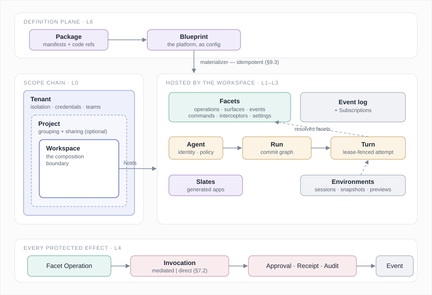
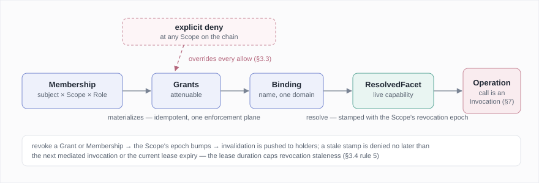
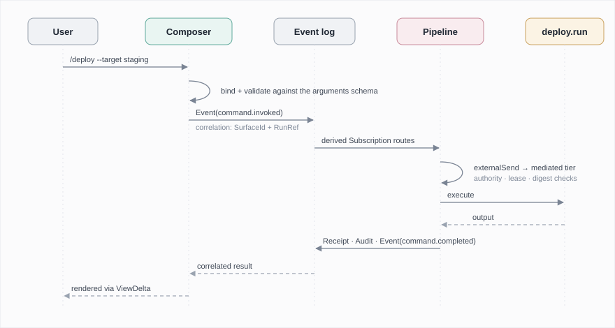
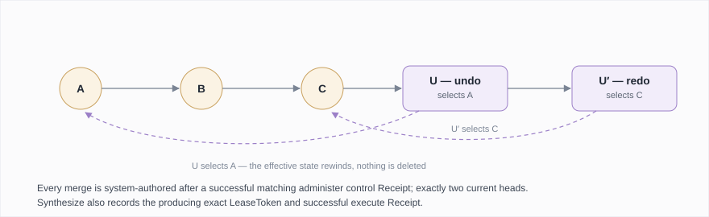
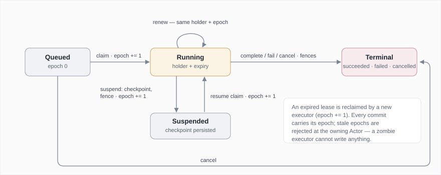
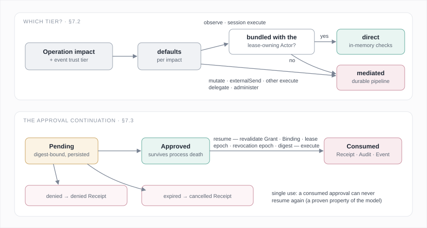
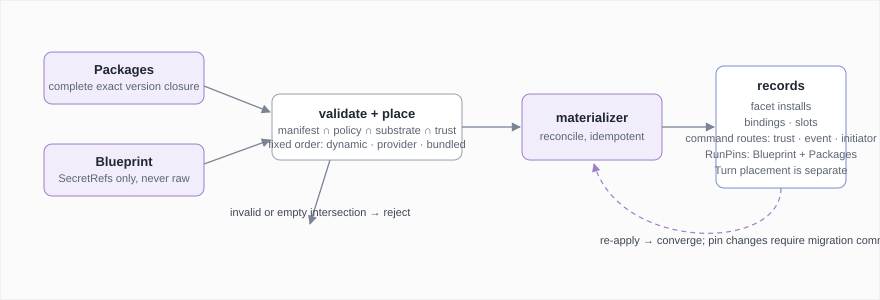
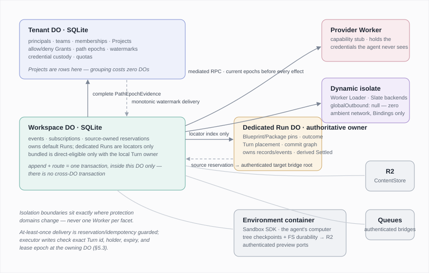

# Agent Core

**A specification for building agent platforms.**

*AI tools have been used to shape parts of this document and the project. The ideas and concepts presented here are of my own, and they may change as I ideate further.*

> **Draft.** This is an alternate reading of `SPEC.md` in Simplified Technical English.
> Every rule carries the same meaning and the same RFC 2119 force as in `SPEC.md`.
> `SPEC.md` is the specification until this draft is approved.

---

## 1. Introduction

### 1.1 Why this exists

I have built the same platform several times now. An agent that survives restarts. A
place to put its conversations, its tools, its files. A way for a webhook, a schedule, a
chat message, and a button press to all end up in front of the same agent loop. A
per-user vault so the agent can act on someone's behalf without ever holding their
credentials. A sandbox with a preview URL. An approval card for the scary actions. A way
to share all of it with a team.

Every platform solves these problems again. Each solution is coupled to that product, so
the next platform cannot reuse it. The frameworks that exist do not help at the right
layer. Agent SDKs give you the loop and stop there. The hosted platforms give you a
control plane you don't own, shaped like their product rather than yours. Nobody gives
you the Lego blocks.

Agent Core is that box of blocks. It defines sixteen primitives. They compose into
complete agent platforms: multi-tenant or personal, chat-first or headless, exploratory
or transactional. Above them it defines a **definition plane**, so a whole platform is a
validated configuration document — a Blueprint — materialized onto a substrate. The
first substrate is Cloudflare Durable Objects. The model doesn't depend on it.

The design rests on a few core ideas:

**Authority works like a capability.** Nothing in the system acts because of *who it
is*; things act because of *what they hold*. A Grant records authority. A Binding gives
that authority a name inside one isolation domain. Resolving a binding produces a live
capability, and you can narrow it, delegate it, and revoke it. Roles and memberships
exist so humans can reason about access, but they materialize *into* Grants, so there is
only one enforcement path to get right. Revoking a Grant disables everything derived
from it. This is the object-capability model, and the ideas go back to Mark Miller's
work. It matters here because of prompt injection. An agent reads untrusted content all
day. If it also holds broad ambient authority, injected instructions will eventually
find something to do with it. Capabilities keep the blast radius of any single
compromise small and revocable.

**Everything durable is a record with a single owner, and every input is an event.** A
conversation is an append-only commit graph with named branches. Branching a
conversation, undoing a step, and exploring in parallel are graph operations. An
execution attempt is a Turn that holds a lease with a fencing epoch. A crashed executor
that comes back later cannot corrupt anything: past its expiry the lease admits nothing,
and once anyone reclaims or fences the Turn its epoch is stale and its writes are
rejected. A webhook, a cron tick, a slash command, and a button press are all the same
thing — an Event, routed by a Subscription — so automation becomes configuration rather
than extra plumbing.

**Enforcement is tiered by impact.** Every protected action is an Invocation. An agent
loop makes thousands of small read calls per session, and several durable records for
every file read would make the whole system unusable. At the same time, an external send
with no receipt is a real liability. So the operation's declared impact decides how it
is enforced. Reading a file inside the agent's own sandbox is an in-memory call. Sending
an email goes through a durable pipeline of intent, approval, receipt, and audit. Policy
can always tighten this, never the other way around.

The rest is composition. Facets bundle operations, UI, events, and prompt text into one
installable capability. Contributions let any facet add commands, automations, and
settings to a platform *as data*: a slash command is a manifest entry, not a code
change. A Slate is an application the agent builds for you, and it runs with no ambient
authority at all. A Lean model checks a documented abstract subset of these semantics.
§14 states its exact boundary and makes no implementation-refinement claim.

### 1.2 What this specifies — and what it leaves to you

Agent Core specifies the platform layer: identity and tenancy, authority, durable
execution, input routing, mediated actions, UI contributions, environments, generated
applications, and the definition plane. It deliberately does **not** specify the agent
loop — model choice, prompting, streaming, tool-call parsing. The loop lives behind the
Turn executor seam (§5.6). You can drive Runs with the Claude Agent SDK, Pydantic AI, a
bespoke loop, or whatever comes next. Agent Core is everything *around* the loop.

### 1.3 How to read this document

Sections 1.4, 1.5, and 2–10 are normative; §11–§12 define profiles and sketches. §13–§14
cover conformance and the formal model. MUST, SHOULD, and MAY are RFC 2119 keywords.
Behavioral contracts appear as abstract TypeScript classes, and pure data shapes appear
as interfaces. Sections marked *(informative)* explain; everything else binds. Short
*why* paragraphs record the reasoning behind the less obvious choices, so the reasoning
itself can be checked and challenged, not just the rules.

### 1.4 Notation and type vocabulary

Identifiers that end in `Id` or `Name` (`PrincipalId`, `SurfaceId`, `BindingName`,
`SlotName`) are opaque, codec-stable identifier types. The simple reference types
`ContentRef`, `OperationRef`, `FacetRef`, `RunRef`, `TurnRef`, `ScopeRef`, and
`ActorRef` are the same kind of type.

The structured record `Ref` types are `PrincipalRef`, `SecretRef` (§3.5),
`ForeignPrincipalRef` (§3.3), and `SubjectRef`. `SubjectRef` is the union
`PrincipalRef | Team | ForeignPrincipalRef`, which is what a Membership or a Grant
names (§3.1, §3.3). `PrincipalRef` is always tenant-qualified: `{ tenant: TenantId,
id: PrincipalId }`. Every caller, authority initiator or delegate, lease holder, route
initiator, cross-Actor permit, and Membership or Grant subject carries this canonical
form. An unqualified id or a mismatched tenant rejects; nothing is inferred. A record
that names both a Scope and a Principal subject rejects a subject qualified by another
Tenant, instead of reading the Tenant off wherever the record is stored. This maps to
**C13-AUTH-PRINCIPAL-REF**.

These type-name suffixes mark JSON-Schema-validated records:

- `Schema`, `Spec`, and `Template`.
- `Mapping` — declarative field maps over JSON Pointers. `FieldMapping` and
  `PayloadMapping` are one shape, defined at §6.2; `ProvenanceMapping` is the third.
- `Selector` — predicate sets over descriptors: `OperationSelector`.
- `Entry` — `SlotEntry`, a validated contribution instance plus its contributor.
- `Requirement` — `BindingRequirement`, a named capability a facet needs bound before
  start.

A type that ends in `Policy` is a declared policy shape. It can be a record or a closed
string union (`DedupePolicy`). `FacetData` is any JSON value: it is what a Surface
renders, what an interceptor sees, and what preparation structurally digests. The unions
the prose depends on:

```ts
type Impact          = "observe" | "mutate" | "externalSend" | "execute" | "delegate" | "administer";
type TrustTier       = "owner" | "authenticated" | "external" | "self";      // §6.1
type EnforcementTier = "mediated" | "direct";                                 // §7.2
type IsolationMode   = "bundled" | "provider" | "dynamic";                    // §1.5, §10.2
type CutPoint        = "operation.before" | "operation.after" | "prompt.assemble"
                     | "input.submitted" | "turn.step";                       // §4.4
type Contributions   = { readonly [slot: SlotName]: readonly unknown[] };     // validated against
                                                                              // the slot's schema (§4.2)
```

Core value types are fields, not primitives:

- `Digest` — a collision-resistant content digest, SHA-256 or stronger.
- `ContentRef` — resolvable through a ContentStore (§8.2).
- `SecretRef` — see §3.5.
- `Revision` — a per-record optimistic-concurrency counter.

A `FacetRef` *identifies* a facet instance. A `Binding` *names* a Grant-backed instance
in one protection domain. A `ResolvedFacet` is the *live capability* that resolution
returns. The canonical serialized `FacetRef` is exactly `<facet-package-id>:<instance>`.
The first segment is the `FacetPackageId` of §4.1 (`core`, `core.fs`, `acme.deploy`),
not a §3.2 Scope. It contains one and only one `:` separator, and each segment matches
`^[a-z][a-z0-9]*(?:[.-][a-z0-9]+)*$`. Empty, noncanonical, or additionally separated
forms reject rather than normalize. The order is always the same: identify, then name,
then resolve. This clause maps to **C13-FACET-REF-CANONICAL**.

### 1.5 Protection domains

A **protection domain** is an isolation boundary with exactly one **owning Actor**
(§8.1). That Actor runs the domain's code in its process, and the code would inherit
that Actor's authority if nothing stopped it. Inside one domain, calls are plain
in-process calls and carry no security cost. Across a domain boundary, nothing passes
except explicitly delegated capabilities and asynchronous Events. **Ambient authority**
is anything code inside a domain can reach without presenting a capability: a Binding it
was not given, a credential it did not resolve, a network destination nobody passed it.
Platform policy places facet code into a domain (§9.2, §10.2) with three isolation
modes: `bundled` (in-process with the hosting Actor), `provider` (a separate service
behind a capability stub), and `dynamic` (loaded code in a fresh isolate with zero
ambient authority).

Zero ambient authority includes zero ambient egress. A `dynamic` domain MUST start with
no network reach of its own. Every destination its code can address arrives as an
explicitly passed Binding. A domain in which code can open a connection the platform did
not give it is not a `dynamic` domain. The rule sits at the substrate instead of in a
policy layer, because code can reach around an outbound policy. Every `externalSend`
obligation in §11 rests on this difference. This maps to
**C13-PLACEMENT-DYNAMIC-NO-EGRESS**.

---

## 2. The model at a glance

Agent Core has **sixteen primitives**. Everything else is a constituent record of a
primitive, a value type (§1.4), a contribution kind (§4.2), a substrate contract (§8),
or a profile (§11). I try hard to keep this count from growing. A concept becomes a
primitive only when at least two real platforms need it and it cannot be built by
composing the others.

| Layer | Primitive | Constituents |
| --- | --- | --- |
| L0 Identity & authority | **Principal** | Team (a named principal set; a Tenant record) |
| | **Scope** — the chain Tenant ⊇ Project ⊇ Workspace | Membership, Role |
| | **Grant** | — |
| | **Binding** | ResolvedFacet |
| L1 Composition | **Facet** | FacetManifest, Contribution, Slot |
| | **Operation** | OperationDescriptor |
| | **Interceptor** | — |
| | **Environment** | Session, tree Checkpoint |
| | **Slate** | versions, deployments |
| L2 Execution | **Agent** | AgentProfile |
| | **Run** | RunBranch, RunCommit, run Checkpoint |
| | **Turn** | TurnLease |
| L3 Interaction | **Event** | provenance, TrustTier |
| | **Subscription** | PayloadMapping, DedupePolicy |
| | **Surface** | View, ViewDelta |
| L4 Mediation | **Invocation** | PreparedInvocation, Approval, EffectAttempt, Receipt, AuditRecord |

Substrate contracts (L5) are **Actor**, **ContentStore**, **RecordCodec**, and the
command protocol dispatcher (§8.5). The definition plane (L6) adds two artifacts:
**Package** and **Blueprint**. That is eighteen nouns in total.



Three paths describe almost every interaction in the system:

```text
ACTIVE       Facet → Invocation(tier) → direct return | mediated PreparedInvocation → [Approval] → [EffectAttempt] → Receipt → Audit → Event
INTERACTION  input → Event → RouteReservation → Subscription target → PreparedInvocation
AUTHORITY    Role allow/deny rules ⇒ Grants → Binding resolver + path epochs → ResolvedFacet
```

Every feature in the assembly sketches of §12 is a composition of these three paths.

---

## 3. Identity and authority (L0)

### 3.1 Principal and Team

A **Principal** is an accountable actor: a human, a service account, a CI bot, or an
independently accountable Agent. Principals authenticate; Scopes own resources.

A **Team** is a named set of Principals recorded in a Tenant. A Team is a Membership
subject, not a separate primitive. Wherever a Membership names a subject, that subject
is `PrincipalRef | Team`. A Principal's effective access is the union of its direct and
team Memberships, under the precedence rule of §3.3.

### 3.2 The Scope chain

**Scope** is one primitive with three roles. The roles form the fixed chain `Tenant ⊇
Project ⊇ Workspace`, and Project is optional:

- a **Tenant** is the ownership and isolation boundary. It owns Projects, Workspaces,
  Teams, credentials, stored content, installed Packages, quotas, and retention. A
  single-user installation still has a Tenant: one Principal, one personal Tenant.
- a **Project** groups Workspaces for organization, policy, and sharing. It is a record
  owned by the Tenant's Actor, not a coordination unit of its own (§8.1, §10.1), so
  grouping your workspaces costs nothing at runtime.
- a **Workspace** is the composition boundary. It hosts Facet installs and the
  subject-local names that Bindings select, plus Events, Subscriptions, Agents, Runs, and
  Slates, and it enforces workspace policy. The Tenant Actor owns each canonical Binding
  together with its backing Grants and path epochs. A Workspace keeps only Binding ids or
  disposable lookup indexes.

*Why a fixed chain rather than arbitrary nesting:* two container levels are what most
mature resource hierarchies converged on, in cloud providers and code forges alike. They
cover the sharing shapes that actually come up, and they keep policy resolution bounded
at three steps. Recursive workspaces would turn policy resolution, the UI, and the
substrate mapping into graph problems, and I have yet to see a platform that needed
them.

### 3.3 Membership, roles, and sharing

A **Membership** binds a subject (`PrincipalRef | Team`) to a Scope with a **Role**. A
**Role** is a named, declared set of authority rules:

```ts
interface Role {
  readonly name: RoleName;                         // "owner", "editor", "reader", …
  readonly rules: readonly RoleRule[];
}

interface RoleRule {
  readonly effect: "allow" | "deny";
  readonly capability: CapabilitySpec;
}
```

A `CapabilitySpec` describes one grantable authority: a Facet or Facet pattern, the
Operations (or Operation impacts) it covers, and any argument constraints. Rule order is
stable for materialization, but it does not alter precedence: any matching deny
overrides every matching allow. Roles are declared in a Blueprint (`policies.roles`) or
supplied by a Package. This document fixes three built-in roles that every platform
provides, each as allow rules — `owner` (all capabilities at the scope, including
`administer`), `editor` (everything except `administer`), and `reader` (`observe`-impact
capabilities only) — and platforms MAY declare more rules, including denies. A Role is a
template. It becomes authority only when a Membership assigns it. This stable rule order
and this allow/deny rule shape are what a Membership materializes into Grants, and they
map to **C13-AUTH-ROLE-MATERIALIZATION**.

**Roles materialize Grants.** A Membership is not itself callable authority. Assigning a
Role at a Scope materializes one durable allow- or deny-Grant per Role rule for that
subject at that Scope, identified by `(membership, rule ordinal)`. Materialization is
idempotent, exactly as a Blueprint materializes records (§9.3). Reapplying the same Role
reconciles those Grants instead of adding authority. Downward flow, attenuation, and
revocation MUST operate only on Grants. The enforcement plane MUST resolve only Grants
and Bindings; Roles and Memberships have no second path. Revoking or changing a
Membership revokes its obsolete materialized Grants and advances the affected path epoch
(§3.4). A guest Membership materializes the same way after removal of every allow rule
that could grant `delegate` or `administer`; deny rules are retained. This single
enforcement plane maps to **C13-AUTH-PLANE**.

*Why:* the moment roles and grants are two separate enforcement systems, they drift
apart, and that kind of drift tends to be discovered during an incident rather than
before it. With one plane, the question "what can this subject actually do" always has
exactly one answer, computed one way.

**Precedence.** Effective authority exists exactly when at least one live matching
allow-Grant reaches the target Scope and no live matching deny-Grant exists on the
ordered Tenant-to-target path. Direct and team Grants count together. A descendant allow
MUST NOT re-widen an ancestor deny; this deny-overrides precedence maps to
**C13-AUTH-DENY-PRECEDENCE**. Example: Team A holds `reader` on Project P, so its
members read every Workspace in P; a deny-Grant for W2 removes W2 without touching W1. A
guest subject is matched by effect. An allow-Grant matches a `ForeignPrincipalRef`
exactly, `verifiedVia` included, so an allow issued to a guest verified under one scheme
is authority under that scheme only. A deny-Grant matches on `{ homeTenant, principalId
}` alone. A deny names who is refused, and `verifiedVia` names only how that guest
proved it, so a deny MUST NOT be escapable by re-verification under another scheme. The
stamp does change: a `handshake` link downgrades to `token`, and one home Tenant may
hold several trusts at once.

**Sharing** is Membership issuance, and there is no second mechanism. Sharing a Project
with a user is a Membership at that Project. A team owning a Project is a Team
Membership at that Project, and every member inherits access by default. Cross-tenant
sharing uses a **guest Membership** whose subject is a `ForeignPrincipalRef {
homeTenant, principalId, verifiedVia }`. Guest-materialized Grants are always
attenuated, MUST NOT carry `delegate` or `administer` capability, and MUST NOT resolve
the host Tenant's credentials. Credential custody never leaves the owning Tenant. The
same Grant precedence and the same Binding resolver apply to guests. This prohibition
maps to **C13-AUTH-GUEST-ELEVATION**.

**Verifying a guest.** `verifiedVia` names how the host Tenant establishes that a
request really comes from the foreign principal. It is one of three schemes, in
increasing order of coupling:

- `token` — the host and home Tenants share an out-of-band trust configuration: a
  signing key or an OIDC issuer URL registered in the host Tenant's policy. The guest
  presents a token issued by the home Tenant. The host verifies the signature and the
  `{ homeTenant, principalId }` claims against the registered issuer. This is the default,
  and it needs no live contact between tenants.
- `callback` — the host holds no key. At authorization time it asks the home Tenant's
  declared verification endpoint whether the token is theirs and the principal is active,
  then caches the answer for the token's lifetime. Use this scheme when the home Tenant
  will not share a key but will answer queries.
- `handshake` — for a first-time link, the two Tenants perform a one-time exchange: the
  home Tenant's owner approves the link, and the host records the resulting trust
  configuration. That exchange downgrades all future verifications to `token`. `handshake`
  is the bootstrap and never materializes a Grant itself. Steady state is always `token`
  or `callback`, and a subject still stamped `handshake` at materialization MUST be denied.
  This maps to **C13-AUTH-GUEST-HANDSHAKE-BOOTSTRAP**.

Whichever scheme is used, the host verifies provenance *before* it materializes any
guest Grant, and a verification failure denies. The wire protocol for a token or a
callback is a substrate or profile concern: the host Tenant's policy declares the issuer
or the endpoint. This document fixes the three schemes and the before-materialization
ordering. This maps to **C13-AUTH-GUEST-VERIFICATION**.

### 3.4 Grant, Binding, resolution, revocation

A **Grant** is a durable authority rule: subject, Scope, `allow | deny` effect,
capability, origin, attenuation lineage, and revocation state. An allow may be delegated
only to an equal or narrower capability. A deny is neither callable nor delegable. A
**Binding** associates a subject-local name with an allow-Grant-backed Facet instance in
one protection domain. Binding resolution evaluates all matching allow and deny Grants
through §3.3 precedence. There is no deny list or role check beside this plane. Callable
access requires a **ResolvedFacet** produced by that resolver; identifiers alone confer
nothing. A Binding authorizes only the Operations of the Facet it names. An Invocation
whose Operation belongs to another Facet MUST NOT be authorized by it. This maps to
**C13-AUTH-BINDING-RESOLUTION**.



```ts
interface PathEpochEvidence {
  readonly path: readonly [ScopeEpoch, ...ScopeEpoch[]]; // exact Tenant→target path
}

interface ScopeEpoch {
  readonly scope: ScopeRef;
  readonly epoch: number;
}

interface ResolutionStamp {
  readonly pathEpochs: PathEpochEvidence;
  readonly lease: LeaseToken;
  readonly originalLeaseExpiresAt: Date;
  readonly resolvedAt: Date;
  readonly resolutionDeadline: Date; // immutable; renewal cannot extend it
}

interface InvalidationWatermark {
  readonly holder: PrincipalRef;
  readonly delivered: readonly ScopeEpoch[]; // unique Scope keys; missing means epoch 0
}

abstract class AuthorityService {
  abstract assignMembership(scope: ScopeRef, subject: SubjectRef, role: RoleSpec): Promise<Membership>;
  abstract revokeMembership(membership: MembershipId): Promise<void>;   // revokes materialized grants, bumps epoch
  abstract grant(scope: ScopeRef, subject: SubjectRef, capability: CapabilitySpec,
                  attenuationOf?: GrantId): Promise<Grant>;
  abstract deny(scope: ScopeRef, subject: SubjectRef, capability: CapabilitySpec): Promise<Grant>;
  abstract revoke(grant: GrantId): Promise<void>;                       // disables descendants, bumps epoch
  abstract bind(domain: ProtectionDomain, name: BindingName, grant: GrantId,
                facet: FacetRef): Promise<Binding>;
  abstract resolve(domain: ProtectionDomain, name: BindingName): Promise<ResolvedFacet>;
  abstract memberships(principal: PrincipalId): Promise<readonly Membership[]>;
}
```

Authority rules:

1. Missing authority denies.
2. Delegation never widens: a delegated capability is equal to or narrower than its
   source, at every depth of the lineage, which matches the Grant rule above. Where this
   document requires strict narrowing it says so at the site — guest-materialized Grants
   drop `delegate` and `administer` (§3.3), and `spawn` runs its child under attenuated
   Grants (§11.8).
3. Raw credentials remain in Tenant custody under §3.5; delegation moves capability
   stubs, not secrets.
4. Discovery is policy-controlled: a Turn receives a redacted view of installed Facets
   under the same policy that governs direct reads.
5. **Path evidence is complete.** Each Scope carries a monotonically increasing
   authority epoch. Every ResolvedFacet carries a `ResolutionStamp`. Its
   `PathEpochEvidence` is the exact ordered Tenant-to-target Scope path and the current
   epoch of every Scope on it. It contains each path Scope exactly once, in order, with
   no omissions, duplicates, or extra Scopes. Evidence is fresh only while the path is
   still exact and every recorded epoch equals the current epoch. Creating, revoking, or
   changing any allow or deny advances the epoch of its Scope.
6. **Direct revocation has one bounded window.** Each holder has one Scope → epoch
   delivered invalidation map, shared by all its resolutions. Delivery and observation
   join maps pointwise with `max`, and entries never decrease. A direct-capable
   resolution records the expiry of the stamp's exact LeaseToken at issuance as
   `originalLeaseExpiresAt`. At resolution it sets `resolutionDeadline =
   min(originalLeaseExpiresAt, resolvedAt + policy.maxDirectRevocationWindow)`, and
   renewal never extends that immutable deadline. The configured window is finite and
   nonnegative. After a relevant epoch advances, let `deliveredAt` be invalidation
   delivery to the holder, and let `observedAt` be the first mediated check by that
   holder that observes any stale path epoch; an absent time is infinity. The resolution
   stops authorizing direct calls at `min(deliveredAt, observedAt, resolutionDeadline)`.
   A direct call requires the stamp's exact Turn id, holder, and lease epoch to be
   current, the current time strictly before the immutable deadline, and, for every
   Scope on its path, holder watermark ≤ recorded epoch.
7. **Mediated authority has one final admission point.** Actor-local mediation compares
   canonical authority and current path epochs in the guarded transaction that admits
   its EffectAttempt. Cross-Actor mediation performs that final comparison in the
   authoritative Tenant Actor, and only after the exact target claim, target fence,
   reservation epoch, item key, ordinal, arguments digest, and whole intent are known.
   Issuing the §10.3 `AuthorityPermit` is the final authority-admission linearization
   point, immediately before target attempt admission. Permit issuance linearizes
   against Grant, Binding-generation, and path-epoch mutation. Revocation committed
   before issuance blocks the permit. Revocation committed after issuance cannot cancel
   the already admitted attempt, but it blocks every not-yet-issued permit. Before
   permit issuance, or during Actor-local admission, a stale comparison atomically joins
   the current path Scope epochs into the holder map, invalidates the cached resolution,
   and records `deniedPreEffect` without an EffectAttempt. The target does not make a
   contradictory second authoritative Grant or epoch decision; it validates and consumes
   the exact permit under `C13-CLOUDFLARE-AUTHORITY-PERMIT-CONSUMPTION`. This rule maps
   to **C13-AUTH-MEDIATED-ADMISSION** and **C13-AUTH-MEDIATED-STALE**.
8. Resolved-facet lifetime follows the isolation mode. A `bundled` resolution lasts no
   longer than its exact Turn and deadline. A held or cached resolution admits only
   while it still names the exact current LeaseToken for that Turn. Fencing, reclaiming,
   or completing the Turn therefore ends it at once, rather than at the next unrelated
   check. A **Turn step** is one iteration of the Turn's execution loop, the interval
   between two successive firings of the `turn.step` interceptor cut point (§4.4). The
   executor seam (§5.6) fixes what one iteration comprises, and this document places no
   further structure on it. A `provider` or `dynamic` resolution lasts one Turn step.
   The capability stub it wraps MUST NOT be held or reused past the step in which it was
   obtained. Every mediated use of it, inside that step or any later one, independently
   re-authorizes against current path epochs, however recently the resolution was
   obtained (§10.2, rule 7 above). This maps to **C13-AUTH-RESOLUTION-LIFETIME**.

*Why a bounded window rather than instant revocation:* no distributed substrate can
update every live holder atomically. Rules 6–7 give direct calls a safety bound without
a delivery-liveness assumption, and they require current evidence for mediated effects.
Eventual delivery and reconciliation use only the external liveness assumptions in §14.

### 3.5 SecretRef

A **SecretRef** `{ source, provider, id }` names a credential held in Tenant custody.
Configuration, manifests, and Blueprints carry SecretRefs, never raw credential values.
A SecretRef is custody delegation, not process isolation: if plaintext is readable in an
agent-visible filesystem, the ref does not protect it. Substrates SHOULD provide
credential-injecting seams — proxy-injected headers, masked environment variables — so
raw values never enter agent-visible domains at all. The ref-only rule maps to
**C13-CONFIG-SECRET-REF**.

Custody is about who may present a credential, not only about where the bytes live. A
SecretRef resolves only inside the Tenant named by its `source`, and only for the exact
Binding and target endpoint that Tenant recorded when it accepted the credential. So
repointing an integration at a new endpoint invalidates the old resolution instead of
presenting the old credential to the new place. `source` MUST equal the exact canonical
value of that Tenant's `TenantId`, never a free-form label, and whatever records custody
checks it. `SecretRef` itself stays a self-contained core value type (§1.4) and does not
import the identity types it names. Acceptance is recorded custody. Whichever
Tenant-owned consumer accepts a SecretRef for use — a Binding, an Environment, an
ingress declaration's `verification.secret`, or any other consumer this document or a
profile names — durably pairs it with the exact consumer identity and target endpoint
the Tenant authorized. That `(SecretRef, consumer, endpoint)` triple is the **custody
record**. This document does not fix where a substrate stores it, beyond the requirement
that it is Tenant-owned data under the one-owner rule every durable record already
follows (§8.4). It is a fact a consumer's own record carries, not a new durable record
kind. A resolution seam MUST check the presenting consumer and target endpoint against
the custody record before it returns a value, and MUST fail the resolution attempt for a
mismatched or unrecorded pair; it never degrades to the raw value. The
credential-isolation seam of §4.5 is the seam this document names, and a profile MAY
name others. For a mediated `externalSend` effect that failure is an ordinary failed
AttemptReceipt (§7.4); custody denial needs no separate record kind and no vocabulary of
its own. A delegation, a guest Membership, and a cross-tenant reservation each carry the
ref and never the value. §3.4 rule 3 and §3.3's guest prohibition are consequences of
this clause, which is the only place it is stated. This maps to
**C13-CONFIG-SECRET-CUSTODY**.

---

## 4. Facets and composition (L1)

### 4.1 The manifest / runtime split

A **Facet** is a live, named, typed capability exposed to a protection domain. It is
defined in two halves:

- the **FacetManifest** — declarative, schema-validated, and inspectable *without
  execution of code*: identity, version, compatibility range, config-schema fragment,
  binding requirements, isolation requirement, and contributions;
- the **runtime class** — the behavior: operation handlers, surface rendering,
  interceptors, lifecycle, and child facets.

```ts
interface FacetManifest {
  readonly id: FacetPackageId;                 // e.g. "core.fs", "acme.deploy"
  readonly version: SemVer;
  readonly compat: CompatRange;                // spec + host compatibility
  readonly isolation: readonly [IsolationMode, ...IsolationMode[]]; // unique admissible modes (§9.2)
  readonly bindings: readonly BindingRequirement[];
  readonly configSchema?: JsonSchema;          // merged into the platform config schema
  readonly contributions: Contributions;       // open map keyed by SlotName (§4.2)
}

abstract class Facet {
  abstract readonly manifest: FacetManifest;
  abstract operation(name: OperationName): Operation<unknown, unknown>;
  abstract surface(id: SurfaceId): Surface;
  abstract interceptor(id: InterceptorId): Interceptor;
  abstract children(): FacetSet;
  abstract start(ctx: OperationContext): Promise<void>;   // idempotent
  abstract stop(ctx: OperationContext): Promise<void>;    // stops children first
}

interface OperationDescriptor<I = unknown, O = unknown> {
  readonly name: OperationName;
  readonly impact: Impact;                     // host-derived (§7.1)
  readonly input: JsonSchema;
  readonly output: JsonSchema;
  readonly help?: string;
  readonly interceptable?: boolean;            // opt-in for cross-facet interception (§4.4)
}

abstract class Operation<I, O> {
  abstract readonly descriptor: OperationDescriptor<I, O>;
  abstract execute(ctx: OperationContext, input: I): Promise<O>;
}
```

At install time the host verifies that the runtime provides every implementation the
manifest declares, and it refuses contributions the manifest does not declare. This maps
to **C13-FACET-INSTALL-VERIFICATION**. Placement uses the deterministic admissible-set
rule in §9.2. A manifest that lists `bundled` does not obtain `bundled` for that reason:
the trust set independently excludes `bundled` for untrusted Packages (§9.2). A manifest
may also exclude modes it will not accept.

Facet lifecycle hooks are idempotent from the caller's perspective. Protected invocation
requires an active, undisposed Facet whose Grant, Binding, lease, and revocation state
are valid per §3.4. Turns dispose resolved Facets on completion, failure, cancellation,
suspension, or authority loss. This maps to **C13-FACET-DISPOSAL**.

*Why the split:* everything a host, a registry, or the Blueprint validator needs to know
about a facet is data it can read without running anything. That property is what makes
a config-defined platform possible at all. It is also the shape that VS Code extensions
and the most successful open agent platforms arrived at independently.

### 4.2 Contributions and slots

A **Contribution** is a typed, schema-validated manifest entry that targets a **Slot**.
Slots are the extension points of a platform. This document defines the core slots, and
the `slots` meta-contribution declares new ones. Contributions are data that compiles
down to existing primitives, and a conforming host MUST materialize them through the
same paths it offers imperatively, so declared and programmatic behavior cannot diverge.
This maps to **C13-FACET-CONTRIBUTION-MATERIALIZATION**.

| Core slot | Entry | Materializes as |
| --- | --- | --- |
| `operations` | OperationDescriptor | catalog entry (runtime must implement) |
| `surfaces` | SurfaceDescriptor | renderable Surface |
| `events` | EventDeclaration | accepted Event kinds + visibility |
| `ingress` | IngressDeclaration (§6.1) | verified external endpoint minting Events |
| `prompt` | PromptContribution | prompt-assembly section |
| `commands` | Command (§4.3) | catalog entry + derived Subscription |
| `automations` | SubscriptionTemplate | Subscription |
| `interceptors` | InterceptorDeclaration (§4.4) | ordered sync hook |
| `settings` | JSON-schema fragment | merged platform config schema |
| `slots` | SlotDeclaration | a new slot others may target |

```ts
interface SlotDeclaration {
  readonly name: SlotName;                  // e.g. "dashboard.card"
  readonly entrySchema: JsonSchema;
  readonly authority: SlotAuthorityPolicy;  // who may contribute; who may see entries
}
```

**Reading slots.** Hosts expose a query API. It is the data source for composers,
palettes, and dashboards:

```ts
abstract class SlotCatalog {
  abstract query(slot: SlotName, viewer: SubjectRef): Promise<readonly SlotEntry[]>;
}
```

`query` MUST filter by the slot's visibility policy. The materializer (§9.3) MUST reject
a contribution that violates the slot's contribute-authority. Core slots carry an
implicit default policy: contribute is any installed Facet in scope, and visibility is
the same policy as direct reads (§3.4 rule 4). These map to
**C13-FACET-SLOT-VISIBILITY** and **C13-FACET-SLOT-AUTHORITY**.

Slot entries come in two flavors. A *declarative* entry is data validated against
`entrySchema`, and the reading Surface renders it. A *surface-backed* entry carries a
`SurfaceId`, and an aggregating platform Surface embeds the referenced child Views as
refs, never as live stubs (§6.3). A `dashboard.card` slot is the canonical
surface-backed case: the platform's dashboard Surface queries the slot and composes the
contributed cards' Views.

### 4.3 Commands

A **Command** is the general form of slash commands, palette entries, and CLI verbs: a
user-invocable, parameterized shortcut to an Operation. It is a contribution kind, not a
primitive. It compiles entirely to catalog entries plus a derived Subscription. So
installing a command changes *no code anywhere*, and the full authority, approval, and
audit machinery applies to it automatically.

```ts
interface Command {
  readonly name: string;                    // canonical id is `${facetId}:${name}`
  readonly title: string;                   // localizable (string or i18n key)
  readonly help?: string;
  readonly arguments: JsonSchema;           // validation + autocomplete
  readonly operation: OperationRef;         // target
  readonly binding: BindingName;             // target capability for initiator authority
  readonly mapping?: FieldMapping;          // arguments → operation input (see below)
  readonly acceptedTrust?: readonly [TrustTier, ...TrustTier[]];
  readonly completion?: OperationRef;       // optional observe-impact completion provider
  readonly surfaces: readonly SlotName[];   // where discoverable (chat.composer, cli, palette)
}

interface SubscriptionTemplate {
  readonly source: EventPattern;
  readonly target: OperationRef;
  readonly binding: BindingName;
  readonly mapping?: PayloadMapping;
  readonly dedupe?: DedupePolicy;
  readonly authority?: "initiator" | "delegated";
}
```

Materialization is deterministic. A Command first applies `mapping`, or identity when
`mapping` is absent. It then emits `command.invoked` with the validated Operation input
at `/input`. Its derived Subscription is exactly:

```ts
{
  source: {
    kind: "command.invoked",
    source: `${facetId}:${command.name}`,
    acceptedTrust: command.acceptedTrust ?? ["owner", "authenticated", "self"],
  },
  target: command.operation,
  mapping: [{ from: "/input", to: "" }],
  dedupe: "event",
  authority: { kind: "initiator", binding: command.binding },
}
```

An automation template defaults `mapping` to root-to-root identity, `dedupe` to `event`,
and `authority` to initiator using its `binding`. Delegated automation MUST be explicit.
Its `source.acceptedTrust` is always explicit and nonempty. These defaults map to
**C13-COMMAND-SUBSCRIPTION-DEFAULTS**.

The lifecycle, end to end:

1. **Install.** The materializer registers the command in each declared surface slot.
   Command `name` MUST be unique per surface slot per Scope. A collision rejects the
   later contribution unless the Scope configures an alias. Per-Scope visibility policy
   (§9.2) MAY disable individual commands. This maps to **C13-COMMAND-COLLISION**.

2. **Discovery.** Surfaces render catalogs through `SlotCatalog.query`. For dynamic
   argument completion beyond schema enums, the host MAY call the command's `completion`
   Operation (`observe` impact) with the partial argument context. The impact is what
   keeps completion off the mediated tier, and it maps to
   **C13-COMMAND-COMPLETION-IMPACT**.

3. **Argument binding.** A Surface owns its input grammar. It produces a `FacetData`
   value that validates against `arguments` before any Event is emitted. CLI token
   ordering, quoting, and flags belong to the CLI Surface profile, not to this core
   contract. With no `mapping`, the validated value passes through unchanged. Otherwise
   the declared pure mapping produces the Operation input. The mapping and both schemas
   MUST be checked at install, and the produced value MUST validate against the
   Operation input schema at execution. These map to **C13-COMMAND-INSTALL-MAPPING** and
   **C13-COMMAND-ARGUMENT-BINDING**.

4. **Invocation.** The surface emits `Event(command.invoked)`. Its correlation MUST
   carry the originating `SurfaceId`, and, for invocation from a conversation, the
   `RunRef` and branch. The derived Subscription routes the Event to the target
   Operation. That Subscription uses exactly the fixed defaults above; no inferred
   compatibility relation and no alternate authority source is permitted. This maps to
   **C13-COMMAND-INVOCATION-CORRELATION**.

5. **Result.** The host MUST emit `Event(command.completed)` correlated to the invoking
   Event's id, and it carries the Operation's output reference or the failure. A Surface
   that renders a `commands` slot MUST subscribe to `command.completed` for its own
   invocations and MUST render results through ViewDelta (§6.3). A command whose effect
   belongs in the conversation appends a RunCommit to the correlated Run under the
   invoker's authority. This maps to **C13-COMMAND-RESULT**.

A worked example — a deploy facet adds `/deploy` to a chat platform:

```ts
contributions: {
  operations: [{ name: "deploy.run", impact: "externalSend", input: DeployArgs }],
  commands: [{
    name: "deploy", title: "Deploy the current slate",
    arguments: DeployArgs, operation: "deploy.run", binding: "deploy",
    surfaces: ["chat.composer", "cli"],
  }],
}
```

Installing the facet makes `/deploy` discoverable wherever the `commands` slot renders.
`/deploy --target staging` binds and validates the arguments, emits `command.invoked`
with the Run correlation, and routes through a mediated Invocation (`externalSend`). The
receipt and the result flow back to the composer through `command.completed`. Adding a
whole new affordance category, such as composer suggestions or dashboard cards, is a
`slots` declaration rather than a change to this document.



### 4.4 Interceptors

An **Interceptor** is an ordered, synchronous, in-process hook at a cut point this
document defines. It can observe, block, or rewrite the value in flight. It is the one
thing asynchronous events cannot express, because a veto or a transform has to return a
value *now*. The value in flight at each cut point:

| Cut point | Value in flight | May |
| --- | --- | --- |
| `operation.before` | (descriptor, input) | block; rewrite input |
| `operation.after` | (descriptor, output) | rewrite output |
| `prompt.assemble` | assembled prompt sections | reorder, add, remove sections |
| `input.submitted` | user input | transform; block |
| `turn.step` | step context | annotate; request stop |

```ts
interface InterceptorDeclaration {
  readonly id: InterceptorId;
  readonly cutPoint: CutPoint;
  readonly appliesTo: OperationSelector;    // DEFAULT: the contributing facet's own operations
  readonly priority: number;                // total order: (priority, facetId, id)
}

abstract class Interceptor {
  abstract intercept(ctx: InterceptContext, value: unknown): InterceptResult;
}

// The value's type at each cut point is fixed by the table above; `unknown` is
// narrowed by `ctx.cutPoint`. An OperationSelector is a set of Operation patterns —
// `own(...)` for the facet's own operations, or a `{ facet, operation }` pattern
// (each field a literal or "*"-terminated prefix) for a declared-interceptable target.
interface InterceptContext {
  readonly cutPoint: CutPoint;              // which point fired (narrows `value`)
  readonly operation?: OperationDescriptor; // present at operation.before/after
  readonly turn?: TurnRef;                  // required only for Turn-bound cut points
  readonly interceptor: InterceptorId;      // self, for attributable rewrites (rule 5)
}

type InterceptResult =
  | { readonly proceed: true; readonly value: unknown }   // pass through or rewrite
  | { readonly proceed: false; readonly reason: string }; // block, scoped to appliesTo
```

Rules:

1. Interceptors run only within one protection domain. Cross-domain interception MUST
   use asynchronous Events. This maps to **C13-INTERCEPTOR-DOMAIN-CONFINEMENT**.
2. `appliesTo` defaults to the contributing facet's own operations. To intercept another
   facet's operations, that facet must declare the operation `interceptable`, and the
   interceptor's facet must hold a Grant for it. A shared domain confers no interception
   rights.
3. Ordering is total and deterministic: ascending `(priority, facetId, interceptorId)`.
   Interceptor ids MUST be unique within a Facet. Hosts record which interceptor last
   rewrote a value. This maps to **C13-INTERCEPTOR-ORDER**.
4. A thrown error blocks. The block is scoped to the interceptor's `appliesTo` and
   surfaces as a typed operation error, never as a silent global veto.
5. Mutating interceptions are attributable. The host records interceptor identity plus
   before and after value digests through the mediated audit channel. There is no second
   channel to choose between, because an applicable interceptor raises the call to
   mediated (§7.2); a direct invocation that presented interception evidence would be an
   invalid state rather than a case to record.
6. `operation.before` completes before preparation. Its final rewritten input is what
   the PreparedInvocation freezes and structurally digests. An interceptor MUST NOT
   rewrite a PreparedInvocation, Approval, EffectAttempt, or effect arguments afterward.
   This maps to **C13-INTERCEPTOR-POST-PREPARATION**.
7. The host persists the ordered `operation.before` transformation trace with the
   PreparedInvocation, including each interceptor identity and its before and after
   digest. A replay reuses the persisted transformed input and trace, and it does not
   rerun mutating pre-effect interceptors. A new interceptor pass creates a new
   InvocationId and a new whole-intent digest.
8. `operation.after` may rewrite only the returned presentation value. It cannot alter
   the effect, the Receipt, or the audit lineage. The host persists its ordered
   transformations and trace with the returned invocation evidence. A replay of the same
   invocation presentation reuses that persisted post-effect value and trace, and it
   does not rerun `operation.after`. These replay clauses map to
   **C13-INTERCEPTOR-REPLAY**.

Example: a policy facet contributes `{ cutPoint: "operation.before", appliesTo:
own("web.fetch"), priority: 10 }` that rewrites outbound URLs onto an allowlisted proxy.
It is the facet's own operation, so it needs no opt-in, and the rewrite is
digest-logged.

### 4.5 Environment and Session

An **Environment** is an execution endpoint that opens live **Sessions**. A Session
exposes session-scoped child Facets (`env.fs`, `env.shell`, `env.ports`, `env.proc`). An
Environment is the agent's computer.

Rules: a stale Session MUST fail; closing a Session MUST dispose its child Facets;
rotation MUST change future Sessions without retargeting open ones. These map to
**C13-ENVIRONMENT-STALE-SESSION**, **C13-ENVIRONMENT-DISPOSE-CLOSE**, and
**C13-ENVIRONMENT-ROTATION**. Environment profiles also define **snapshot/restore**
(boot from a known image), **ephemeral-filesystem durability** (backup and restore for
container-backed environments), **preview exposure** (how a port becomes an
authenticated URL), and the **credential-isolation seam** (secrets injected by proxy,
never present inside the environment).

A Session is **Turn-owned** when exactly one Turn opened it, no other Turn may use it,
and it closes when that Turn reaches a terminal status. A Turn-owned Session cannot be
shared and cannot outlive its Turn, and that is what makes its contents reachable by
that Turn alone. §7.2 keys an enforcement floor on this property, so it is a condition a
platform tests rather than assumes. This maps to **C13-ENVIRONMENT-TURN-OWNED**.

A **device environment** (§11) is an Environment behind a reverse-connection transport:
the user's laptop or phone. Its profile adds pairing (key exchange plus operator
approval), transport-attached consent (per device × agent, fail-closed), and typed
device command surfaces. These are Environment-profile concerns, not new primitives.

### 4.6 Slate

A **Slate** is a programmable, user-facing application produced inside the platform —
the thing your agent builds for you. It has a **source document** (content-addressed; a
git-shaped history is a permitted canonical representation), **immutable versions**, and
**deployments**. A Slate composes with the other primitives rather than duplicating
them:

- live preview *is* an Environment Session — a running process with ports — not a
  rendered View;
- the Slate backend is agent-authored code (§4.7). It executes in the `dynamic` isolation
  mode with zero ambient authority, and capabilities arrive only through explicitly passed
  Bindings;
- publishing or embedding a Slate contributes Surfaces. App-private data is owned by the
  Slate's Actor.

Operations: `update`, `commit`, `fork`, `publish`, `deploy`, `rollback`.

### 4.7 Agent-authored code

Three consumers execute code the agent wrote. **Programmatic tool calling**: a Turn
submits code that strings Operation calls together, the host runs it once, and the
returned value is the tool call's result. That isolate lives for one submission and is
gone when the submission ends. **Slate backends** (§4.6): durable, versioned application
code. **Agent-authored facets**: ordinary Facets whose Package the agent produced,
installed and alive as long as any install references them. The three differ in lifetime
and in nothing else. This section states the shared shape once so they cannot drift
apart.

The shape composes primitives this document already has; it is not a seventeenth.
Placement (§9.2) puts the code in a `dynamic` domain, and the trust set never hands
agent-authored code `bundled`, because holding nothing is the point of it. §1.5 strips
that domain of ambient authority and ambient egress. The capability set arrives only as
explicitly passed Bindings. Every call the code makes against one is an ordinary
Invocation, tiered by §7.2. Nothing crosses back out except the code's returned value
and asynchronous Events. From the model's side a programmatic tool call is one Operation
invocation — code in, value out — while every Operation the code called in between
carries its own admission and evidence.

Handing the capability set to the isolate is not transport; it is delegation. §1.5
already says that nothing else crosses a domain boundary, and the §3.4 rules bound the
passed set exactly as they bound any other delegate: equal at most, never wider, and a
deny is not delegable. The isolate's Invocations present its own delegated authority,
never the authority of the code that loaded it. So revoking a passed Grant severs the
isolate and leaves its loader untouched. This maps to **C13-AUTH-ISOLATE-DELEGATION**.

One `dynamic` semantics does not mean one hosting mechanism. A substrate profile MAY
offer more than one backing for loaded code, identified by a substrate-defined, opaque,
nonempty id; §10.2 names two, `workerLoader` and `dispatchNamespace`, and this document
fixes no enum of them. A platform declares which backing serves each of the three
consumers this section names — programmatic tool calling, Slate backends, and
agent-authored facets, a closed set, because nothing else is agent-authored code under
this section — as part of `policies.placement` (§9.2). That is one more mapping,
consumer → backing id, beside the isolation-mode admissibility the same record already
declares, not a new artifact. A consumer the Blueprint does not map uses the profile's
declared default backing. Every offered backing MUST preserve identical authority
semantics: zero ambient authority, zero ambient egress, and capabilities only as
explicitly passed Bindings. So the choice between backings is operational, never an
authority decision. Each backing demonstrates this independently, the same way any
`dynamic`-mode implementation does (the no-ambient-egress requirement of §1.5), never by
comparison against another backing. This maps to **C13-PLACEMENT-AUTHORED-BACKING**.

---

## 5. Execution (L2)

### 5.1 Agent

An **Agent** is durable identity, profile, and policy: instructions, model policy (a
ModelPolicy seam — providers are out of scope), ambient and bound Facet specs, memory
and task relationships, and Run history. A model call happens only inside a Turn. This
maps to **C13-TURN-MODEL-CALL**.

### 5.2 Run, RunBranch, RunCommit

A **Run** is a branchable, durable work session and conversation lineage. It owns input
history, RunBranches (named movable heads), RunCommits (immutable records: root,
message, checkpoint, invocation, event delivery, result, merge, verdict, undo,
migration), status, an optional parent Run, and results. There is no separate
conversation primitive: conversation state *is* the Run's branch and commit graph.

```ts
interface RunPins {
  readonly blueprint: { readonly id: BlueprintId; readonly version: SemVer;
      readonly digest: Digest };
  readonly packages: readonly PackagePin[]; // complete transitive closure, unique by id
  readonly agent: { readonly id: AgentId; readonly revision: Revision;
      readonly digest: Digest };
  readonly effectivePolicy: { readonly id: PolicySetId; readonly revision: Revision;
      readonly digest: Digest };
  readonly modelPolicy: { readonly id: ModelPolicyId; readonly revision: Revision;
      readonly digest: Digest };
  readonly environment: { readonly id: EnvironmentId; readonly revision: Revision;
      readonly digest: Digest };
}

interface PackagePin {
  readonly id: PackageId;
  readonly version: SemVer;                  // exact, never a range
  readonly manifestDigest: Digest;
  readonly codeDigest: Digest;
}

interface TurnPlacementSnapshot {
  readonly turn: TurnId;
  readonly pins: RunPins;
  readonly placements: readonly PlacementPin[]; // every resolved Facet, unique by ref
}

interface PlacementPin {
  readonly facet: FacetRef;
  readonly manifest: readonly IsolationMode[];
  readonly policy: readonly IsolationMode[];
  readonly substrate: readonly IsolationMode[];
  readonly trust: readonly IsolationMode[];
  readonly selected: IsolationMode;
}

type RunLifecycle =
  | { readonly kind: "active" }
  | { readonly kind: "terminal"; readonly outcome: "succeeded" | "failed" | "cancelled";
      readonly terminalCommit: RunCommitId; readonly obligation: SettlementObligation;
      readonly exhausted?: "tokens" | "wallClockMs" | "depth" }; // cancelled by ceiling only

type RunObligation =
  | { readonly kind: "approval"; readonly approval: ApprovalId }
  | { readonly kind: "invocationItem"; readonly invocation: InvocationId;
      readonly itemIndex: number; readonly itemKey: string }
  | { readonly kind: "route"; readonly reservation: RouteReservationId }
  | { readonly kind: "reconciliation"; readonly attempt: EffectAttemptId }
  | { readonly kind: "systemCommit"; readonly commit: RunCommitId }
  | { readonly kind: "acceptance"; readonly acceptance: AcceptanceId };

interface AcceptanceCriterion {
  readonly id: AcceptanceId;
  readonly operation: OperationRef;           // the verifier, an ordinary Operation
}

interface AcceptanceVerdict {
  readonly acceptance: AcceptanceId;
  readonly subject: Digest;                   // head tree digest the verifier saw
  readonly receipt: ReceiptId;                // its attempted Receipt
}

interface RunAdmissionRegistry {
  readonly run: RunId;
  readonly epoch: number;
  readonly open: boolean;
  readonly reserved: readonly RunObligation[];  // unique canonical identities
  readonly completed: readonly RunObligation[]; // subset of reserved
}

interface RunAdmissionReservation {
  readonly run: RunId;
  readonly registryEpoch: number;
  readonly obligation: RunObligation;
}

interface SettlementObligation {
  readonly registryEpoch: number;
  readonly obligations: readonly RunObligation[];
  readonly requiredAudits: readonly SettlementAuditObligation[];
}

interface ForcedTurnCancellation {
  readonly run: RunId;
  readonly terminalTurn: TurnId;
  readonly turn: TurnId;
  readonly priorLeaseEpoch: number;
  readonly fencedLeaseEpoch: number;
  readonly controlReceipt: ReceiptId;
  readonly controlAudit: AuditRecordId;
  readonly cancellationEvent: EventId;       // token-scoped turn.cancel inbox evidence
  readonly cancellationAudit: AuditRecordId;
}

interface SettlementAuditObligation {
  readonly audit: AuditRecordId;
  readonly evidence:
    | { readonly kind: "receipt"; readonly invocation: InvocationId;
        readonly receipt: ReceiptId }
    | { readonly kind: "delivery"; readonly reservation: RouteReservationId }
    | { readonly kind: "commit"; readonly id: RunCommitId };
}

interface ResourceCeiling {
  readonly tokens?: number;
  readonly wallClockMs?: number;
  readonly depth?: number;
}
```

`PackagePin.id` identifies the distributable Package release, not a contained
`FacetManifest.id`. `PackageId` and `FacetPackageId` are distinct opaque identities and
MUST NOT be converted or compared by string value. One Package may contain several
independently identified FacetManifests. This maps to **C13-RUN-PIN-IDENTITY-TYPES**.

- Starting a Run creates one root RunCommit and immutable **RunPins**. The pins fix the
  exact Blueprint id, version, and digest; the complete transitive Package version
  closure; the Agent id, revision, and digest; the effective PolicySet id, revision, and
  digest; the ModelPolicy id, revision, and digest; and the Environment id, revision,
  and digest. `Run.agent` MUST equal `RunPins.agent.id`, and the complete Package
  closure MUST be nonempty and unique by `PackagePin.id`. Package ranges never appear in
  RunPins. Every referenced source record and Package release remains resolvable while
  any Run, Turn, Session, tree checkpoint, or Snapshot pins it. These exact identities
  map to **C13-RUN-PINS-SOURCES**, **C13-RUN-PINS-ENVIRONMENT**, and
  **C13-RUN-PINS-VALIDITY**. Every commit names its RunPins. Every non-root,
  non-migration unary commit inherits its exact parent's pins, and a merge requires
  equal pins on both parents. **Run migration** is an `administer`-impact Operation that
  appends a unary migration commit naming exact `from` and `to` RunPins; its parent uses
  `from` and the migration commit uses `to`. Before installation, the target `to` pins
  MUST satisfy the same `RunPins.Valid(Run.agent)` constraints as Run creation. An
  invalid Agent identity, an empty or duplicate Package closure, or a malformed source
  identity rejects without appending or installing the migration commit. A Turn retains
  the pins captured at its start, so only Turns started from the migration commit or its
  descendants use the new pins. Migration is never implicit, and branches with different
  pins cannot merge until they are explicitly migrated to equal pins. Parent inheritance
  maps to **C13-RUN-PARENT-PIN-INHERITANCE**.

- Each Turn separately captures one immutable **TurnPlacementSnapshot** after §9.2
  selection. RunPins do not encode placement, and a later policy or substrate change
  does not retarget that Turn. Terminalization requires the terminal Turn's snapshot
  pins to equal the Run's current pins, and its terminal commit to inherit those exact
  pins from the current head. A Turn retained across migration keeps its old pins and
  MUST be rejected as terminalizer after the Run migrates. These pin-validity clauses
  map to **C13-RUN-MIGRATED-TURN-REJECTION**.

- Before any Run-associated Approval, Invocation item, RouteReservation, reconciliation,
  or required system commit is admitted locally or remotely, the Run-owning Actor MUST
  reserve its canonical `RunObligation` in the durable `RunAdmissionRegistry`
  transaction. Reservation uses only identities known before remote work: ApprovalId;
  InvocationId plus item index and item key; RouteReservationId; EffectAttemptId for
  reconciliation; or planned RunCommitId. Receipt, delivery, projection, and Audit ids
  are never reserved. Duplicate canonical keys reuse the existing reservation.
  Completion atomically adds that exact reserved identity to `completed`; an unreserved
  identity cannot complete. Every remote actor validates the exact
  `RunAdmissionReservation` identity, Run, and registry epoch before admission; a
  substituted identity or a closed or changed epoch rejects. This maps to
  **C13-RUN-ADMISSION-REGISTRY** and **C13-RUN-RESERVATION-EPOCH**.

- **Terminalization** is one Run-owner transaction: close the admission registry,
  advance its epoch, snapshot exactly `reserved − completed`, append the terminal result
  commit under the exact current Turn token, fence that Turn, record the Run outcome,
  and capture one finite SettlementObligation. Every sibling Turn MUST already be both
  terminal and unheld; otherwise, and only while this terminalization is open, the
  system MUST force-cancel it through the closed §5.3 rows. The sibling MUST be a
  distinct Turn in the same Run. One exact successful `administer` control Receipt and
  its matching AuditRecord authorize the sequence. Each cancellation fences the sibling,
  appends token-scoped `turn.cancel` inbox and Audit evidence, and records
  `ForcedTurnCancellation` with both fence epochs and the exact control evidence. Forced
  cancellation appends no sibling result commit, and it never presents or impersonates
  the sibling's LeaseToken or `CommitWriter.turn`. Terminalization commits only after
  every sibling is both terminal and unheld. No running sibling retains admission. This
  maps to **C13-RUN-FORCED-CANCELLATION**. Once closed, the Run rejects new routes,
  preparations, Turns, migrations, merges, undo, and other control writes; system
  writers may complete only captured evidence obligations.

- The terminal snapshot is exactly the just-closed registry's reserved-minus-completed
  set, not a remote discovery query: all pending Approvals, admitted Invocation items
  without a terminal current Receipt, RouteReservations without terminal delivery,
  EffectAttempts that require reconciliation, and required system commits. It contains
  no completed and no unreserved work. The finite registry MAY honestly be empty when no
  reservation was admitted; empty does not mean discovery was skipped. This maps to
  **C13-RUN-FRONTIER-COMPLETE** and **C13-RUN-FRONTIER-EMPTY**.

- Terminal does not assert that all asynchronous evidence has arrived. **Settled** is
  derived, never assigned. A Run is Settled exactly when every captured Invocation item
  has a terminal current Receipt, no indeterminate Receipt is current, every captured
  RouteReservation has delivery or terminal rejection evidence, and every captured
  system RunCommit exists. Every required audit obligation MUST resolve to an existing
  AuditRecord of the stated evidence kind whose typed causal chain reaches that exact
  terminal Receipt, route delivery, or commit. Every captured Approval MUST resolve for
  its exact Invocation as consumed, denied, or expired. Every captured reconciliation
  MUST resolve the exact captured indeterminate Receipt to one final Receipt for the
  same EffectAttempt with the required `receiptSuperseded` lineage. Every captured
  acceptance criterion MUST hold a current satisfying verdict. BatchOutcome is available
  when every item has a current Receipt, and its terminal form additionally requires a
  non-indeterminate outcome. This maps to **C13-RUN-SETTLED-DERIVED**.

- `spawn` creates a child Run under attenuated authority (`delegate` impact, §11 Self
  profile).

- The commit graph MUST be **append-only**. An `undo` appends an undo RunCommit `U`
  whose parent is the current head and whose `selects` field names an ancestor commit.
  The branch head advances to `U`, and the branch's **effective state** becomes the
  selected commit. Redo appends another undo commit that selects the prior effective
  commit. The interval until the next non-undo commit is the **pending revert**; it is
  durable and reversible. Prior heads remain reachable, and ancestry queries are
  unaffected. This maps to **C13-RUN-UNDO-REDO**.

- Undo that targets a branch with a held Turn MUST first fence that Turn (§5.3), whether
  or not its lease has expired, because an expired lease is still reclaimable until
  someone fences it. An undo that would orphan an in-flight Turn is rejected until the
  Turn is fenced or completes. This maps to **C13-RUN-UNDO-FENCE**.

- `merge` is binary. It appends one RunCommit whose ordered parents are exactly the
  target branch's current head followed by the distinct source branch's current head.
  Multiway merge is a deterministic left fold of binary merges in caller-supplied branch
  order. A merge records one of the three content resolutions in §5.2.1. The graph
  records lineage and does not compute content.

- Conforming stores MUST support ancestry and reachability queries, not only head moves.
  This maps to **C13-RUN-ANCESTRY**.

The **canonical graph** MUST have one root with zero parents. Every non-root, non-merge
commit has exactly one parent, equal to its branch head at append. Every merge has
exactly the two parents above. No other parent arity is valid. Appending atomically
advances only the target branch head. Commit records and parent order never change. This
maps to **C13-RUN-GRAPH-ARITY**.

A Run MAY declare **acceptance criteria** when it opens, so that finishing is something
it proves rather than something it asserts. Each criterion names an Operation that
decides whether the work is done, and the Run-owning Actor reserves its `AcceptanceId`
as an `acceptance` RunObligation. An `AcceptanceId` is unique across the store, so two
Runs cannot declare the same criterion identity with different verifiers, and a verdict
names exactly one criterion. The obligation is never completed as bookkeeping. It stays
outstanding, it is snapshotted at terminalization like any other, and it is discharged
only by evaluation at settlement. It is satisfied exactly when an `AcceptanceVerdict`
for that `AcceptanceId` names an attempted Receipt whose outcome is `succeeded` and
whose `subject` equals the Run's current head tree digest. That digest is the tree
digest of the head of the Run's `initialBranch`, the one branch the Run record itself
names, so satisfaction is never selectable by the caller that asks. Completing the
obligation when the verdict arrives would freeze it against whatever tree was current at
that instant, and a later commit carrying a new `treeCheckpoint` would leave the Run
settling on a proof about a tree it no longer has. The verifier is an ordinary
Operation, so its Receipt carries the whole §7 admission and audit chain. The Receipt
MUST come from the exact Operation the criterion names; a succeeded Receipt from any
other Operation is not evidence for this criterion, or the declared verifier would be
decoration and any success anywhere would discharge it. An unsatisfied acceptance
obligation is exactly as unfinished as an outstanding Approval: it is snapshotted into
the SettlementObligation, and the Run is not Settled while it stands. A criterion bounds
nothing — not time, not cost, not attempts — and a Run that declares none is settled by
the same rule as before. This maps to **C13-RUN-ACCEPTANCE-OBLIGATION**.

A verdict is evidence for its exact `subject` and for nothing else. While a criterion
holds a verdict naming the current head tree digest, that verdict is current evidence,
and the system MUST NOT run the verifier again. A further attempt is admissible only
against a head tree digest that no recorded verdict for that criterion names. So what
makes a retry possible is changed input, not elapsed time and not a counted attempt. A
Run therefore cannot spin against inputs it has not moved, and one that keeps failing is
visible as a criterion undischarged across distinct subjects. This maps to
**C13-RUN-ACCEPTANCE-SUBJECT**.

A `delegate`-impact spawn MAY attenuate resources alongside capability, by carrying an
optional `ResourceCeiling` on the spawn's attenuation. That is the same
content-addressed attenuation whose digest `SpawnReservation.attenuation` already
commits (§5.2), not a new record. The same rule governs it as governs capability (§3.4
rule 2): a child ceiling MUST NOT exceed the parent's remaining allowance in any
declared dimension, and a dimension the child does not declare inherits the parent's
remainder. A Run that declares no ceiling is unbounded, because the platform imposes
none, so fan-out narrows downward without anything capping work nobody chose to bound.
This maps to **C13-RUN-RESOURCE-CEILING**.

The three dimensions differ in how their remainder is known. `depth` and `wallClockMs`
MUST be derived, never separately accounted. Depth is the length of the spawn lineage
from the Run back to the ancestor that declared the ceiling. Wall-clock consumption is
the current time minus the Run's root RunCommit timestamp. Both are computable from
records this document already requires, with no running total to maintain. `tokens` has
no such derivation. Consuming it needs a durable running total per Run, which a host
MUST accumulate at the same point a model call commits (§5.1, C13-TURN-MODEL-CALL). This
document requires that counter without shaping its storage further, which is left to the
executor seam (§5.6) like every other model-call detail. This maps to
**C13-RUN-CEILING-REMAINDER**.

Exhaustion is neither silence nor a new mechanism. The host cancels the Run through the
closed §5.3 rows with outcome `cancelled`, and it records the exhausted dimension in
`RunLifecycle`'s terminal `exhausted` field. The Run's acceptance criteria still say
whether the work was finished, so an exhausted Run with an undischarged criterion reads
as exactly that. A ceiling is scheduling state, like claim expiry (§7.4). It never
appears in authority admission and it changes no admission decision. This maps to
**C13-RUN-CEILING-EXHAUSTION**.

#### 5.2.1 Merge resolution and tree conflicts

Two things can be in conflict at a merge: the *conversation* and the *filesystem tree*.
They are handled separately, because §5.4 already separates their checkpoints.

**Conversation resolution.** A merge's `resolution` names one of three kinds over its
ordered pair of parents:

- `pick` — the content is one parent's content verbatim, so the chosen branch wins. The
  resolution records which parent was picked.

- `concat` — the content is the parent-order concatenation of their contents. Use it
  when the branches contributed to disjoint parts of the answer.

- `synthesize` — the content is produced by an aggregating Turn that read the parent
  heads. The resolution records its exact LeaseToken and a successful `execute` Receipt
  whose PreparedInvocation binds that token and whose result is the synthesized content.
  A separate successful `administer` control Receipt authorizes the system writer to
  append the merge.

Because these are the only three kinds, a reader can tell how merge content relates to
its parents without re-running anything. `synthesize` is the mixture-of-agents case
(§12).

**Tree conflicts.** Tree merge is defined only for the same binary parent pair, over the
same Environment and one common-ancestor tree. The platform MUST resolve the tree
separately, and it MUST record the outcome on the merge commit's `treeCheckpoint`. A
merge with more than two tree inputs is invalid rather than implementation-defined. This
maps to **C13-RUN-BINARY-TREE-MERGE**.

`policies.treeMerge` is a field of `PolicySet` (§9.2) beside `tiers`, `approvals`, and
`placement` — one more declared policy, not a new artifact. It names three settings and
never picks silently:

- `ours` / `theirs` — take one side's tree wholesale, and the resolution records which
  side;

- `perPath` — take, per path, the side that changed it relative to the common ancestor.
  Paths changed on **both** sides are conflicts, and they are surfaced rather than
  guessed. No merge commit is appended while any conflict is unresolved. **The
  operator** is the authenticated Principal who invokes the `administer`-impact
  merge-resolution Operation for this Run's Scope. The term names who that Operation's
  caller is, not a second resolution path: there is exactly one mechanism, an
  `administer`-impact Operation, and "the operator" is how this document refers to
  whoever legitimately calls it. That Operation supplies an explicit side for every
  conflict, and the final merge records those path resolutions. A platform that never
  merges over a shared tree — each branch owns a disjoint Environment, the Cognition
  read/write-split pattern — never meets a tree conflict and MAY omit
  `policies.treeMerge`. A platform that omitted it and then merges two branches over one
  Environment rejects that merge, because no explicit side can be supplied. This maps to
  **C13-RUN-TREE-CONFLICT-EXPLICIT**.



```ts
interface RunCommit {
  readonly id: RunCommitId;
  readonly branch: RunBranchId;
  readonly kind: "root" | "message" | "checkpoint" | "invocation" | "eventDelivery"
               | "result" | "merge" | "verdict" | "undo" | "migration";
  readonly parents: readonly RunCommitId[];
  readonly pins: RunPins;
  readonly writer: CommitWriter;
  readonly subjectTurn?: TurnId;
  readonly content?: ContentRef;
  readonly selects?: RunCommitId;                 // undo/redo only
  readonly treeCheckpoint?: ContentRef;           // §5.4 — associated tree snapshot, if any
  readonly resolution?: MergeResolution;          // merge only (§5.2.1)
  readonly treeResolution?: TreeMergeResolution;  // merge only (§5.2.1)
  readonly invocation?: InvocationId;                 // invocation only (§7.3)
  readonly receipt?: ReceiptId;                   // invocation or control effect
  readonly reservation?: RouteReservationId;      // eventDelivery only
  readonly migration?: { readonly from: RunPins; readonly to: RunPins }; // migration only
}

type CommitWriter =
  | { readonly kind: "root" }
  | { readonly kind: "turn"; readonly token: LeaseToken }
  | { readonly kind: "system"; readonly cause: SystemCause };

type SystemCause =
  | { readonly kind: "receipt"; readonly audit: AuditRecordId; readonly receipt: ReceiptId }
  | { readonly kind: "delivery"; readonly audit: AuditRecordId;
      readonly reservation: RouteReservationId }
  | { readonly kind: "control"; readonly audit: AuditRecordId; readonly receipt: ReceiptId };

type MergeResolution =
  | { readonly kind: "pick"; readonly parent: RunCommitId }
  | { readonly kind: "concat" }
  | { readonly kind: "synthesize"; readonly token: LeaseToken;
      readonly receipt: ReceiptId };

type TreeMergeResolution =
  | { readonly policy: "ours" | "theirs"; readonly side: RunCommitId;
      readonly base: ContentRef; readonly environment: EnvironmentId }
  | { readonly policy: "perPath"; readonly resolutions: readonly PathResolution[];
      readonly base: ContentRef; readonly environment: EnvironmentId };

// `base` and `environment` name the exact common-ancestor tree and the Environment the
// merge resolved over — the two facts "the same Environment and one common-ancestor
// tree" (below) requires a reader be able to check without re-deriving them.
interface PathResolution {
  readonly path: string;
  readonly side: RunCommitId;
}

```

Every SystemCause names exact evidence and a preexisting compatible AuditRecord. The
commit-kind matrix is closed:

| CommitWriter | Permitted kinds | Additional requirement |
| --- | --- | --- |
| `root` | `root` | atomic with Run creation |
| `turn(token)` | `message`, `checkpoint`, `result`, `verdict` | exact current LeaseToken; `subjectTurn = token.turn` |
| `system(receipt)` | `invocation` | exact Receipt for any outcome and matching Receipt audit |
| `system(delivery)` | `eventDelivery` | exact terminal RouteDelivery and matching delivery audit |
| `system(control)` | `merge`, `undo`, `migration` | exact successful `administer` Receipt and matching audit |

No other pair commits; a host MUST reject any CommitWriter and kind pair this matrix
does not name. Root, Turn-authored content, Receipt evidence, and delivery evidence do
not require a successful Invocation. Only control effects do. A system writer MAY append
Receipt or delivery evidence after the originating Turn is fenced, and it gains no Turn
authority. Every merge MUST be system-authored by its successful matching control
Receipt. A `synthesize` merge additionally MUST record a LeaseToken and a successful
`execute` Receipt whose PreparedInvocation binds that exact token and content. These map
to **C13-WRITER-MATRIX**, **C13-WRITER-POST-FENCE-EVIDENCE**,
**C13-WRITER-SYSTEM-MERGE**, and **C13-WRITER-SYNTHESIS**.

*Why selection instead of head-rewind:* an append-only graph means nothing is ever lost,
undo is itself undoable, ancestry queries stay simple, and two observers can never
disagree about history. They can only disagree about which commit is currently selected,
which is one field.

### 5.3 Turn: lease-fenced execution attempts

A **Turn** is one lease-fenced execution attempt inside a Run: input, status, lease,
branch, immutable TurnPlacementSnapshot, resolved FacetSet, checkpoints, Invocations,
and result.

```ts
interface LeaseToken {
  readonly turn: TurnId;
  readonly holder: PrincipalRef;
  readonly epoch: number;
}

abstract class TurnLease {
  abstract readonly turn: TurnId;                                     // exact, immutable
  abstract readonly holder: PrincipalRef | undefined;
  abstract readonly epoch: number;                                   // monotonic
  abstract readonly expiresAt: Date | undefined;
  abstract claim(holder: PrincipalRef, now: Date, expiresAt: Date): TurnLease;
  abstract renew(holder: PrincipalRef, epoch: number, now: Date, expiresAt: Date): TurnLease;
  abstract reclaim(holder: PrincipalRef, now: Date, expiresAt: Date): TurnLease;
  abstract fence(): TurnLease;                                       // epoch += 1, holder cleared
}
```

A Turn starts `queued` with an unheld exact-Turn lease at epoch 0. The only lifecycle
transitions are those in the table below. A Turn MUST NOT take any other, and the
complete table maps to **C13-TURN-LIFECYCLE**:

| From | Operation | To | Lease rule |
| --- | --- | --- | --- |
| `queued` | claim | `running` | set holder and expiry; epoch + 1 |
| `running` | renew | `running` | same holder and epoch, unexpired lease, later expiry |
| `running` with expired lease | reclaim | `running` | replace holder and expiry; epoch + 1 |
| `running` | suspend | `suspended` | persist checkpoint, then fence; epoch + 1 |
| `suspended` | claim | `running` | set holder and expiry; epoch + 1 |
| `running` | succeed | `succeeded` | commit result, then fence; epoch + 1 |
| `running` | fail | `failed` | commit result, then fence; epoch + 1 |
| `running` | cancel | `cancelled` | fence; epoch + 1 |
| `queued` | cancel | `cancelled` | clear holder; epoch + 1 |
| `suspended` | cancel | `cancelled` | remain unheld; epoch + 1 |
| `queued` sibling | system force-cancel during terminalization | `cancelled` | exact administer control evidence; fence epoch + 1; token-scoped cancellation inbox/audit |
| `running` sibling | system force-cancel during terminalization | `cancelled` | exact administer control evidence; fence epoch + 1; token-scoped cancellation inbox/audit |
| `suspended` sibling | system force-cancel during terminalization | `cancelled` | exact administer control evidence; fence epoch + 1; token-scoped cancellation inbox/audit |

Terminal Turns MUST NOT transition. A lease never changes its `turn`, and it MUST NOT
authorize a write for another Turn. Every executor-authored RunCommit, Invocation
intent, EffectAttempt, child-Run spawn, callback, checkpoint, and terminal result MUST
present that exact Turn id and the current lease epoch. A mismatch, an expiry, or a
stale epoch rejects it. A system writer MAY append only the evidence and control kinds
the §5.2 CommitWriter matrix allows. These map to **C13-TURN-EXACT-LEASE** and
**C13-TURN-EXECUTOR-WRITER**.

Every claim, renew, or reclaim requires `expiresAt > now` and MUST be rejected without
it. Reclaim additionally requires the recorded expiry to be at or before `now`. This
maps to **C13-TURN-LEASE-EXPIRY**.

For running success, failure, or cancellation, the terminal result commit is validated
with the current LeaseToken, and the fence is applied in the same transition, with the
result logically before the fence. Queued and suspended cancellation produces no Turn
result commit unless Run terminalization records it as a captured system obligation.



The lease is deliberately application-visible. Your code can hand the epoch to an
external system and ask it to check, and that check is the only kind of fencing that
still works across a network partition.

### 5.4 Checkpoints

Two checkpoint kinds are distinct and MUST NOT be conflated: **run checkpoints**
(conversation and executor state, recorded as RunCommits) and **tree checkpoints**
(filesystem state of an Environment, content-addressed snapshots). Undoing a
conversation and undoing files are separate operations. A RunCommit MAY carry
`treeCheckpoint` (§5.2) naming the tree snapshot current at that commit, and that is
what makes *coordinated* undo expressible as two explicit steps, never one implicit
step. This maps to **C13-RUN-CHECKPOINT-KINDS**.

### 5.5 Cache lineage

A Turn may carry an advisory `cacheLineage` hint. The hint identifies the Turn and
prompt prefix it descends from, so executors can preserve provider-side prefix caches
across forked or parallel attempts. It is purely advisory and carries no correctness
semantics. Systems that exploit prefix-cache sharing across forks have measured roughly
a quarter of inference cost saved, which is what earns this a dedicated field.

### 5.6 The executor seam

```ts
abstract class TurnExecutor {
  abstract execute(turn: TurnContext): Promise<TurnOutcome>;
  // TurnContext: resolved facets, operation catalog, prompt assembly, inbox,
  // lease commit handle, checkpoint handle, tiered invocation gateway (§7.2),
  // cancellation signal
}
```

Existing harnesses — the Claude Agent SDK, Pydantic AI, the Vercel AI SDK, bespoke loops
— are hosted behind this seam. Prompt assembly derives from platform rules, Agent
instructions, Workspace and Run context, the branch's **effective state** (§5.2, not the
raw head, which may be an undo marker), `prompt` contributions, and operation help. It
is interceptable at `prompt.assemble`.

Mid-turn input uses `turn.deliverEvent`, a lease-fenced operation that appends an Event
to the running Turn's inbox. Hosts MAY implement delivery as "the durable log is the
queue" and re-read the inbox each step. **Cancellation** is the reserved inbox Event
`turn.cancel`. Fencing a Turn — by undo, takeover, or timeout — delivers it, and a
conforming executor observes the cancellation signal between steps and stops committing.
This maps to **C13-TURN-CANCEL-INBOX**.

An executor MAY hand the model a handle instead of a result. A mediated Invocation's
tool position then returns its admission identity: the InvocationId, or the child RunRef
for a `delegate`-impact spawn. The outcome arrives later as an ordinary Event, delivered
mid-turn through `turn.deliverEvent`, or read from the inbox by a later Turn if this one
ends first. Nothing about admission changes. The pipeline runs unaltered, the Receipt
and audit chain attach to the identity the handle names, and a spawn's `delegate`
Receipt carries the child RunRef, never the child's result. This is the non-blocking
shape: a parent spawns, ends its Turn, and reads the answer as history instead of
holding its context open to wait. This maps to **C13-TURN-ADMISSION-HANDLE**.

The Turn lifecycle above is closed. There is no normative `retryTurn` transition, a
failed or cancelled Turn is never resurrected, and ordinary admission of another Turn
creates no retry linkage and no inherited authority. This maps to **C13-TURN-NO-RETRY**.

The runtime MUST contain no Turn-retry operation that can recreate a terminal Turn. This
maps to **C13-TURN-NO-RETRY-RUNTIME**.

The command protocol MUST contain no Turn-retry command family. This maps to
**C13-TURN-NO-RETRY-PROTOCOL**.

The supported package surface MUST expose no Turn-retry symbol. This maps to
**C13-TURN-NO-RETRY-EXPORT**.

The durable record and migration registries MUST contain no Turn-retry record and no
upcast. A later integration that finds such a pre-public extension deletes it rather
than adapting it. This maps to **C13-TURN-NO-RETRY-RECORD**.

---

## 6. Interaction (L3)

### 6.1 Events, provenance, ingress

An **Event** is an immutable occurrence record: scope, source (Facet or Actor),
category, payload reference and digest, idempotency key, correlation and causation,
**provenance**, derived **TrustTier**, and visibility policy. A webhook, a schedule
firing, a chat message, a button press, and a command invocation are all Events. That
gives one input model, one routing mechanism, and one audit trail for everything that
enters the system.

**Trust tiers MUST be host-derived, never facet-asserted**, which maps to
**C13-TRUST-HOST-DERIVED**. A Facet supplies raw provenance — authenticated identity,
channel, group, transport verification result — and the host derives the tier from that
provenance and the Blueprint's trust-tier policy:

- `owner` — the authenticated owning Principal of the scope;
- `authenticated` — a verified non-owner principal;
- `external` — an unauthenticated or third-party origin;
- `self` — emitted by a Turn executor under a valid lease. Only the host assigns this tier,
  and only for lease-fenced emissions.

TrustTier is categorical, not ordered. Consumers MUST declare an explicit accepted set;
there is no minimum-tier comparison. This maps to **C13-SUBSCRIPTION-ACCEPTED-TIERS**.

An Event whose tier was set by a non-host source MUST be rejected. If a channel adapter
could stamp its own trust tier, a compromised adapter could mark an attacker's message
as `owner` and defeat every policy keyed on the tier. This maps to
**C13-TRUST-ASSERTION-REJECTION**.

**Ingress.** External input enters through `ingress` contributions:

```ts
interface IngressDeclaration {
  readonly path: string;                       // or transport binding
  readonly verification: { scheme: "hmac" | "signature" | "oauth" | "mtls"; secret: SecretRef };
  readonly provenance: ProvenanceMapping;      // verified identity → provenance fields
}
```

The host exposes declared endpoints, verifies each request per `verification`, and mints
Events with derived provenance. An unverified request MUST NOT mint an Event. This maps
to **C13-TRUST-VERIFIED-INGRESS**.

The standard source actions enter through ordinary mediated host Operations and the
closed Receipt-to-Event causal edge. They create no WriteRecord-to-Event edge and no
second audit root. The exact mapping is:

| Source Event | Host Operation | Required source outcome |
| --- | --- | --- |
| `task.actionSubmitted` | `host.task.submitAction` (`mutate`) | successful AttemptReceipt |
| `command.invoked` | `host.command.submit` (`mutate`) | successful AttemptReceipt |
| verified ingress Event | `host.ingress.accept` (`mutate`) | successful AttemptReceipt after transport verification |
| scheduler Event | `host.schedule.fire` (`mutate`) | successful AttemptReceipt for the exact `(subscription, fireTime)` key |

The successful Receipt's AuditRecord causes the Event AuditRecord, after which routing
continues `Event → RouteReserved`. A denied, cancelled, failed, indeterminate, or
unverified source action emits no source Event. `command.completed` is caused the same
way, by the target Operation's terminal Receipt. This maps to
**C13-PROFILE-SOURCE-EVENT-CAUSALITY**.

**Ownership.** An Event is owned by the Actor that accepts it (§8.4). Appending and
routing are transactional within that owning Actor. Routing over Events owned by a
different Actor is an asynchronous, at-least-once, idempotency-keyed projection (§10.1).

### 6.2 Subscription

A **Subscription** is a durable route from matching Events to an Operation:

```ts
type DedupePolicy = "none" | "event" | "causation" | "payload";

interface Subscription {
  readonly id: SubscriptionId;
  readonly source: EventPattern;             // which Events match
  readonly target: OperationRef;
  readonly mapping: PayloadMapping;          // event payload → operation input
  readonly dedupe: DedupePolicy;             // "none" | "event" | "causation" | "payload"
  readonly authority: AuthoritySource;
}

type AuthoritySource =
  | { readonly kind: "initiator"; readonly binding: BindingName }
  | { readonly kind: "delegated"; readonly binding: BindingName };

type TenantRelation =
  | { readonly kind: "same"; readonly tenant: TenantId }
  | { readonly kind: "cross"; readonly source: TenantId; readonly target: TenantId;
      readonly authority: BindingName };

interface RouteReservation {
  readonly id: RouteReservationId;
  readonly invocation: InvocationId;          // stable across every delivery retry
  readonly event: EventId;
  readonly sourceAuditCause: AuditRecordId;
  readonly sourceActor: ActorRef;
  readonly targetActor: ActorRef;
  readonly tenants: TenantRelation;
  readonly subscription: SubscriptionId;
  readonly dedupeKey: string;
  readonly operation: OperationRef;
  readonly authority: AuthoritySource;
  readonly projection: RouteProjectionId;
  readonly projectionRef: ContentRef;
  readonly projectionDigest: Digest;
  readonly trust: TrustTier;
  readonly initiator?: PrincipalRef;
}

interface RouteProjection {
  readonly id: RouteProjectionId;
  readonly reservation: RouteReservationId;
  readonly content: ContentRef;
  readonly digest: Digest;
  readonly authenticationDigest?: Digest;   // present exactly when authenticated
}

interface RouteDelivery {
  readonly reservation: RouteReservationId;
  readonly outcome: "delivered" | "rejected";
  readonly targetAudit: AuditRecordId;
  readonly reason?: string;                  // required exactly when rejected
}

// An EventPattern matches on kind and source, each a literal or a "*"-terminated
// prefix wildcard, and an explicit nonempty accepted-tier set. All fields must match.
interface EventPattern {
  readonly kind: string;                     // "task.*" matches "task.statusChanged"
  readonly source?: string;                  // Facet/Actor id, prefix-wildcarded
  readonly acceptedTrust: readonly [TrustTier, ...TrustTier[]]; // unique; no tier ordering
}

// A PayloadMapping (and the FieldMapping used by Commands, §4.3) is an ordered list of
// moves from source JSON-pointer paths into target paths, with optional literals.
// It is pure data — no code — so it is validated at install and inspectable.
type PayloadMapping = readonly FieldMove[];
interface FieldMove {
  readonly to: string;                       // JSON Pointer into the operation input
  readonly from?: string;                    // JSON Pointer into the event payload
  readonly literal?: FacetData;              // used instead of `from` for a constant
}
```

Routing is at-least-once, with deduplication on the subscription's dedupe key. `event`
dedupes on the Event id, `causation` on its cause, `payload` on its payload digest, and
`none` assigns each delivery a distinct key. Before delivery, the Event-owning source
Actor MUST authenticate the Event and mapping, derive trust, validate that the tier is
in `acceptedTrust`, map the payload, and append the authoritative **RouteReservation**.
The reservation's projection and digest MUST be immutable. The target never remaps
source data and never accepts an unauthenticated projection. These map to
**C13-ROUTE-SOURCE-OWNED** and **C13-ROUTE-PROJECTION-DIGEST**.

`initiator` uses the authenticated initiating Principal that the source Actor recorded
in the reservation, through exactly its named Binding. An Event without one cannot use
that source. The target copies that Principal into InvocationAuthority and cannot
substitute another principal. The complete PrincipalRef, tenant included, MUST
exact-match the source Event, the RouteReservation tenant relation, the
PreparedInvocation authority, the optional LeaseToken holder, and any AuthorityPermit.
Matching `PrincipalId` values in different Tenants are different principals. `delegated`
uses the named Binding independently of the initiator. A same-tenant reservation
prohibits cross-tenant authority. A cross-tenant reservation requires the
`TenantRelation.cross.authority` Binding in addition to the Subscription's
AuthoritySource; an absent Binding or a tenant mismatch denies delivery. These map to
**C13-SUBSCRIPTION-AUTHORITY** and **C13-ROUTE-CROSS-TENANT-BINDING**.

For a deduplicating policy, `(subscription, dedupeKey)` identifies one reservation and
one stable InvocationId. Redelivery reuses both and cannot prepare another intent. A
reservation has at most one terminal RouteDelivery. Admission writes it, so a
reservation the target has not admitted has none, and it is written once: a redelivery
that finds it returns it rather than appending another. `sourceAuditCause` MUST be the
preexisting source-Actor Event AuditRecord for that reservation's `event` field, and it
causes the source-local reservation audit entry. This maps to
**C13-ROUTE-DELIVERY-ONCE**. The source-owned reservation is the only cross-Actor causal
bridge. Its authenticated projection admits a cause-free, target-local `routeProjected`
bridge root, and no source AuditRecord causes that root. Target-local delivery and
preparation cite the bridge root. A scheduled automation is a Subscription from a
scheduler Event, with an idempotency key derived from `(subscription, fireTime)`. A
webhook automation is a Subscription from a verified ingress Event. Example: `{ source:
{ kind: "schedule.daily-report", acceptedTrust: ["self"] }, target: "report.generate",
dedupe: "event", authority: { kind: "delegated", binding: "daily-report" } }`.

### 6.3 Surface, View, ViewDelta

A **Surface** is a stable UI contribution from a Facet. A **View** is one rendered
snapshot of it.

```ts
interface View {
  readonly surface: SurfaceId;
  readonly revision: Revision;               // replay is keyed on this (§10.3)
  readonly body: ViewBody;                   // JSON data only — no live handles
  readonly actions: readonly ActionDescriptor[];
  readonly cursor: EventCursor;              // opaque resume position in the Event log
  readonly intentDigest?: Digest;            // present exactly on a decision View (§7.3)
  readonly marks?: readonly ViewMark[];      // provenance of values the host did not originate
}

// A ViewMark attributes one sub-value of `body` to the TrustTier of the Event or
// Operation input it came from (§6.1). `path` uses the same JSON Pointer vocabulary
// FieldMapping and PayloadMapping already use (§6.2) — no new pointer syntax.
interface ViewMark {
  readonly path: string;                     // JSON Pointer into `body`
  readonly tier: TrustTier;
}

// ViewBody is arbitrary JSON: the rendered, data-only snapshot a client displays.
// It contains ContentRefs and SurfaceIds, never live Facets, stubs, or credentials.
type ViewBody = FacetData;

// An ActionDescriptor declares a user action the View offers and the Event it emits
// when invoked; the platform routes that Event to an Operation via a Subscription.
interface ActionDescriptor {
  readonly id: string;                       // stable within the Surface
  readonly label: string;                    // localizable (string or i18n key)
  readonly emits: EventKind;                 // the Event kind this action produces
  readonly arguments?: JsonSchema;           // shape of the action's payload
}

// EventKind is the Event's `kind` string (§6.1); `EventPattern.kind` matches it.

// An EventCursor is an opaque, codec-stable position in the owning Actor's Event log.
// A reconnecting client presents its last cursor to resume ViewDelta replay (§10.3).
```

A View MUST carry no live Facets, no stubs, no credentials, and no hidden state: refs
only. Surfaces stream through **ViewDelta** events, which are RFC 6902 JSON Patches
against a View revision, compatible with AG-UI's `STATE_DELTA` convention, so clients
update without re-snapshotting. Surface actions emit Events, and Subscriptions route
them to Operations. Aggregating surfaces such as dashboards compose slot-contributed
child Views per §4.2. Token-level model-output streaming is an executor and transport
concern (§5.6), not Events. This maps to **C13-VIEW-NO-LIVE-STATE**.

A View that presents an intent for a human decision carries the provenance of what it
shows. A **decision View** is exactly a View whose `intentDigest` field is present. The
field's presence is the discriminator, and it names the exact intent (§7.3) the decision
authorizes; an ordinary View omits it. Every body value the host did not originate MUST
be marked in that View's `marks` list with the TrustTier of the Event or Operation input
it came from (§6.1). A Surface MUST render a marked value as data, never as **platform
voice**. Platform voice is any rendered position a viewer would attribute to the
platform itself rather than to the marked value's own source: unquoted body copy, a
headline, a button label synthesized from the value. To render as data is to use a
position and treatment — a quoted or clearly labeled field, never host-authored prose —
that a reasonable viewer reads as showing someone else's input rather than the platform
speaking. Without this rule, the last step of the chain, a person reading rendered text,
is the one step decided on unattributed input. This maps to
**C13-VIEW-APPROVAL-PROVENANCE**.

---

## 7. Mediation (L4)

### 7.1 Impact taxonomy

§1.4 defines the six impacts. The **trust boundary** encloses the protection domains
(§1.5) the Tenant controls. A request crosses it when its destination is not one of
them: another Tenant, a third party, or any endpoint reached over a network the platform
does not own.

Boundary rule: an operation whose request crosses the trust boundary is `externalSend`,
whatever the data direction, and reading the response is `observe`. A web fetch is
`externalSend`; listing its cached result is `observe`. The host derives this from the
**seam** the call leaves through, never from what the callee declares about itself, and
a seam is fixed by whoever controls the destination, never by the destination itself.
For an Operation whose destination is the platform's own first-party code, `bundled`
placement (§9.2) already is that control. A Blueprint that trusts a Package enough to
run it in-process has already trusted every claim in its manifest, impact included, so
the manifest's declared impact stands as the seam. For an Operation whose destination is
externally configurable — an integration that reaches an endpoint the Tenant chose — the
seam is the Tenant's own install-time configuration. That configuration uses the
`configSchema`-validated vocabulary §4.1 already has, not a new one: it is a boundary
fact the Blueprint or Package config records when the integration is installed, never a
value the configured endpoint returns at call time. A declared impact is a claim by the
party whose reach is in question, and a host that accepted one uncritically would let
any remote name its own enforcement tier. So such a claim MAY raise the §7.2 floor the
seam derives, never lower it: it is refused whenever it would admit `direct` under any
condition where the derived impact requires `mediated`. §11's MCP profile is one
instance of this rule, not an exception to it: its `remote` install configuration is the
seam, and a tool's own impact annotation may only raise the floor `remote` derives. This
maps to **C13-FACET-IMPACT-BOUNDARY**.

### 7.2 Enforcement tiers

Every protected call is an **Invocation**, and enforcement is tiered. Workspace policy
maps an Operation's `Impact` to an `EnforcementTier`. Impact is the key because it is
the class the policy is about. The facet and the Operation are derivable from the call
itself, and a policy keyed on them would be an instance list rather than a rule. Event
trust tier decides whether an Event may invoke a Command at all (§6.1), which is an
admission question and not a tiering one.

- **mediated** — the durable pipeline: resolve initiator or delegated-Binding authority
  → durably record intent → reserve the Run obligation when Run-associated → evaluate
  policy → Approval when required (§7.3) → establish the exact item claim → perform the
  final Actor-local authority admission or issue the cross-Actor §10.3 permit →
  pre-effect Receipt **or** EffectAttempt → invoke under stable operation identity →
  attempted Receipt → AuditRecord → Event.

- **direct** — an in-process call. Authority, exact current Turn lease, delivered
  watermark, PathEpochEvidence, and the immutable §3.4 deadline are checked in memory.
  No durable writes occur on the call path, and telemetry MAY be sampled. A `direct`
  call MUST resolve a facet `bundled` in the Actor that owns the Turn lease. A provider-
  or dynamic-mode facet is never `direct`, because its authority check would cross an
  isolate boundary. This co-location requirement maps to
  **C13-POLICY-DIRECT-COLOCATION**.

Enforcement is a floor, not a bidirectional override. The floor is: `observe` → direct;
on a Turn-owned Session (§4.5), `execute` and `mutate` whose target is that Session's
own filesystem → direct; every other `execute` and `mutate`, plus `externalSend`,
`delegate`, and `administer` → mediated. Policy MAY raise a direct floor to mediated,
and it MAY add approval, which raises it too, because an approval has nowhere to be
recorded on the direct path. It MUST NOT lower a mediated floor, and it MUST NOT remove
an approval required by a profile, Operation, Package, or ancestor policy. Three further
conditions raise direct to mediated: lack of bundled co-location; an applicable
`operation.before` or `operation.after` interceptor, whose rewrite evidence (§4.4 rule
3) has no direct channel to be recorded through; and the absence of a configured
`maxDirectRevocationWindowMs`, without which §3.4 rule 6 can bound no revocation window.
An interceptor contributed over an `observe` operation therefore moves that read onto
the mediated path, and a host SHOULD surface that consequence at contribution time
rather than leave it to be discovered as latency. These tightenings are monotone. A
write inside a Turn-owned Session crosses no seam (§7.1) and acquires no authority, so
it can neither exfiltrate nor escalate. The durable evidence for that filesystem is the
tree checkpoint the writes produce (§5.4) rather than a receipt per write, and that is
the digest acceptance criteria and merges consume anyway. `mutate` against anything else
— a platform record, another facet, a shared or longer-lived Session — keeps its
mediated floor, and so does every `externalSend`, `delegate`, and `administer`. The two
prohibitions this floor states map to **C13-POLICY-MEDIATION-FLOOR** and
**C13-POLICY-APPROVAL-FLOOR**.

Every mediated effect, an internal mutation or execution included, uses the one final
authority-admission linearization point in §3.4 rule 7. Actor-local admission performs
the comparison in the attempt-admission transaction. Cross-Actor admission performs it
when the Tenant Actor issues the exact-claim permit. Target consumption validates local
claim, fence, reservation epoch, watermark, single use, and expiry, but it does not
reopen the Grant decision. This rule is not limited to external sends, and it maps to
**C13-POLICY-EPOCH-RECHECK**.



### 7.3 PreparedInvocation and Approval

Preparation freezes the whole effect intent before policy or approval:

```ts
interface PreparedInvocationHeader {
  readonly id: InvocationId;
  readonly operation: OperationRef;
  readonly impact: Impact;
  readonly domain: ProtectionDomain;
  readonly target: FacetRef;
  readonly actor: ActorRef;
  readonly authority: InvocationAuthority;
  readonly lease?: LeaseToken;
  readonly placement: PlacementPin;
  readonly pathEpochs: PathEpochEvidence;
  readonly route?: RouteReservationId;
  readonly projectionDigest?: Digest;        // required exactly when route is present
  readonly auditCause: AuditRecordId;
  readonly requestKey: OperationRequestKey;
  readonly idempotencySeed: string;
}

type InvocationAuthority =
  | { readonly kind: "initiator"; readonly principal: PrincipalRef;
      readonly binding: BindingName }
  | { readonly kind: "delegated"; readonly principal: PrincipalRef;
      readonly binding: BindingName };

interface OperationRequestKey {
  readonly caller: CommandCaller;
  readonly key: string;
}

interface InterceptorTrace {
  readonly interceptor: InterceptorId;
  readonly before: Digest;
  readonly after: Digest;
}

interface InterceptorTransformation {
  readonly interceptor: InterceptorId;
  readonly input: FacetData;
  readonly output: FacetData;
  readonly trace: InterceptorTrace;
}

interface ReplayItem {
  readonly itemIndex: number;
  readonly rawPayloadIdentity: Digest;
  readonly before: readonly InterceptorTransformation[];
  readonly preparedArguments: FacetData;
  readonly after?: readonly InterceptorTransformation[];
  readonly presentation?: FacetData;
}

interface MediatedReplayRecord {
  readonly requestKey: OperationRequestKey;
  readonly target: FacetRef;
  readonly operation: OperationRef;
  readonly package: PackagePin;
  readonly lease?: LeaseToken;
  readonly route?: RouteReservationId;
  readonly invocation: InvocationId;
  readonly items: readonly [ReplayItem, ...ReplayItem[]];
}

interface PreparedItem {
  readonly arguments: FacetData;
  readonly idempotencyKey: string;
}

type PreparedPayload =
  | { readonly kind: "single"; readonly item: PreparedItem }
  | { readonly kind: "batch"; readonly items: readonly [PreparedItem, ...PreparedItem[]] };

interface PreparedInvocation {
  readonly header: PreparedInvocationHeader;
  readonly payload: PreparedPayload;
  readonly intentDigest: Digest;
}

interface InvocationContinuation {
  readonly invocation: InvocationId;
  readonly intentDigest: Digest;
  readonly approval: ApprovalId;
  readonly firstAttempt: EffectAttemptId;
  readonly firstItemIndex: number;
  readonly firstOrdinal: number;
  readonly firstClaim: ItemClaimId;
  readonly firstClaimOwner: ItemClaimOwner;
  readonly firstItemKey: string;
  readonly admittedAt: Date;
}
```

A PreparedInvocation MUST have exactly one shared header. A batch is nonempty and
ordered. Homogeneity is structural, because operation, impact, target, authority,
optional exact LeaseToken, and evidence occur only in that header. Every item MUST
validate against the shared Operation input schema. A single is not encoded as a
one-item batch, item order is part of identity, and a batch is not atomic. These map to
**C13-PREPARED-SHARED-HEADER**, **C13-PREPARED-OPTIONAL-LEASE**, and
**C13-PREPARED-PAYLOAD-SHAPE**.

The host MUST derive, never accept, each item key from the complete tuple
`("agent-core.item.v1", structuralDigest(completeSharedHeaderIdentity), payloadShape,
itemIndex, structuralDigest(arguments), header.idempotencySeed)`. The shared-header
identity commits every header field, not only InvocationId. Payload shape is `single` or
`batch(itemCount)`. The derivation is domain-separated and collision resistant, and the
index is zero for a single. `intentDigest` MUST cover the canonical structural encoding
of the complete header and payload, including shape, order, exact optional LeaseToken,
authority, evidence, arguments, and every derived key. Invocation identity therefore
explicitly binds both InvocationId and the exact lease epoch. The digest is not byte
concatenation, and it omits no field. Format, derivation, and digest algorithm are
codec-versioned (§8.3). These map to **C13-PREPARED-ITEM-KEYS** and
**C13-PREPARED-WHOLE-DIGEST**.

Before any mutating interceptor runs, the host atomically looks up the
`MediatedReplayRecord` by authenticated caller plus `OperationRequestKey`. A miss
reserves that key together with the canonical raw structural payload identity, the
target Facet, Operation, and Package pin, the exact optional lease, and the exact
optional route. A hit with any changed bound field rejects before interceptors. A
matching hit reuses the persisted per-item `before` transformations and prepared
arguments, and after completion it also reuses each item's persisted `after`
transformations and presentation. `items` is the exact payload length and order, every
`itemIndex` equals its position, each transformation chain is ordered and nested
(`next.input = previous.output`), and an after chain stays associated with the output of
that same item. Batch replay cannot reorder, merge, or substitute item traces or
presentations. The record is completed atomically as each phase becomes durable, so
process death cannot cause either interceptor phase to rerun. `direct` Invocations
create no durable replay record and no trace. These rules map to
**C13-PREPARED-REPLAY-IDENTITY**, **C13-PREPARED-REPLAY-PRE**, and
**C13-PREPARED-REPLAY-POST**.

A routed preparation MUST use its RouteReservation's stable InvocationId, authority,
projection digest, target Actor and domain, and audit bridge. `route` and
`projectionDigest` are either both absent or both present. When they are present, the
digest MUST equal the reservation's authenticated projection digest, and `auditCause`
MUST be the target Actor's `routeProjected` AuditRecord for that reservation. Initiator
authority MUST name exactly the authenticated Principal the source reservation owns.
This maps to **C13-PREPARED-ROUTED-PROJECTION**.

A local preparation has neither `route` nor `projectionDigest`, and it allocates one
stable InvocationId. The host also assigns the immutable idempotency seed. If `lease` is
present, preparation and every executor effect require that exact current token and the
matching entry in the TurnPlacementSnapshot. If it is absent, `actor` MUST be
authenticated as the exact owner of `domain`, and only that Actor may prepare or
continue the invocation. In all cases `auditCause` MUST be a preexisting compatible
record in that Actor's local audit chain, with matching tenant and correlation. These
map to **C13-PREPARED-NO-TURN-OWNER** and **C13-PREPARED-NO-TURN-AUDIT**.

An **Approval** authorizes exactly one InvocationId and its `intentDigest`, and an
Invocation has at most one Approval record. An `InvocationContinuation` MUST be absent
before first consumption. This maps to **C13-PREPARED-APPROVAL-UNIQUE** and
**C13-PREPARED-CONTINUATION-ABSENT**.

Approval is invocation-level, single-use, and MAY expire. Expiry is terminal from
`pending` and from `approved`, so an approved Approval its Invocation never consumed
still resolves. Pending state survives process death, but resume requires the exact
token only when the header carries one. Denial, or an authority or digest mismatch,
emits one `deniedPreEffect` Receipt per untouched item. Expiry, cancellation, or loss of
a required Turn emits `cancelledPreEffect`. Neither creates an EffectAttempt. Approval
consumption, persistence of one `InvocationContinuation`, and admission of the
invocation's first EffectAttempt are one guarded transition, so concurrent resumes
cannot both execute. The continuation binds the exact first EffectAttempt id, item
index, ordinal, claim id and owner, and item key, and the persisted attempt MUST
exact-match all of them. That EffectAttempt's `invocation` MUST equal the continuation
InvocationId, and its item index and key MUST identify an item in the bound
PreparedInvocation. A malformed or substituted firstAttempt makes the continuation
invalid. The Approval is consumed exactly once, not once per item. Where an Approval was
required, every later batch item and retry validates the persisted continuation's
InvocationId, whole-intent digest, ApprovalId, and exact persisted first-attempt
identity before its own normal authority, epoch, claim, and effect admission; it neither
consumes nor recreates an Approval. Where none was required, no continuation exists, and
later items and retries proceed on that same normal admission alone. This maps to
**C13-PREPARED-APPROVAL-FIRST-ATTEMPT** and **C13-PREPARED-APPROVAL-CONTINUATION**.

### 7.4 EffectAttempt, Receipt, AuditRecord, reconciliation

An **EffectAttempt** MUST be immutable write-ahead evidence that one item may cross the
effect boundary. Retry appends a new ordinal. Pre-effect denial or cancellation never
creates one. This maps to **C13-EFFECT-ATTEMPT-IMMUTABLE**.

```ts
type ItemClaimOwner =
  | { readonly kind: "executor"; readonly token: LeaseToken;
      readonly worker: ClaimWorkerId }
  | { readonly kind: "system"; readonly actor: ActorRef;
      readonly worker: ClaimWorkerId };

interface ItemClaim {
  readonly id: ItemClaimId;
  readonly invocation: InvocationId;
  readonly itemIndex: number;
  readonly attemptOrdinal: number;
  readonly owner: ItemClaimOwner;
  readonly expiresAt: Date;                  // strictly future at claim or recovery
}

interface EffectAttempt {
  readonly id: EffectAttemptId;
  readonly invocation: InvocationId;
  readonly itemIndex: number;
  readonly ordinal: number;
  readonly claim: ItemClaimId;
  readonly token?: LeaseToken;
  readonly startedAt: Date;
  readonly idempotencyKey: string;
  readonly auditCause: AuditRecordId;
}

type Receipt = PreEffectReceipt | AttemptReceipt;

interface PreEffectReceipt {
  readonly id: ReceiptId;
  readonly invocation: InvocationId;
  readonly itemIndex: number;
  readonly outcome: "deniedPreEffect" | "cancelledPreEffect";
  readonly recordedAt: Date;
  readonly reason: string;
}

interface AttemptReceipt {
  readonly id: ReceiptId;
  readonly attempt: EffectAttemptId;
  readonly outcome: "succeeded" | "failed" | "indeterminate";
  readonly previous?: ReceiptId;
  readonly recordedAt: Date;
  readonly result?: ContentRef;
}

type BatchOutcome = "succeeded" | "partiallySucceeded" | "failed"
  | "denied" | "cancelled" | "indeterminate";

type TerminalBatchOutcome = "succeeded" | "partiallySucceeded" | "failed"
  | "denied" | "cancelled";
```

A PreEffectReceipt is terminal for its item and has no EffectAttempt and no
supersession. An AttemptReceipt references one existing EffectAttempt. Its first record
has no `previous`. Only an `indeterminate` chain head may be superseded, exactly once,
by `succeeded` or `failed` for the same attempt. No final Receipt may be superseded.
Attempts and Receipts are never updated and never deleted. An item's current Receipt is
its PreEffectReceipt, or the chain head for its greatest attempt ordinal. A new ordinal
is allowed only after the prior ordinal is finally `failed`; neither `succeeded` nor
`indeterminate` admits a concurrent retry. These lineage rules map to
**C13-RECEIPT-IMMUTABLE**.

ReceiptId MUST be allocated from one owning-Actor namespace, across both Receipt
variants and all items. `AttemptReceipt.previous` and the `previous` and `next` of
`AuditKind.receiptSuperseded` all refer to that same namespace. An id is never reused.
This maps to **C13-RECEIPT-ID-NAMESPACE**.

Each nonterminal item has at most one live claim. Claiming is an atomic compare-and-set
over `(InvocationId, itemIndex)`. The first claim uses attempt ordinal 0 and requires
`expiresAt > now`. Claim ownership and expiry are scheduling state, separate from
attempt ordinal. An executor claim embeds the exact LeaseToken; a system claim names its
owning Actor. Only the current claim owner may append the one matching EffectAttempt for
that ordinal. When an EffectAttempt is appended, its invocation, item index, ordinal,
and optional token MUST equal the admitting claim's invocation, item index,
attemptOrdinal, and owner token. These map to **C13-CLAIM-INITIAL-ATOMIC** and
**C13-CLAIM-FUTURE-EXPIRY**.

An abandoned claim may be recovered only when `expiresAt <= now` and no EffectAttempt
exists for that claim's ordinal. Its replacement retains the same invocation, item
index, and ordinal, names a different worker, and requires a new `expiresAt > now`.
Recovery never advances the ordinal. An ordinal that already has an EffectAttempt is not
eligible for abandoned-claim recovery and follows Receipt reconciliation instead. These
map to **C13-CLAIM-RECOVERY-NO-ATTEMPT**, **C13-CLAIM-RECOVERY-NEW-OWNER**,
**C13-CLAIM-RECOVERY-FUTURE-EXPIRY**, and **C13-CLAIM-RECOVERY-SAME-ORDINAL**.

A new ordinal is claimed only after the prior ordinal has a final `failed` Receipt,
which maps to **C13-ATTEMPT-ORDINAL-AFTER-FAILURE**. Scoping recovery and ordinal
advance to the ordinal rather than the item is what keeps an item recoverable after a
worker claims a retry ordinal and stops before it appends its EffectAttempt. No attempt
at that ordinal means no effect was attempted at it, because the attempt is appended in
the same guarded transaction that admits it. Pre-effect policy may terminalize an
unclaimed item. A final Receipt clears the claim: `succeeded` terminalizes the item, and
`failed` permits the next ordinal. These rules apply to index 0 of a single too, and
they prevent two executors from continuing one item.

`BatchOutcome` MUST be unavailable until every item has a current Receipt. Those
Receipts need not be final, so the derived outcome may be `indeterminate`. A
`TerminalBatchOutcome` MUST be available exactly when the derived BatchOutcome is
non-indeterminate. Neither aggregate is a Receipt, and neither substitutes for item
evidence. These map to **C13-BATCH-OUTCOME-COMPLETE** and
**C13-BATCH-OUTCOME-TERMINAL**. Aggregate `denied` and `cancelled` therefore cannot be
confused with the item outcomes `deniedPreEffect` and `cancelledPreEffect`. Derivation
is the first matching rule: any indeterminate → `indeterminate`; all succeeded →
`succeeded`; some succeeded → `partiallySucceeded`; otherwise any failed → `failed`;
otherwise any cancelledPreEffect → `cancelled`; otherwise → `denied`.

For mediated external effects, intent and EffectAttempt evidence MUST precede the
effect. The call MUST carry the item's idempotency key. If its result is not known, the
pipeline appends `indeterminate`, and reconciliation re-queries that same attempt by
idempotency key and appends its superseding final Receipt. A resend after final failure
is a new EffectAttempt through the normal mediated path, never an unrecorded reconciler
action. Eventual reconciliation depends only on the external liveness assumptions stated
in §14. These map to **C13-EFFECT-WRITE-AHEAD**, **C13-EFFECT-IDEMPOTENCY**,
**C13-EFFECT-RECONCILIATION**, and **C13-EFFECT-SUPERSEDING-RECEIPT**.

An **AuditRecord** is one immutable entry in an append-only typed causal chain:

```ts
interface AuditRecord {
  readonly id: AuditRecordId;
  readonly actor: ActorRef;
  readonly tenant: TenantId;
  readonly correlation: CorrelationId;
  readonly cause?: AuditRecordId;
  readonly kind: AuditKind;
}

type AuditKind =
  | { readonly kind: "invocation"; readonly id: InvocationId }
  | { readonly kind: "approval"; readonly id: ApprovalId;
      readonly phase: "pending" | "approved" | "denied" | "expired" | "consumed" }
  | { readonly kind: "attempt"; readonly id: EffectAttemptId }
  | { readonly kind: "receipt"; readonly id: ReceiptId;
      readonly outcome: PreEffectReceipt["outcome"] | AttemptReceipt["outcome"] }
  | { readonly kind: "receiptSuperseded"; readonly previous: ReceiptId;
      readonly next: ReceiptId }
  | { readonly kind: "write"; readonly id: WriteRecordId; readonly outcome: WriteRecord["outcome"] }
  | { readonly kind: "event"; readonly id: EventId }
  | { readonly kind: "routeReserved"; readonly id: RouteReservationId }
  | { readonly kind: "routeProjected"; readonly projection: RouteProjectionId;
      readonly reservation: RouteReservationId }
  | { readonly kind: "delivery"; readonly reservation: RouteReservationId }
  | { readonly kind: "commit"; readonly id: RunCommitId };
```

```text
Invocation → Approval(approved) → EffectAttempt → Receipt → Event → RouteReserved
Invocation → EffectAttempt
Invocation or Approval(denied|expired) → pre-effect Receipt
indeterminate Receipt → ReceiptSuperseded
Receipt or ReceiptSuperseded → Commit
source RouteReservation ═ authenticated projection ═> target RouteProjected(root) → Delivery → Commit
```

The permitted local typed edges are exactly these: Invocation → Approval, EffectAttempt,
pre-effect Receipt, or WriteRecord; approved Approval → EffectAttempt; denied Approval →
denied Receipt; expired Approval → cancelled Receipt; EffectAttempt → attempted Receipt;
indeterminate Receipt → ReceiptSuperseded; Receipt → Event or Commit; ReceiptSuperseded
→ Event or Commit; Event → RouteReserved; RouteProjected → Delivery; Delivery → Commit.
ReceiptSuperseded is a specialized append caused by its prior indeterminate Receipt, and
it names the final next Receipt. Every cause MUST exist before append and MUST share
tenant and correlation; append never rewrites an entry. Invocation records are ordinary
roots. A `routeProjected` record is the special target-local bridge root described
below, not an ordinary root. A host-created command-rejection WriteRecord MAY also be a
root, only under the §8.5 no-caller-cause rule. These map to
**C13-AUDIT-EDGE-RELATION**, **C13-AUDIT-PREEXISTING-CAUSE**, and
**C13-AUDIT-APPEND-ONLY**.

Cross-Actor causality MUST NOT point directly into another Audit log. The source-owned
RouteReservation is the authenticated bridge. The target's `routeProjected` entry is a
target-local bridge root with no AuditRecord cause, and it is admitted only by
authentication of that reservation projection. Delivery is caused by the target-local
projection entry. This maps to **C13-AUDIT-ROUTE-BRIDGE**.

The reservation cites the preexisting source Event audit cause, and it MUST authenticate
source Actor, target Actor, tenants, projection, authority, and stable InvocationId.
Cross-tenant delivery also verifies the reservation's explicit cross-tenant Binding.
These map to **C13-ROUTE-SOURCE-EVENT**, **C13-ROUTE-AUDIT-CAUSE**,
**C13-ROUTE-TENANT-RELATION**, and **C13-ROUTE-STABLE-INVOCATION**.

Every Receipt outcome has an AuditRecord. Attempted outcomes are caused by their
EffectAttempt audit, and pre-effect outcomes are caused by Invocation or terminal
Approval audit. Indeterminate supersession gets a separate `receiptSuperseded` entry
that links both Receipt ids before the final Receipt is observed. Every SystemCause MUST
name the exact preexisting receipt, delivery, or control AuditRecord the writer matrix
requires. Telemetry is diagnostic and never substitutes for a Receipt, RouteReservation,
WriteRecord, or AuditRecord. This maps to **C13-AUDIT-TELEMETRY-EXCLUDED**.

---

## 8. Substrates (L5)

### 8.1 Actor

An **Actor** is a durably addressable state machine with one authoritative coordination
unit. That unit owns its mailbox, local transaction boundary, lifecycle, recovery, and
fencing state. It MUST serialize conflicting commands, recover state before it serves,
commit at declared linearization points, and reject stale fences. The Actor roles are
Tenant, Workspace, Run (when dedicated), Environment, and Slate host. This maps to
**C13-OWNERSHIP-ACTOR-CONTRACT**.

### 8.2 ContentStore

```ts
abstract class ContentStore {
  abstract put(bytes: Uint8Array, hint?: MediaHint): Promise<{ ref: ContentRef; digest: Digest }>;
  abstract get(ref: ContentRef, range?: ByteRange): Promise<Uint8Array>;
  abstract stat(ref: ContentRef): Promise<ContentStat | undefined>;
}
```

Every `ContentRef` in this specification MUST resolve through a ContentStore: run
inputs, checkpoints, instructions, results, slate sources. A ContentStore belongs to
exactly one Tenant (§3.2, §8.4 rule 1), and a `ContentRef` resolves only for a caller
whose authority reaches that Tenant. There is no cross-Tenant content read without a
Grant that says so. This maps to **C13-CONTENT-RESOLUTION**.

A reference alone keeps nothing alive. Every durable record type that names a
`ContentRef` is a retained owner of that content for as long as the record exists. The
§8.4 rule 6 ownership map — record type → owning Actor, already required — is where that
fact is declared: which field names the reference, and which retention owner holds it.
That is one more column on a map that already exists, not a new artifact. Collection
offers only content no declared retainer owns. For a record kind whose lifecycle defines
removal, such as a compacted View or ViewDelta revision, removing the record releases
its ownership. For a record kind this document declares append-only and undeletable — a
Receipt, an AuditRecord, a RunCommit (§5.2, §7.4, §8.3) — removal never occurs, so
release never fires for it either. Such a record retains its named content for its own
full durable lifetime, bounded only by Tenant-level retention policy (export, legal
deletion, Tenant closure), not by a per-record release step. Either way, retention and
collection follow Tenant policy over content no declared retainer owns, so a record
cannot outlive the bytes it names. This maps to **C13-CONTENT-CUSTODY**.

### 8.3 Records and codecs

Durable records are data. Every record type defines a stable serialized form with a
**versioned codec**, used identically for storage, the command protocol, and
export/import. A codec MUST upcast records of an older minor within the same major. It
MUST reject an unknown major, newer or older, and an unknown newer minor, with a typed
error and never a silent truncation. Live behavior wraps records; it never *is* the
record, and durable records never own live substrate resources. This maps to
**C13-CODEC-VERSIONING**.

### 8.4 State-ownership rules

1. Every record type names exactly **one owning Actor**.
2. Other actors hold identifiers and rebuildable indexes only. An index maps id →
   locator and is disposable. A Workspace's index over dedicated Runs is constrained to
   `{ runId, actor locator, pins, terminal outcome, settled }` and never carries
   replayable Run state.
3. Caches are derived, versioned, and rebuildable; a cache miss is never an error.
4. Cross-actor reads use RPC or explicitly versioned snapshots, never dual writes.
5. Authority resolution returns complete PathEpochEvidence, and the direct and mediated
   paths enforce §3.4 rules 5–8. Rules 1–4 map to **C13-OWNERSHIP-SINGLE-OWNER**.
6. Conformance includes an **ownership map** artifact — record type → owning Actor —
   verified against the implementation.

In particular, the Tenant Actor MUST be the sole durable owner of Binding, Grant, and
ScopeEpoch records. Creating, replacing, or deactivating a Binding and advancing its
affected path epoch MUST occur in one Tenant-local control transaction. Workspace and
Run Actors MAY retain Binding ids and rebuildable indexes, never canonical or mirrored
Binding records. This maps to **C13-OWNERSHIP-AUTHORITY-RECORDS**.

These rules exist because mirrored state is the most expensive class of bug a durable
platform can have. Two copies of the truth always eventually disagree, and by the time
they do, both copies have already been read by something.

### 8.5 The command protocol

Protocol **commands** — controller contracts, distinct from the user-facing Commands of
§4.3 — are how coordination is implemented. Every mutating command defines authority,
valid lifecycle state, linearization point, durable mutation, emitted observation,
reply, retry, and reconciliation behavior. The reference command families are Tenant,
membership, resource, Grant, Binding, Event, Subscription, Run, Turn, RunBranch,
RunCommit, Invocation, Approval, Environment, and Workspace portability.

A conforming substrate provides a **dispatcher** that enforces the envelope at the
protocol boundary. The families include allow/deny Grant, Binding, RouteReservation,
RunPins migration, PreparedInvocation, Approval consumption, EffectAttempt, Receipt, and
AuditRecord append commands.

```ts
type CommandCaller =
  | { readonly kind: "principal"; readonly principal: PrincipalRef }
  | { readonly kind: "actor"; readonly actor: ActorRef };

interface CommandEnvelope {
  readonly command: string;
  readonly caller: CommandCaller;
  readonly idempotencyKey: string;
  readonly expectedRevision?: Revision;
  readonly lease?: LeaseToken;
  readonly callerCause?: AuditRecordId;
  readonly payload: ContentRef;
  readonly payloadDigest: Digest;
}

type CommandOutcome =
  | "committed"
  | "rejectedMalformed"
  | "rejectedAuthentication"
  | "rejectedAuthority"
  | "rejectedLifecycle"
  | "rejectedRevision"
  | "rejectedLease"
  | "duplicate";

interface WriteRecord {
  readonly id: WriteRecordId;
  readonly actor: ActorRef;
  readonly envelopeDigest: Digest;
  readonly caller?: CommandCaller;            // absent only when malformed before decode
  readonly command?: string;
  readonly at: Date;
  readonly outcome: CommandOutcome;
  readonly audit: AuditRecordId;
  readonly duplicateOf?: WriteRecordId;       // present exactly for duplicate
}
```

The dispatcher MUST evaluate in this order: decode and shape, authenticate the exact
caller, duplicate lookup on `(caller, idempotencyKey)`, authority, lifecycle, expected
revision, optional LeaseToken, then mutation. A Turn-owned command requires a token, and
a supplied token MUST always be checked for exact Turn, holder, epoch, and non-expiry. A
missing required, unexpected, stale, wrong-Turn, or expired token yields
`rejectedLease`. A duplicate MUST return the original reply, and it MUST record
`duplicateOf`, without re-running later gates or the mutation. These map to
**C13-PROTOCOL-OUTCOMES**, **C13-PROTOCOL-EXACT-ENVELOPE**, and
**C13-PROTOCOL-DUPLICATE**.

Each command family MUST declare whether `expectedRevision` is required, and whether a
LeaseToken is required, optional, or forbidden. Missing required envelope fields and
forbidden fields are `rejectedMalformed`, except token-policy violations, which are
`rejectedLease`. This maps to **C13-PROTOCOL-FAMILY-ENVELOPE-POLICY**.

Every request appends exactly one WriteRecord and one linked AuditRecord, malformed and
rejected requests included. A valid `callerCause` MUST preexist and MUST be a permitted
typed cause. When a rejection has no usable caller cause, the host creates an
attributable root `write` AuditRecord; malformed input may omit caller and command. An
accepted request without a caller cause first receives a host-created Invocation root.
The envelope digest covers the raw submitted envelope even when decode fails.
WriteRecord and AuditRecord contain each other's preallocated ids and commit atomically
with the decision. RunCommit commands additionally enforce §5.2. Cross-Actor observation
is post-commit and uses §6.2 reservation bridges. The rejection-root rule maps to
**C13-PROTOCOL-REJECTION-ROOT**.

---

## 9. The definition plane (L6)

### 9.1 Package

A **Package** is the distributable unit: one or more FacetManifests, code references,
version, compatibility range, provenance, and config-schema fragments. Packages are
inspectable without execution, because hosts, registries, and the Blueprint validator
read manifests as data. Registry governance is out of scope; the package shape is not.

### 9.2 Blueprint

A **Blueprint** declares a platform:

```ts
interface Blueprint {
  readonly meta: { name: string; version: SemVer };
  readonly packages: readonly PackageInstall[];    // package ref + config (SecretRefs only)
  readonly scopes?: ScopeScaffold;                 // default Projects/Workspaces
  readonly agents: readonly AgentProfile[];
  readonly slots?: readonly SlotDeclaration[];
  readonly subscriptions?: readonly SubscriptionTemplate[];
  readonly policies: PolicySet;                    // enforcement tiers, approval rules,
                                                   // trust-tier derivation, placement policy,
                                                   // command visibility, quotas, retention
  readonly environments?: readonly EnvironmentSpec[];
  readonly surfaces?: SurfaceLayout;
}
```

`policies.placement` decides isolation (§1.5) with one explicit preference order. For
each Facet, compute exactly `manifest ∩ policy ∩ substrate ∩ trust`, where each term is
an independently derived admissible-mode set. One preference order applies everywhere:
`dynamic`, then `provider`, then `bundled`. Placement MUST be the first member of the
intersection in that order. An empty intersection MUST reject the Blueprint, and no
fallback is inferred. These map to **C13-PLACEMENT-INTERSECTION**,
**C13-PLACEMENT-ORDER**, and **C13-PLACEMENT-EMPTY**.

`policies.placement.trusted` names the Packages the trust set admits to `bundled`, as a
nonempty list of globs matched against the whole `PackageId`. `*` matches any sequence
of characters, including none, everywhere it appears in the pattern. Every other
character matches itself, and a pattern with no `*` matches only that exact id. The
trust set MUST exclude `bundled` for every Package no glob matches. If the chosen mode
cannot admit a policy-selected direct call, that call MUST escalate to mediated (§7.2),
and placement itself does not change. These map to **C13-PLACEMENT-UNTRUSTED-BUNDLED**
and **C13-POLICY-DIRECT-ESCALATION**.

The composed platform config schema is this document's base schema plus every installed
package's `settings` fragments, and a Blueprint MUST validate against it **before any
package code loads**. This maps to **C13-BLUEPRINT-VALIDATE-BEFORE-LOAD**.

A skeleton:

```jsonc
{
  "meta": { "name": "support-desk", "version": "1.2.0" },
  "packages": [
    { "ref": "core.chat@^2", "config": {} },
    { "ref": "acme.deploy@^1", "config": { "apiKey": { "$secret": "acme/deploy-key" } } }
  ],
  "agents": [{ "name": "helper", "instructions": "…", "model": { "policy": "balanced" } }],
  "policies": {
    "placement": {
      "trusted": ["core.*"],
      "allowed": ["provider", "dynamic"]
    },
    "tiers": { "acme.deploy:deploy.run": "mediated" }
  }
}
```

### 9.3 Materialization

A **materializer** MUST project a Blueprint into records — Facet installs, Bindings,
Subscriptions, slots, policies, scope scaffolding — **idempotently**. Re-applying
reconciles (create, update, remove-managed) rather than duplicates. Materialized records
are marked Blueprint-managed, and manual edits to managed records are rejected or
adopted explicitly, per policy. The materializer enforces slot contribute-authority
(§4.2), command uniqueness (§4.3), and role-to-Grant materialization (§3.3) through the
same records the runtime uses. Reconciliation on a live platform MUST order changes so
that existing RunPins remain resolvable (§5.2). Removing a pinned Package is deferred
until no Run references it, or performed through explicit Run migration; it is never
silent. These map to **C13-BLUEPRINT-REMATERIALIZE** and **C13-BLUEPRINT-RUN-PINS**.



This is the control plane, and honestly it is the goal of this whole project: a platform
is a Blueprint plus Packages, deployed onto a substrate profile. The same document that
configures your platform is the one a registry can inspect, a reviewer can diff, and a
second substrate can materialize.

---

## 10. The Cloudflare profile (normative)

Cloudflare Durable Objects are the first-class substrate. A DO is very nearly an Actor
already — single-threaded, durably addressed, with private transactional storage — so
the mapping is short. What the profile mostly adds is discipline about the things DOs do
*not* give you. There is no transaction across two DOs. RPC stubs do not outlive an
execution context. Queues deliver at least once. The rules below are written against
those facts.

### 10.1 Topology

| Construct | Hosting |
| --- | --- |
| Tenant Actor | one Durable Object per Tenant (SQLite): principals, teams, memberships, Projects, canonical Bindings, allow/deny Grants, path epochs and invalidation holders, credential custody, quotas |
| Workspace Actor | one DO per Workspace (SQLite): facet installs, Binding ids and rebuildable lookup indexes only, its event log, subscriptions, runs (default) or run index (dedicated), tasks |
| Run | Workspace-owned by default; MAY be pinned `dedicated` at start. Its owner retains RunPins, active/terminal outcome, graph, and derived Settled obligations; migration only per §5.2. Maps to **C13-CLOUDFLARE-RUN-HOSTING**. |
| Turn execution | in the Run-owning DO; each Turn retains a placement snapshot, and offloaded callbacks carry exact Turn, holder, and epoch — delivery is at-least-once and mismatches reject |
| Environment | Sandbox SDK container or session DO; tree checkpoints and filesystem durability via R2 snapshots; preview via authenticated exposed ports |
| Slate | records in the owning DO; frontend on static assets; backend as dynamic-mode code (§10.2) |
| ContentStore | R2, with DO SQLite for small content, content-addressed; the store and its owner edges are owned by the Tenant Actor |
| Events | owned by the accepting Actor. Cross-Actor delivery uses a source-owned authenticated RouteReservation with stable InvocationId and a target-local delivery record; Queues/RPC may redeliver but cannot remap or duplicate intent. |

Projects are records in the Tenant DO, so grouping adds zero DOs. Authority resolution
returns complete PathEpochEvidence. The profile MUST monotonically deliver invalidation
watermarks. It MUST atomically advance them on mediated stale observation. It MUST
enforce the exact Turn lease and immutable deadline for direct calls. It MUST perform
Actor-local final authority admission in the attempt transaction. It MUST perform
cross-DO final authority admission at Tenant permit issuance, after the exact claim
identity is known (§3.4, §10.3). The watermark obligation maps to
**C13-AUTH-WATERMARK-MONOTONE**.



### 10.2 Facet hosting

Placement follows the §9.2 admissible-set intersection and preference order. It is
**not** one Worker per Facet. Isolation boundaries are drawn exactly where protection
domains change, and same-domain separation is fanout and cold-start tax with no security
benefit:

1. **Bundled** — facet code ships in the platform Worker and runs in-process inside the
   hosting Actor. Resolutions are Turn-scoped, and the facet is eligible for `direct`
   (§7.2). First-party facets — fs, shell, memory, tasks, chat — live here, by policy
   grant.
2. **Provider** — a separate Worker or service behind a service binding or
   capability-RPC stub (Workers RPC or Cap'n Web). This is where custody demands
   isolation: third-party integrations and credential-holding approval gateways. RPC
   stubs do not survive execution contexts, hibernation, or isolate eviction, so
   provider resolutions are scoped to a single Turn step and re-resolved with current
   path epochs each step (§3.4 rules 7–8). Revocation drops the stub, and so do platform
   lifecycle events. Re-resolution is the uniform recovery for both.
3. **Dynamic** — two named backings (§4.7), both loading code into a fresh isolate:
   `workerLoader`, code loaded through Worker Loader, and `dispatchNamespace`,
   pre-deployed code loaded through a Workers-for-Platforms dispatch namespace. The
   agent-authored code of §4.7 — programmatic tool calls, Slate backends, agent-authored
   facets — runs under either. Hosts pass `globalOutbound: null` or the equivalent; this
   is how the substrate satisfies the no-ambient-egress requirement of §1.5.
   Capabilities arrive only as explicitly passed Bindings, a delegation under §3.4
   (§4.7) and not a copy of the loader's authority. Worker Loader is in open beta at the
   time of writing, and `dispatchNamespace` serves as the GA fallback for pre-deployed
   code — Slate backends and agent-authored facets — with identical authority semantics,
   that one included. Which backing serves which §4.7 consumer is the platform's
   declaration to make.

### 10.3 Implementation constraints

Cross-DO mediated authority uses this profile record:

```ts
interface AuthorityPermit {
  readonly tenant: TenantId;
  readonly issuer: ActorRef;                 // authoritative Tenant Actor
  readonly source: ActorRef;
  readonly target: { readonly actor: ActorRef; readonly fence: number;
      readonly domain: ProtectionDomain };
  readonly principal: PrincipalRef;
  readonly binding: { readonly name: BindingName; readonly generation: Revision };
  readonly facet: FacetRef;
  readonly operation: OperationRef;
  readonly package: PackagePin;
  readonly impact: Impact;
  readonly invocation: InvocationId;
  readonly reservation: RunAdmissionReservation;
  readonly itemIndex: number;
  readonly attemptOrdinal: number;
  readonly claim: ItemClaimId;
  readonly claimOwner: ItemClaimOwner;
  readonly itemKey: string;
  readonly argumentsDigest: Digest;
  readonly intentDigest: Digest;
  readonly pathEpochs: PathEpochEvidence;
  readonly authority: InvocationAuthority;
  readonly lease?: LeaseToken;
  readonly nonce: string;
  readonly requestDigest: Digest;
  readonly issuedAt: Date;
  readonly expiresAt: Date;
}
```

After the target has durably established the exact item claim and Run admission
reservation, it MUST durably record one immutable target request containing every
would-be permit field except `requestDigest` and `issuedAt`, together with the full
canonical `AuthorityCheckRequest`. The request digest covers that exact record,
including its nonce and expiry. The authenticated transport caller MUST be the target
Actor named by the request; the Tenant does not mirror or claim ownership of the
target's fence. The Tenant Actor issues this short-lived permit as the final
authority-admission linearization point immediately before target attempt admission.
Issuance is one Tenant transaction against the authenticated immutable request, current
Grants, Binding generation, complete path epochs, qualified PrincipalRef, and optional
exact lease. The Tenant MUST reject a request whose expiry is not strictly after the
issuance clock, and the issued permit MUST bind the exact request digest. An exact
previous issuance may be replayed after response loss while it remains valid; its
original `issuedAt` is immutable. Revocation or epoch mutation committed before issuance
blocks it; mutation after issuance does not cancel that admitted permit but blocks every
later issuance. The target Actor authenticates issuer and source. It exact-matches every
bound field to the persisted PreparedInvocation, Run reservation epoch, local claim id
and owner, package pin, and target fence and domain. It requires `issuedAt <= now <
expiresAt`. It exact-matches `requestDigest` to its retained target request. It then
atomically records a separate exact-permit consumption with EffectAttempt admission.
Consumption MUST retain rather than delete or replace the immutable target request; both
records survive restart, and recovery MUST fail closed unless the request and
consumption still match exactly. A nonce is single-use even after expiry. A missing
request, mismatch, substitution, replay, closed or changed reservation epoch, stale
local claim/fence, or expiry records a pre-effect denial and no EffectAttempt. A newer
target-local watermark arriving after issuance MUST NOT reject, cancel, or stale a valid
issued permit: issuance is irreversible authority admission. Target watermark join and
stale-denial evidence occur only when issuance failed, the permit is
expired/substituted/invalid, or an unissued intent is compared. Post-issuance revocation
blocks only future permit issuance. The permit delegates no ambient authority and
creates no cross-DO transaction. These clauses map to
**C13-CLOUDFLARE-AUTHORITY-PERMIT-BINDING** and
**C13-CLOUDFLARE-AUTHORITY-PERMIT-CONSUMPTION**.

- DO SQLite is synchronous; the dispatcher's envelope check plus guarded mutation is
  one synchronous span with no intervening `await` (input-gate hazard, §8.5).
- Platform and Slate-backend deployment uses dispatch namespaces; per-app resources
  (D1, KV) are provisioned at first need and recorded on the owning Slate record.

### 10.4 Durable execution

This profile rests its durability on four platform mechanisms: the object's alarm, its
reconciliation outbox, its hibernating sockets, and its SQLite storage. At each one a
substrate can satisfy the local runtime and still diverge in production, so the
conformance evidence for the rules below is taken from a deployed account.

A Durable Object has exactly one alarm, so no scheduler inside it writes that alarm
directly. Each scheduler records a durable per-owner claim, and the physical alarm
tracks the earliest live claim. Setting, advancing, or releasing one owner's claim MUST
leave every other owner's wakeup armed. A claim that fires releases only itself. The
alarm then falls back to the earliest surviving claim, or is torn down when none
remains. The claim table, not the platform's alarm slot, is the state that arbitration
is repaired from. This maps to **C13-CLOUDFLARE-ALARM-CLAIMS**.

Alarms drive schedules, with idempotency key `(subscription, fireTime)`, and they serve
as the reconciliation driver (§7.4): an alarm sweep re-queries indeterminate attempts
and appends final Receipts, and retry creates a new mediated EffectAttempt. Workflows
`step.waitForEvent` MAY serve as the driver for provider-callback flows instead. The
driver holds one claim that tracks the earliest entry of a durable reconciliation
outbox. The claim is armed when an entry is enqueued, rebuilt from the outbox when the
Actor starts, and released once the outbox drains. So no due entry is left without a
wakeup, and no drained outbox is left holding one. This maps to
**C13-CLOUDFLARE-RECONCILIATION-DRIVER**.

An armed alarm is durable state rather than a live timer, and its recovery belongs to
the platform. Losing the instance MUST NOT drop the schedule: the platform
re-instantiates the object and fires the alarm on schedule, without anything outside the
object having touched it. A handler that throws MUST NOT drop it either. The entry stays
unacknowledged, and the alarm re-fires until a sweep completes. Because recovery is the
platform's, a conforming deployment MUST NOT need an external timer, cron, or keepalive
request to re-arm work it has already armed. This maps to
**C13-CLOUDFLARE-ALARM-DURABILITY**.

A reconciliation that fails is rescheduled, never acknowledged. The sweep records the
failure, moves that entry to a bounded retry time, and re-arms the alarm for it, and the
entry settles under the same driver on a later sweep. A sweep that fails before it
reaches its entries floors the re-arm one retry delay out, rather than at the past
schedules it never read, which would refire immediately and spin. This maps to
**C13-CLOUDFLARE-RECONCILIATION-RETRY**.

Reconciliation awaits application work with the object's input gate open, so a request
can reschedule an entry while the sweep that read it is still running. Acknowledgement
and reschedule therefore fence on the schedule the sweep observed. An entry whose
schedule moved underneath the sweep MUST survive it with the newer schedule intact, and
the alarm MUST point at that schedule. An entry whose schedule still matches is cleared.
This maps to **C13-CLOUDFLARE-RECONCILIATION-FENCE**.

WebSocket surfaces use hibernation. ViewDelta streaming requires a durable, compactable
delta and snapshot log keyed by revision in the owning DO, and the per-socket last-acked
revision cursor in the WebSocket attachment (≤ 16 KB). Replay cost is bounded by
periodic snapshots. The attachment is that cursor's only home, so the cursor MUST
survive hibernation and isolate eviction in the attachment alongside the open socket. A
socket resumed in a new isolate replays exactly the revisions past its acknowledged
cursor, and an acknowledged revision is never replayed to it again. This maps to
**C13-CLOUDFLARE-VIEW-ATTACHMENT**.

Queues and Workflows are at-least-once, with no platform-fenced DO callback, so all
fencing is the application-level lease epoch (§5.3). A delivery the target accepts is
acknowledged and MUST NOT be handed back. One the target declines is retried and
redelivered. A message whose body carries no decodable delivery identity MUST NOT reach
the target, and it MUST NOT be acknowledged either, because acknowledging destroys it.
Such a message is retried until the queue's own dead-letter policy takes custody, while
the rest of its batch keeps its own dispositions. This maps to
**C13-CLOUDFLARE-QUEUE-DISPOSITION**.

DO SQLite bounds the size of a stored string, BLOB, or row. This profile declares that
bound as a value the deployed platform accepts, row overhead included, not merely one
the local runtime accepts. Every durable write seam MUST refuse an over-limit payload as
invalid input before it opens a transaction, because the runtime would otherwise surface
the bound as an opaque statement failure partway through one. The refusal MUST leave the
object serving and its durable log unchanged. This maps to
**C13-CLOUDFLARE-STORAGE-LIMIT**.

Durable state is independent of the deployed code version. Deploying a new Worker MUST
NOT clear alarm claims, the physical alarm, reconciliation outbox entries, or the view
revision log. The new version resumes that work rather than restarting it: a schedule
armed by the previous version fires under the new one and settles there. This maps to
**C13-CLOUDFLARE-DEPLOYMENT-CONTINUITY**.

---

## 11. Profiles

- **P11-BASE-COMPOSITION** A profile is a named, conformance-testable composition of primitives, never a new primitive.
- **P11-BASE-CONTRACT** Each profile specifies its Operations, Events, invariants, and
  conformance obligations. A profile with no listed Event makes no Event-emission
  promise.
- **P11-BASE-NAMES** Operation names are conventional; a platform MAY rename them but MUST preserve applicable impacts and invariants.
- **P11-BASE-TESTS** Each claimed profile MUST provide tests for its listed Operations and invariants, plus Event shape and causality where Events are listed.
- **P11-BASE-EVIDENCE** Conformance evidence is governed by §13; this section makes no claim about test implementation status.

### 11.1 Filesystem

- **P11-FILESYSTEM-READ** Operation `read` has `observe` impact.
- **P11-FILESYSTEM-STAT** Operation `stat` has `observe` impact.
- **P11-FILESYSTEM-LIST** Operation `list` has `observe` impact and is paged and stat-inclusive.
- **P11-FILESYSTEM-WRITE** Operation `write` has `mutate` impact and supports create, replace, and upsert modes.
- **P11-FILESYSTEM-REMOVE** Operation `remove` has `mutate` impact.
- **P11-FILESYSTEM-MOVE** Operation `move` has `mutate` impact and is same-filesystem only.
- **P11-FILESYSTEM-MKDIR** Operation `mkdir` has `mutate` impact.
- **P11-FILESYSTEM-SESSION-DIRECT** A mutating Operation is direct-tier eligible only under the §7.2 floor, which requires the target to be a Turn-owned Session's own filesystem.
- **P11-FILESYSTEM-RECEIPT** Every mediated mutating Operation records the canonical
  mediated Invocation `Receipt`. The profile defines no second Receipt type.
- **P11-FILESYSTEM-PATHS** Paths are normalized and cannot traverse outside the root. An
  escape rejects with the stable code `path.invalid`, never a silent clamp.
- **P11-FILESYSTEM-RANGES** Reads are byte-ranged.
- **P11-FILESYSTEM-ATOMIC-WRITE** Writes are atomic at path granularity.
- **P11-FILESYSTEM-ERROR-CLOSED** Filesystem errors use one fixed, stable code set.
- **P11-FILESYSTEM-ERROR-CODES** The set is `not-found`, `exists`, `not-a-directory`, `is-a-directory`, `path.invalid`, and `too-large`.
- **P11-FILESYSTEM-ERROR-BRANCHING** Callers branch on stable codes, not messages.
- **P11-FILESYSTEM-SUITE** Conformance uses the parameterized filesystem suite.
- **P11-FILESYSTEM-BACKINGS** The suite runs against every backing store and every observed and mount-composition wrapper.
- **P11-FILESYSTEM-READONLY** A readonly wrapper exposes only the reader contract and no
  mutating Operations. It does not accept a mutation and synthesize a profile-specific
  error.
- **P11-FILESYSTEM-CODE-ASSERTIONS** The suite asserts the complete stable code set.
- **P11-FILESYSTEM-ATOMICITY-ASSERTIONS** The suite asserts write atomicity.
- **P11-FILESYSTEM-PAGING-ASSERTIONS** The suite asserts stat-inclusive paging.
- **P11-FILESYSTEM-MOVE-ASSERTIONS** The suite asserts same-filesystem move semantics.

### 11.2 Shell

- **P11-SHELL-RUN** Operation `run` has `execute` impact and is direct-tier eligible only under the §7.2 floor, which requires a Turn-owned Session (§4.5).
- **P11-SHELL-CANCEL** Operation `cancel` has `mutate` impact.
- **P11-SHELL-COMPOSITION** Shell is composed from Filesystem and Environment.
- **P11-SHELL-PARSER** A parser tokenizes the command line.
- **P11-SHELL-REGISTRY** A command registry resolves built-ins and explicitly declared external commands.
- **P11-SHELL-UNKNOWN** Unknown commands reject rather than implicitly handing off.
- **P11-SHELL-STREAMS** Standard input, output, and error are streamed.
- **P11-SHELL-FILESYSTEM** Shell filesystem Operations are the Filesystem profile bound to session `env.fs`.
- **P11-SHELL-SINGLE-AUTHORITY** Shell has no second filesystem authority.
- **P11-SHELL-CANCELLATION** Cancellation is prompt and leaves the Session usable.
- **P11-SHELL-BOUNDARY** A command escaping the Session filesystem boundary fails with the Filesystem code set.
- **P11-SHELL-HANDOFF** External execution handoff is an explicitly declared command, never implicit fallthrough.

### 11.3 Memory

- **P11-MEMORY-REMEMBER** Operation `remember` has `mutate` impact.
- **P11-MEMORY-RECALL** Operation `recall` has `observe` impact.
- **P11-MEMORY-FORGET** Operation `forget` has `mutate` impact.
- **P11-MEMORY-COMPOSITION** Memory is composed from Facet, Operations, and a prompt contribution.
- **P11-MEMORY-CANONICAL** Canonical content is stored once.
- **P11-MEMORY-INDEXES** Full-text, vector, or combined indexes are rebuildable caches over canonical content.
- **P11-MEMORY-PROMPT** The prompt contribution surfaces the most relevant recalled content.
- **P11-MEMORY-DISCOVERY** `recall` never returns content the caller could not read directly under §3.4 rule 4.
- **P11-MEMORY-REBUILD** Indexes are derived and a rebuild is not observable to callers.
- **P11-MEMORY-PRUNE-PAST** Pruning removes only content past retention.
- **P11-MEMORY-PRUNE-WITHIN** Pruning never silently drops content within retention.

### 11.4 Task

- **P11-TASK-CREATE** Operation `create` has `mutate` impact.
- **P11-TASK-UPDATE** Operation `update` has `mutate` impact.
- **P11-TASK-LIST** Operation `list` has `observe` impact.
- **P11-TASK-COMPOSITION** Task is composed from Facet, Operations, and a task-board Surface.
- **P11-TASK-HIERARCHY** Tasks form an acyclic hierarchy.
- **P11-TASK-RUN-RELATION** A Task MAY relate to a Run.
- **P11-TASK-EVENT** The Surface renders the board and emits `task.actionSubmitted` through the §6.1 mediated source Operation and Receipt causality.
- **P11-TASK-CYCLE-REJECTION** A cycle-forming `update` rejects.
- **P11-TASK-RUN-REFERENCE** A Task's Run relation is a reference.
- **P11-TASK-NO-RUN-COPY** A Task never copies Run state.
- **P11-TASK-PRODUCT-LIFECYCLE** Products MAY define a status lifecycle in their Task Facet schema.
- **P11-TASK-NO-BASE-LIFECYCLE** The base profile defines no Task status lifecycle.

### 11.5 Web

- **P11-WEB-FETCH** Operation `fetch` has `externalSend` impact because the request crosses the trust boundary.
- **P11-WEB-SEARCH** Operation `search` has `externalSend` impact.
- **P11-WEB-CACHED** Reading a cached response has `observe` impact.
- **P11-WEB-URL-SAFETY** SSRF and allowlist policy is enforced before the request leaves.
- **P11-WEB-CREDENTIAL-POLICY** Credential policy is enforced before the request leaves.
- **P11-WEB-LIMIT-POLICY** Rate and size limits are enforced before the request leaves.
- **P11-WEB-DISALLOWED** No request reaches a disallowed host.
- **P11-WEB-CREDENTIAL-ATTACHMENT** Credentials attach only under credential policy.
- **P11-WEB-BOUNDS** Response size and rate are bounded.
- **P11-WEB-BLOCK** A blocked request denies rather than truncates.

### 11.6 MCP

- **P11-MCP-ADAPTER** MCP is an adapter Facet.
- **P11-MCP-TOOLS** Discovered MCP tools become Operations.
- **P11-MCP-RESOURCES** Discovered resources become Operations whose impact the host
  derives the same way. Reading one from a remote server is `externalSend`, and only a
  platform-side cached projection of a completed read is `observe`.
- **P11-MCP-PROMPTS** Discovered prompts become prompt contributions.
- **P11-MCP-SCHEMA-BOUNDARY** Tools, resources, and prompts are schema-validated at discovery.
- **P11-MCP-LIFECYCLE** MCP start, health, and stop are the Facet lifecycle.
- **P11-MCP-REVISION** The profile targets exact MCP protocol revision `2025-11-25`. Any
  other negotiated revision rejects discovery.
- **P11-MCP-PROMPT-COUNT** A server contributes at most 32 prompt items per discovery.
- **P11-MCP-PROMPT-BYTES** The canonical UTF-8 encoding of all contributed prompt titles and bodies is at most 262144 bytes per discovery.
- **P11-MCP-POSITIVE-BOUNDS** Both MCP prompt maxima are positive, finite, and enforced before materialization.
- **P11-MCP-INVOCATION** An MCP tool call is an ordinary Invocation.
- **P11-MCP-IMPACT-ANNOTATION** Tool `_meta["io.agent-core/impact"]` is a claim by the
  discovered server. The host derives the impact under `C13-FACET-IMPACT-BOUNDARY`
  (§7.1), and applies the claim only when it does not lower the §7.2 enforcement floor
  of that derived impact. Otherwise the derived impact stands.
- **P11-MCP-IMPACT-UNKNOWN** An annotation value outside the closed `Impact` set rejects discovery.
- **P11-MCP-IMPACT-DEFAULT-REMOTE** A remote tool's host-derived impact is `externalSend`.
- **P11-MCP-IMPACT-DEFAULT-LOCAL** A local tool's host-derived impact is `execute`.
- **P11-MCP-MALFORMED-SCHEMA** A malformed tool schema rejects at discovery.
- **P11-MCP-NO-LATE-SCHEMA** Schema rejection does not wait until call time.

### 11.7 Approval gateway

- **P11-APPROVAL-GATEWAY-OBSERVE** Operation `observe` reads the credential-holding
  external resource, so it has `externalSend` impact. Only a platform-side cached
  projection of a completed read is `observe`.
- **P11-APPROVAL-GATEWAY-APPLY** Operation `applyAction` has `externalSend` impact and is always mediated.
- **P11-APPROVAL-GATEWAY-PROVIDER** The gateway's manifest admits `provider` only, so
  §9.2 can select nothing else for it. It mediates a credential-holding external
  resource.
- **P11-APPROVAL-GATEWAY-READS** Observations are authorized reads.
- **P11-APPROVAL-GATEWAY-CONTINUATION** Actions are whole-intent-digest-bound Invocations through the invocation-level approval continuation.
- **P11-APPROVAL-GATEWAY-RECEIPTS** The gateway persists canonical Receipts.
- **P11-APPROVAL-GATEWAY-RECONCILIATION** The gateway reconciles indeterminate outcomes under §7.4.
- **P11-APPROVAL-GATEWAY-SURFACE** The gateway contributes an approval Surface.
- **P11-APPROVAL-GATEWAY-CREDENTIAL** Raw credentials never enter the agent domain.
- **P11-APPROVAL-GATEWAY-MATCH** `applyAction` runs only against an approved, matching PreparedInvocation and persisted continuation.

### 11.8 Self

- **P11-SELF-CHECKPOINT** Operation `checkpoint` has `mutate` impact.
- **P11-SELF-COMMIT-MESSAGE** Operation `commitMessage` has `mutate` impact.
- **P11-SELF-SPAWN** Operation `spawn` has `delegate` impact.
- **P11-SELF-FINISH** Operation `finish` has `mutate` impact.
- **P11-SELF-PROPOSE-MIGRATION** Operation `proposeMigration` has `administer` impact.
- **P11-SELF-COMPOSITION** Self is a Facet plus Operations over L2.
- **P11-SELF-SPAWN-MEMBRANE** Spawning child Runs flows through the Invocation membrane.
- **P11-SELF-FINISH-MEMBRANE** Finishing flows through the Invocation membrane.
- **P11-SELF-AUTHORITY** Self lifecycle actions receive normal authority checks.
- **P11-SELF-RECEIPTS** Self lifecycle actions receive canonical Receipts.
- **P11-SELF-AUDIT** Self lifecycle actions receive audit evidence.
- **P11-SELF-ATTENUATION** `spawn` creates a child Run under attenuated Grants and, when one is declared, an attenuated `ResourceCeiling` (§5.2).
- **P11-SELF-LEASE** Every Self Operation is lease-fenced.
- **P11-SELF-NO-WIDENING** A spawned child's authority does not exceed its parent's authority.
- **P11-SELF-MEDIATION** No Self Operation bypasses mediation.

### 11.9 Environment

- **P11-ENVIRONMENT-SPECIFICATION** The Environment profile is specified with §4.5.
- **P11-ENVIRONMENT-OPEN** The base Session lifecycle includes open.
- **P11-ENVIRONMENT-USE** The base Session lifecycle includes use.
- **P11-ENVIRONMENT-CLOSE** The base Session lifecycle includes close.
- **P11-ENVIRONMENT-CHILD-FACETS** Child Facets are Session-scoped.
- **P11-ENVIRONMENT-ROTATION** Rotation does not retarget open Sessions.
- **P11-ENVIRONMENT-SNAPSHOT** A conforming Environment profile specifies snapshot and restore.
- **P11-ENVIRONMENT-EPHEMERAL-DURABILITY** It specifies ephemeral-filesystem durability.
- **P11-ENVIRONMENT-PREVIEW** It specifies an authenticated preview URL per exposed port.
- **P11-ENVIRONMENT-CREDENTIAL-SEAM** It specifies the credential-isolation seam.
- **P11-ENVIRONMENT-NO-AMBIENT-EGRESS** A Session starts with no network reach of its
  own. Every destination its child Facets can address arrives as an explicitly passed
  Binding. So code written inside the Session cannot route around the outbound policy
  its `externalSend` Operations enforce.
- **P11-ENVIRONMENT-NO-BASE-OPERATIONS** The base profile declares no Operations.
- **P11-ENVIRONMENT-NO-BASE-EVENTS** The base profile declares no Events.
- **P11-ENVIRONMENT-CHILD-CONTRACTS** Session child Facet profiles declare their own Operations, Events, and impacts.
- **P11-ENVIRONMENT-FAIL-CLOSED** A stale Session fails closed.
- **P11-ENVIRONMENT-DISPOSE** Closing a Session disposes its child Facets.

### 11.10 Device

- **P11-DEVICE-CAMERA** Operation `camera` has the versioned input `{ deviceId: string, arguments: { facing: "front" | "rear" } }` with no additional properties.
- **P11-DEVICE-LOCATION** Operation `location` has the versioned input `{ deviceId: string, arguments: { accuracyMeters?: nonnegative number } }` with no additional properties.
- **P11-DEVICE-SMS** Operation `sms` has the versioned input `{ deviceId: string, arguments: { to: nonempty string, message: nonempty string } }` with no additional properties.
- **P11-DEVICE-SCREEN** Operation `screen` has the versioned input `{ deviceId: string, arguments: { mode: "capture" | "stream" } }` with no additional properties.
- **P11-DEVICE-SYSTEM-RUN** Operation `system.run` has the versioned input `{ deviceId: string, arguments: { command: nonempty string, arguments?: string[] } }` with no additional properties.
- **P11-DEVICE-ENVIRONMENT** Device is an Environment behind a reverse-connection transport.
- **P11-DEVICE-PAIRING** Pairing requires key exchange and operator approval.
- **P11-DEVICE-CONSENT-PAIR** Consent is transport-attached, exact per device and Agent, and fail-closed.
- **P11-DEVICE-TYPED-SURFACE** Device exposes a typed command Surface.
- **P11-DEVICE-LIVE-IMPACT** Every live device request has `externalSend` impact.
- **P11-DEVICE-CACHED-READ** Operation `readCached` has `observe` impact and versioned input `{ deviceId: nonempty string, key: nonempty string }` with no additional properties.
- **P11-DEVICE-NO-PROFILE-EVENTS** The profile declares no profile-specific Events.
- **P11-DEVICE-COMMAND-EVENTS** Command exposure uses standard `command.invoked` and `command.completed` Events with §6.1 Receipt causality.
- **P11-DEVICE-CONSENT-LIVE** A device command executes only under live consent for its exact pair.
- **P11-DEVICE-CONSENT-ABSENT** Absence of consent denies before an EffectAttempt.
- **P11-DEVICE-CONSENT-FINAL-CHECK** The target performs the final exact-pair consent check immediately before EffectAttempt admission.
- **P11-DEVICE-CONSENT-REVOCATION** Consent revocation committed before that final check denies without an EffectAttempt.
- **P11-DEVICE-CONSENT-ADMITTED** Revocation does not cancel an external effect already admitted by an EffectAttempt.
- **P11-DEVICE-CONSENT-ISOLATION** One device's consent never authorizes another device.
- **P11-DEVICE-SCHEMA-VERSION** All six Device Operation input schemas are codec-versioned and follow §8.3.

### 11.11 Slate

- **P11-SLATE-UPDATE** Operation `update` has `mutate` impact on the Slate record.
- **P11-SLATE-COMMIT** Operation `commit` has `mutate` impact on the Slate record.
- **P11-SLATE-FORK** Operation `fork` has `mutate` impact on the Slate record.
- **P11-SLATE-PUBLISH** Operation `publish` has `mutate` impact on the Slate record.
- **P11-SLATE-DEPLOY** Operation `deploy` has `externalSend` impact.
- **P11-SLATE-ROLLBACK** Operation `rollback` has `mutate` impact.
- **P11-SLATE-SPECIFICATION** The Slate profile is specified with §4.6.
- **P11-SLATE-SOURCE** Source is content-addressed with immutable version history.
- **P11-SLATE-DYNAMIC** The backend's manifest admits `dynamic` only, so §9.2 selects a
  `dynamic` domain for it. The zero-ambient-authority and zero-ambient-egress rules of
  §1.5 apply to it as to any other `dynamic` domain.
- **P11-SLATE-PREVIEW** Live preview is an Environment Session.
- **P11-SLATE-IMMUTABLE-PUBLICATION** A published version is immutable.
- **P11-SLATE-MEDIATED-DEPLOY** `deploy` is a mediated Invocation.
- **P11-SLATE-BINDINGS** The backend receives capabilities only through explicitly passed Bindings.
- **P11-SLATE-ROLLBACK-POINTER** `rollback` atomically changes the active pointer to an existing successful deployment owned by the same Slate and does not contact a provider.
- **P11-SLATE-ROLLBACK-NO-DEPLOY** Applying a new or prior version to an external provider is `deploy`, not `rollback`, and retains `externalSend` impact.

### 11.12 Single-tenant

- **P11-SINGLE-TENANT-POLICY** Single-tenant is a policy profile.
- **P11-SINGLE-TENANT-NO-MACHINERY** It introduces no new machinery.
- **P11-SINGLE-TENANT-PRINCIPAL** It has one Principal.
- **P11-SINGLE-TENANT-TENANT** It has one Tenant.
- **P11-SINGLE-TENANT-OWNER** Policy auto-grants an `owner` Membership as a trusted-operator default.
- **P11-SINGLE-TENANT-RECORDS** The ordinary Grant and Binding records still exist.
- **P11-SINGLE-TENANT-PROMOTION** Policy change can promote the platform to multi-tenant without rewriting records.
- **P11-SINGLE-TENANT-ASSEMBLY** A personal assistant is a policy choice rather than a different architecture.
- **P11-SINGLE-TENANT-NO-OPERATIONS** The profile declares no Operations.
- **P11-SINGLE-TENANT-NO-EVENTS** The profile declares no Events and no impacts.

---

## 12. Assembly sketches *(informative)*

Four platforms, assembled from the same box of blocks. These are inspired by real
systems. Where the real system does something the primitives don't capture, the sketch
says so.

**An exploration platform** (Proteus-shaped). A Workspace DO per agent workspace,
sibling RunBranches as parallel heads, and an orchestration Facet owning search state.
Search statistics — visit counts, value estimates, preference ledgers — are the
orchestration Facet's own records, referenced from RunCommits: the commit graph records
lineage and results, not algorithm state. Self-modifying scaffolds are a versioned
Slate-like resource. Shadow evaluation runs as child Runs spawned under attenuated
Grants and ResourceCeilings (§5.2), and promotion is a mediated `administer` Invocation.
The primary calling convention is programmatic tool calling (§4.7): one code submission
per tool call, capabilities passed as Bindings, in-Session writes on §7.2's Turn-owned
floor, and results returnable as handles (§5.6). One thing the real system does that
these primitives deliberately do not capture: it amortizes admission across a whole code
execution, and performs hundreds of boundary-crossing effects with no per-effect
admission. Here every `externalSend` and every non-Session `mutate` pays its own
mediated pipeline, and §7.3 batching amortizes only homogeneous items of one Operation.
A rebuild on these primitives keeps per-effect evidence and pays that cost knowingly.

**An app generator** (vibesdk-shaped). One Workspace per generated app. The generator
Agent runs in the Workspace DO. The app is a Slate whose source history is git-shaped
content in the ContentStore. Live preview is an Environment Session, a container with an
exposed port. Deploys are mediated `externalSend` Invocations into a dispatch namespace,
and chat arrives as Events.

**A personal assistant** (OpenClaw-shaped). Single-tenant profile. Channel facets
contribute `ingress`, outbound `externalSend` Operations, and `commands`. Routing rules
are Subscriptions. Per-group trust downgrades are trust-tier policy over ingress
provenance (§6.1). Devices are Device-profile Environments, and skills are
prompt-contribution Packages. The whole assistant is one Blueprint, and hot-reload is
re-materialization.

**Mixture-of-agents orchestration.** Proposer Turns use sibling branches from one parent
commit. An aggregator Turn reads two sibling heads and produces synthesis content under
an exact LeaseToken and a successful `execute` Receipt. After a matching `administer`
control Receipt succeeds, a system writer appends the binary merge. More proposers are
folded in caller-supplied order. A judge Turn writes a verdict commit, and fan-out is
`delegate`-impact spawning under attenuated Grants.

---

## 13. Conformance

The bold labels below are the stable atomic conformance map for binding prose in
§§1.4–1.5, §§2–10, and §13. A repeated explanation or cross-reference maps to the same
concept label rather than creating a duplicate requirement. A modified clause carries an
inline map where its primary atom would otherwise be ambiguous. Every §11 atom carries
its own authoritative `P11-*` label. Label order has no semantic meaning.

A conforming implementation provides:

- **C13-AUTH-PLANE** One durable allow/deny Grant plane.
- **C13-AUTH-ROLE-MATERIALIZATION** Idempotent Role-rule materialization.
- **C13-AUTH-DENY-PATH** The `AuthorityService.deny` path.
- **C13-AUTH-BINDING-RESOLUTION** Binding-only resolution, and a Binding authorizes only its own Facet's Operations.
- **C13-AUTH-DENY-PRECEDENCE** Deny-overrides precedence.
- **C13-AUTH-DIRECT-SUBJECT** Direct Principal authority cases.
- **C13-AUTH-TEAM-SUBJECT** Team-derived authority cases.
- **C13-AUTH-GUEST-SUBJECT** Guest authority cases.
- **C13-AUTH-GUEST-ELEVATION** The guest elevation prohibition.
- **C13-AUTH-GUEST-VERIFICATION** The host verifies a guest's provenance by one of the three declared schemes before materializing any Grant, and a failure denies.
- **C13-AUTH-GUEST-HANDSHAKE-BOOTSTRAP** `handshake` is a bootstrap scheme that materializes no Grant itself, and a subject still stamped `handshake` at materialization is denied.
- **C13-AUTH-PRINCIPAL-REF** Security-sensitive Principal references are tenant-qualified and exact-matched.
- **C13-AUTH-PATH-EVIDENCE** Complete Tenant-to-target PathEpochEvidence.
- **C13-AUTH-EPOCH-ADVANCEMENT** Path epoch advancement for allow and deny changes.
- **C13-AUTH-PATH-ORDER** Path evidence in exact order and with no extra Scopes.
- **C13-AUTH-WATERMARK-MONOTONE** Monotonic delivered invalidation watermarks.
- **C13-AUTH-DIRECT-LEASE** Direct admission requires the exact current LeaseToken.
- **C13-AUTH-DIRECT-DEADLINE** Direct admission requires a deadline derived from the original lease expiry.
- **C13-AUTH-DIRECT-WATERMARK** Direct admission requires an unstaled watermark.
- **C13-AUTH-MEDIATED-STALE** A mediated stale comparison atomically advances the watermark before recording pre-effect denial.
- **C13-AUTH-MEDIATED-ADMISSION** Cross-DO permit issuance after exact claim identity is the final authority-admission linearization point.
- **C13-AUTH-RESOLUTION-LIFETIME** A `bundled` resolution expires with its Turn and
  deadline. A `provider` or `dynamic` resolution lasts one Turn step and re-resolves
  against current path epochs.
- **C13-AUTH-ISOLATE-DELEGATION** A capability passed into a `dynamic` isolate is a
  delegation bounded by the §3.4 rules. The isolate's Invocations present its own
  delegated authority, never its loader's.
- **C13-PLACEMENT-INTERSECTION** Deterministic placement by admissible-set intersection over manifest, policy, substrate, and trust sets.
- **C13-PLACEMENT-ORDER** Placement uses the one fixed preference order.
- **C13-PLACEMENT-EMPTY** An empty placement intersection is rejected.
- **C13-PLACEMENT-UNTRUSTED-BUNDLED** Untrusted placement excludes `bundled`.
- **C13-PLACEMENT-DYNAMIC-NO-EGRESS** A `dynamic` domain starts with no ambient network reach; every destination arrives as an explicitly passed Binding.
- **C13-PLACEMENT-AUTHORED-BACKING** A platform declares which backing hosts each
  agent-authored code consumer. Every offered backing preserves identical `dynamic`
  authority semantics.
- **C13-POLICY-DIRECT-COLOCATION** The `direct`-tier co-location requirement is enforced.
- **C13-POLICY-DIRECT-ESCALATION** A direct call that cannot be co-located escalates to `mediated` (§7.2).
- **C13-POLICY-MEDIATION-FLOOR** No policy can make `externalSend`, `delegate`,
  `administer`, `execute` outside a Turn-owned Session, or `mutate` outside that
  Session's own filesystem direct.
- **C13-POLICY-APPROVAL-FLOOR** No policy can remove mandatory approval.
- **C13-POLICY-EPOCH-RECHECK** Every mediated effect performs the current-epoch check.
- **C13-CONFIG-SECRET-REF** Configuration is SecretRef-only, with no raw credentials in manifests or Blueprints.
- **C13-CONFIG-SECRET-CUSTODY** A SecretRef resolves only inside its owning Tenant and only for the recorded Binding and target; delegation carries the ref, never the value.
- **C13-FACET-MANIFEST** Facet manifests are implemented.
- **C13-FACET-REF-CANONICAL** Every FacetRef uses the one canonical `<facet-package-id>:<instance>` identity.
- **C13-FACET-CONTRIBUTION-MATERIALIZATION** Facet contributions materialize through the specified primitive paths.
- **C13-FACET-SLOT-AUTHORITY** Slot contribute-authority is enforced.
- **C13-FACET-SLOT-VISIBILITY** `SlotCatalog.query` is viewer-filtered.
- **C13-FACET-DISPOSAL** A Turn disposes its resolved Facets on completion, failure, cancellation, suspension, or authority loss.
- **C13-FACET-INSTALL-VERIFICATION** Install-time verification requires every implementation the manifest declares and refuses a contribution it does not declare.
- **C13-FACET-IMPACT-BOUNDARY** The host derives an operation's impact from the seam its request crosses, never from a declaration by the callee.
- **C13-COMMAND-ARGUMENT-BINDING** The Command lifecycle performs argument binding (§4.3).
- **C13-COMMAND-INSTALL-MAPPING** Command mapping validates at install.
- **C13-COMMAND-SUBSCRIPTION-DEFAULTS** Derived Subscription defaults are deterministic.
- **C13-COMMAND-COLLISION** Command collisions are rejected.
- **C13-COMMAND-COMPLETION-IMPACT** A command's `completion` Operation carries `observe` impact, so argument completion never leaves the direct tier.
- **C13-COMMAND-INVOCATION-CORRELATION** `Event(command.invoked)` correlation carries
  the originating SurfaceId and, from a conversation, the RunRef and branch. The derived
  Subscription admits no inferred compatibility relation and no alternate authority
  source.
- **C13-COMMAND-RESULT** Command results are delivered as correlated `command.completed` Events.
- **C13-INTERCEPTOR-DOMAIN-CONFINEMENT** Interception happens only within one protection domain, and crossing one uses asynchronous Events.
- **C13-INTERCEPTOR-POST-PREPARATION** No interceptor rewrites a PreparedInvocation, Approval, EffectAttempt, or effect arguments after preparation.
- **C13-INTERCEPTOR-ORDER** Interceptors order by `(priority, facetId, interceptorId)`.
- **C13-INTERCEPTOR-SELF-SCOPE** Interceptors default to self-scope.
- **C13-INTERCEPTOR-CROSS-FACET** Cross-facet interception is opt-in.
- **C13-INTERCEPTOR-ATTRIBUTION** Pre-preparation rewrites are attributable.
- **C13-INTERCEPTOR-FROZEN-RETRY** Retrying a frozen intent does not rerun mutating interceptors.
- **C13-INTERCEPTOR-REPLAY** Replay persists and reuses both pre-effect and post-effect interceptor transformations and traces.
- **C13-INTERCEPTOR-THROW-BLOCK** A thrown interceptor error is a scoped block.
- **C13-ENVIRONMENT-STALE-SESSION** Environment session lifecycle rejects a stale session.
- **C13-ENVIRONMENT-DISPOSE-CLOSE** Environment session close disposes child Facets.
- **C13-ENVIRONMENT-ROTATION** Environment rotation does not retarget open Sessions.
- **C13-ENVIRONMENT-TURN-OWNED** A Turn-owned Session is opened by exactly one Turn, usable under no other Turn's lease, and closes when its owning Turn reaches a terminal status.
- **C13-TRUST-HOST-DERIVED** Trust tiers are host-derived.
- **C13-TRUST-ASSERTION-REJECTION** Tier-asserting sources are rejected.
- **C13-TRUST-VERIFIED-INGRESS** Verified ingress mints Events.
- **C13-PROFILE-SOURCE-EVENT-CAUSALITY** Standard profile source Events are caused by the exact successful host-Operation Receipt.
- **C13-SUBSCRIPTION-ACCEPTED-TIERS** Subscriptions have explicit accepted-tier sets.
- **C13-SUBSCRIPTION-AUTHORITY** Subscriptions use initiator or explicit delegated authority.
- **C13-ROUTE-SOURCE-OWNED** RouteReservations are source-owned and authenticated.
- **C13-ROUTE-STABLE-INVOCATION** RouteReservations carry a stable InvocationId.
- **C13-ROUTE-SOURCE-EVENT** RouteReservations name their source Event.
- **C13-ROUTE-AUDIT-CAUSE** RouteReservations name their audit cause.
- **C13-ROUTE-PROJECTION-DIGEST** RouteReservations authenticate their projection digest.
- **C13-ROUTE-TENANT-RELATION** RouteReservations authenticate their tenant relation.
- **C13-ROUTE-CROSS-TENANT-BINDING** Cross-tenant RouteReservations authenticate their Binding.
- **C13-ROUTE-DELIVERY-ONCE** A reservation has at most one terminal RouteDelivery and it is written once; redelivery returns it.
- **C13-PREPARED-SHARED-HEADER** PreparedInvocation uses one shared header.
- **C13-PREPARED-OPTIONAL-LEASE** The shared header carries an optional exact LeaseToken.
- **C13-PREPARED-PAYLOAD-SHAPE** Payload is exactly single or nonempty ordered homogeneous batch.
- **C13-PREPARED-ITEM-KEYS** Per-item idempotency keys are derived from the complete specified identity.
- **C13-PREPARED-WHOLE-DIGEST** Whole-intent digesting is canonical and structural.
- **C13-PREPARED-REPLAY-IDENTITY** Mediated replay keys bind caller, request key, raw payload identity, target pin, lease, and route before interceptors.
- **C13-PREPARED-REPLAY-PRE** Matching mediated replay reuses exact ordered per-item pre-effect transformations and prepared arguments.
- **C13-PREPARED-REPLAY-POST** Matching batch replay preserves item-indexed output
  association while it reuses exact per-item post-effect transformations and
  presentations. A direct call writes no replay record.
- **C13-PREPARED-ROUTED-PROJECTION** Routed preparation obeys the exact projection rules.
- **C13-PREPARED-NO-TURN-OWNER** No-Turn mediation authenticates the domain owner.
- **C13-PREPARED-NO-TURN-AUDIT** No-Turn mediation requires a preexisting local audit cause.
- **C13-PREPARED-APPROVAL-BINDING** Approval binds to the PreparedInvocation.
- **C13-PREPARED-APPROVAL-SINGLE-USE** Approval is invocation-level and single use.
- **C13-PREPARED-APPROVAL-UNIQUE** At most one Approval exists per Invocation.
- **C13-PREPARED-CONTINUATION-ABSENT** Invocation continuation is absent before first Approval consumption.
- **C13-PREPARED-APPROVAL-FIRST-ATTEMPT** Approval consumption is atomic with the first admitted EffectAttempt and persisted continuation.
- **C13-PREPARED-APPROVAL-CONTINUATION** Where an Approval was required, later batch
  items and retries validate that the exact first EffectAttempt belongs to the
  continuation Invocation and PreparedInvocation item, and they consume no further
  Approval. Where none was required, no continuation exists.
- **C13-RECEIPT-PRE-EFFECT** Terminal pre-effect Receipts are distinct from attempted Receipts.
- **C13-EFFECT-ATTEMPT-IMMUTABLE** EffectAttempts are immutable.
- **C13-RECEIPT-ATTEMPT-CHAIN** Attempted Receipts form the specified attempt chains.
- **C13-RECEIPT-ID-NAMESPACE** All Receipt kinds share one ReceiptId namespace.
- **C13-CLAIM-INITIAL-ATOMIC** Initial item claims are atomic.
- **C13-CLAIM-FUTURE-EXPIRY** Item claims require a future expiry.
- **C13-CLAIM-RECOVERY-NO-ATTEMPT** Recovery is permitted only for an expired claim with no attempt.
- **C13-CLAIM-RECOVERY-NEW-OWNER** Recovery uses a new owner.
- **C13-CLAIM-RECOVERY-FUTURE-EXPIRY** Recovery records a new future expiry.
- **C13-CLAIM-RECOVERY-SAME-ORDINAL** Recovery retains the same attempt ordinal.
- **C13-ATTEMPT-ORDINAL-AFTER-FAILURE** A new attempt ordinal appears only after final failure.
- **C13-RECEIPT-INDETERMINATE-SUPERSESSION** Indeterminate supersession follows the exact lineage rules.
- **C13-RECEIPT-IMMUTABLE** Attempts and Receipts are never updated or deleted, and only an indeterminate chain head is superseded, exactly once, and never a final Receipt.
- **C13-BATCH-OUTCOME-COMPLETE** BatchOutcome exists only after every item has a current Receipt.
- **C13-BATCH-OUTCOME-TERMINAL** A terminal aggregate exists only when no current outcome is indeterminate.
- **C13-EFFECT-WRITE-AHEAD** Effect evidence is written before the external effect.
- **C13-EFFECT-IDEMPOTENCY** Idempotency keys propagate to the provider effect.
- **C13-EFFECT-RECONCILIATION** Indeterminate effects reconcile by the specified attempt identity.
- **C13-EFFECT-SUPERSEDING-RECEIPT** Reconciliation obeys superseding Receipt rules.
- **C13-EFFECT-RECONCILIATION-DRIVER** Reconciliation has a named driver.
- **C13-AUDIT-APPEND-ONLY** Typed audit chains are append-only.
- **C13-AUDIT-PREEXISTING-CAUSE** Audit causes preexist.
- **C13-AUDIT-RECEIPT-OUTCOMES** Every Receipt outcome has an AuditRecord.
- **C13-AUDIT-SYSTEM-WRITER** System-writer causes are audited.
- **C13-AUDIT-EDGE-RELATION** Audit chains enforce the exact permitted edge relation.
- **C13-AUDIT-ROUTE-BRIDGE** Source-owned RouteReservation bridges are the only cross-Actor audit bridge.
- **C13-AUDIT-SETTLED-OBLIGATION** Settled audit obligations resolve to their exact captured evidence.
- **C13-AUDIT-TELEMETRY-EXCLUDED** Telemetry never substitutes for a Receipt, RouteReservation, WriteRecord, or AuditRecord.
- **C13-RUN-GRAPH-ARITY** The canonical Run graph enforces every parent arity, including that a merge has exactly two ordered parents.
- **C13-RUN-BINARY-TREE-MERGE** Tree merge is binary.
- **C13-RUN-UNDO-REDO** Undo and redo are append-only selection.
- **C13-RUN-UNDO-FENCE** Undo fences a held Turn before appending, regardless of lease expiry.
- **C13-RUN-ANCESTRY** Run storage supports ancestry queries.
- **C13-WRITER-MATRIX** Run commits enforce the exact root/Turn/system CommitWriter matrix.
- **C13-WRITER-POST-FENCE-EVIDENCE** Receipt and delivery evidence may complete after fencing only as specified.
- **C13-WRITER-SYSTEM-MERGE** Merges are system-authored by successful control Receipts.
- **C13-WRITER-SYNTHESIS** Synthesis records exact-token successful execute evidence.
- **C13-RUN-PINS-IMMUTABLE** RunPins are immutable.
- **C13-RUN-PINS-BLUEPRINT** RunPins include the exact Blueprint version and digest.
- **C13-RUN-PINS-PACKAGES** RunPins include the complete Package closure.
- **C13-RUN-PINS-SOURCES** RunPins identify exact Blueprint, Agent, effective PolicySet, and ModelPolicy source identities and digests.
- **C13-RUN-PINS-ENVIRONMENT** RunPins identify exact Environment id, revision, and digest and keep every pinned source resolvable.
- **C13-RUN-PINS-VALIDITY** RunPins bind Run.agent and a nonempty Package closure unique by PackageId.
- **C13-RUN-PIN-IDENTITY-TYPES** `PackageId` and `FacetPackageId` are distinct opaque identities and are never converted or compared by string value.
- **C13-RUN-CHECKPOINT-KINDS** Run checkpoints and tree checkpoints are distinct records and are never conflated.
- **C13-RUN-TREE-CONFLICT-EXPLICIT** A path changed on both sides is surfaced, and no
  merge commit is appended while any tree conflict is unresolved. The explicit side for
  each conflict comes from the operator or an `administer`-impact Operation, and the
  merge records it.
- **C13-RUN-PARENT-PIN-INHERITANCE** Every non-migration unary commit inherits exact parent pins.
- **C13-RUN-MIGRATED-TURN-REJECTION** A Turn retaining pre-migration pins cannot terminalize a migrated Run.
- **C13-RUN-PLACEMENT-SNAPSHOT** Each Turn has a separate immutable placement snapshot.
- **C13-RUN-EQUAL-PIN-MERGE** Merge admission requires equal pins.
- **C13-RUN-EXPLICIT-MIGRATION** Run migration is explicit, durably evidenced, and rejects invalid target RunPins before installation.
- **C13-RUN-ADMISSION-REGISTRY** Every Run-associated asynchronous obligation uses
  canonical pre-remote identity reserve, completion, and close transitions in the
  Run-owner registry.
- **C13-RUN-RESERVATION-EPOCH** Remote admission validates the exact reserved identity and open Run registry epoch.
- **C13-RUN-ACCEPTANCE-OBLIGATION** A declared acceptance criterion is a reserved Run
  obligation that only a succeeded verifier Receipt discharges. Declaring none changes
  nothing.
- **C13-RUN-ACCEPTANCE-SUBJECT** An acceptance verdict is evidence for its exact subject digest, and a further attempt requires a subject no recorded verdict names.
- **C13-RUN-RESOURCE-CEILING** A spawned Run's declared resource ceiling never exceeds
  its parent's remainder in any declared dimension. An undeclared dimension inherits
  that remainder, and declaring none bounds nothing.
- **C13-RUN-CEILING-EXHAUSTION** An exhausted ceiling cancels the Run through the
  ordinary §5.3 terminal rows. It names the exhausted dimension only when that dimension
  has no allowance left.
- **C13-RUN-CEILING-REMAINDER** `depth` and `wallClockMs` remainders are derived from
  the spawn lineage and the root RunCommit timestamp rather than separately accounted.
  `tokens` is a durable per-Run running total, accumulated where a model call commits.
- **C13-RUN-TERMINAL-SIBLINGS** Run terminalization closes only after every sibling Turn is terminal and unheld.
- **C13-RUN-FORCED-CANCELLATION** Forced cancellation is terminalization-only, distinct-sibling, administer-authorized fencing and cancellation evidence without Turn impersonation.
- **C13-RUN-TERMINAL-OBLIGATIONS** Run terminalization captures a finite obligation set.
- **C13-RUN-FRONTIER-COMPLETE** The terminal snapshot captures exactly reserved-minus-completed obligations with no omissions or extras.
- **C13-RUN-FRONTIER-EMPTY** An honestly empty admitted unfinished frontier is valid.
- **C13-RUN-SETTLED-DERIVED** Settled is derived from captured obligations, including exact Approval and reconciliation lineage discharge.
- **C13-TURN-ADMISSION-HANDLE** An executor may return a mediated Invocation's admission
  identity in the model's tool position without changing admission. A spawn's `delegate`
  Receipt carries the child RunRef, never the child's result.
- **C13-TURN-CANCEL-INBOX** Mid-turn delivery appends to the running Turn's lease-fenced
  inbox, and cancellation is the reserved `turn.cancel` Event. A conforming executor
  observes it between steps and stops committing.
- **C13-TURN-EXACT-LEASE** Turn leases are exact-Turn.
- **C13-TURN-LEASE-EXPIRY** Every lease claim, renew, or reclaim requires a future `expiresAt`, and reclaim additionally requires the recorded expiry to be at or before now.
- **C13-TURN-MODEL-CALL** A model call happens only inside a Turn.
- **C13-TURN-LIFECYCLE** Turns implement the complete lifecycle table.
- **C13-TURN-NO-RETRY** The closed Turn lifecycle contains no retry transition.
- **C13-TURN-NO-RETRY-RUNTIME** Runtime integration contains no Turn retry operation.
- **C13-TURN-NO-RETRY-PROTOCOL** Protocol integration contains no Turn retry command family.
- **C13-TURN-NO-RETRY-EXPORT** Package integration exposes no Turn retry symbol.
- **C13-TURN-NO-RETRY-RECORD** Record and migration registries contain no Turn retry record or upcast.
- **C13-TURN-EXECUTOR-WRITER** Every executor-authored write — RunCommit, Invocation
  intent, EffectAttempt, child-Run spawn, callback, checkpoint, and terminal result —
  rejects stale, expired, wrong-Turn, wrong-holder, and terminal-transition leases.
- **C13-VIEW-NO-LIVE-STATE** Views satisfy the no-live-state invariant.
- **C13-VIEW-DELTA-REPLAY** ViewDelta supports revision replay.
- **C13-VIEW-APPROVAL-PROVENANCE** A decision View marks every value the host did not
  originate with its TrustTier, and names the exact `intentDigest` it authorizes. Its
  Surface renders a marked value as data rather than as platform voice.
- **C13-CONTENT-RESOLUTION** Every ContentRef resolves through a ContentStore that belongs to exactly one Tenant, and only for a caller whose authority reaches that Tenant.
- **C13-CONTENT-CUSTODY** Every record naming a `ContentRef` retains that content until the record releases it.
- **C13-CODEC-VERSIONING** Every durable record codec satisfies §8.3.
- **C13-PROTOCOL-EXACT-ENVELOPE** The command dispatcher enforces exact caller and optional LeaseToken envelopes.
- **C13-PROTOCOL-FAMILY-ENVELOPE-POLICY** Each command family declares whether
  `expectedRevision` is required, and whether a LeaseToken is required, optional, or
  forbidden. A violated declaration is `rejectedMalformed`, except for token policy,
  which is `rejectedLease`.
- **C13-PROTOCOL-OUTCOMES** The command dispatcher produces deterministic complete outcomes.
- **C13-PROTOCOL-DUPLICATE** Duplicate commands return duplicate replies without repeating mutation.
- **C13-PROTOCOL-REJECTION-ROOT** Host rejection roots follow §8.5.
- **C13-PROTOCOL-WRITE-AUDIT-LINK** WriteRecord and AuditRecord evidence are linked.
- **C13-PROTOCOL-ATOMIC-EVIDENCE** Domain decision, WriteRecord, and AuditRecord commit atomically.
- **C13-OWNERSHIP-MAP** Conformance includes the state-ownership map required by §8.4 rule 6.
- **C13-OWNERSHIP-SINGLE-OWNER** Every record type has one owning Actor; other Actors hold only rebuildable indexes and derived caches, and never dual-write.
- **C13-OWNERSHIP-ACTOR-CONTRACT** An Actor serializes conflicting commands, recovers state before serving, commits at declared linearization points, and rejects stale fences.
- **C13-OWNERSHIP-AUTHORITY-RECORDS** The Tenant Actor is the sole durable owner of
  Binding, Grant, and ScopeEpoch records. A Binding change and its path-epoch advance
  commit in one Tenant-local control transaction, and other Actors retain no canonical
  or mirrored copy.
- **C13-BLUEPRINT-VALIDATE-BEFORE-LOAD** Blueprint validation completes before package code loads.
- **C13-BLUEPRINT-REMATERIALIZE** Blueprint re-materialization is idempotent.
- **C13-BLUEPRINT-RUN-PINS** Re-materialization preserves RunPins (§9.3).
- **C13-CLOUDFLARE-AUTHORITY-PERMIT-BINDING** A Cloudflare cross-DO authority permit
  binds every specified tenant, source, target, authority, intent, item, claim, pin,
  epoch, nonce, and time field.
- **C13-CLOUDFLARE-AUTHORITY-PERMIT-CONSUMPTION** The target validates local claim,
  fence, reservation identity and epoch, single use, and expiry. It then irreversibly
  consumes a valid issued permit, regardless of a newer post-issuance watermark.
- **C13-CLOUDFLARE-RUN-HOSTING** A Run is Workspace-owned by default and may be pinned
  `dedicated` at start. Its owner retains RunPins, active or terminal outcome, graph,
  and derived Settled obligations, and migration follows §5.2.
- **C13-CLOUDFLARE-ALARM-CLAIMS** The object's single alarm is arbitrated by durable per-owner claims and tracks the earliest live one, so no owner clobbers another's wakeup.
- **C13-CLOUDFLARE-RECONCILIATION-DRIVER** The reconciliation driver's claim tracks the
  earliest durable outbox entry. The claim is armed on enqueue, rebuilt at startup, and
  released when the outbox drains.
- **C13-CLOUDFLARE-ALARM-DURABILITY** An armed alarm survives instance loss and a throwing handler, and the platform, not an external re-arming path, recovers it.
- **C13-CLOUDFLARE-RECONCILIATION-RETRY** A failed reconciliation is rescheduled to a bounded retry time rather than acknowledged, and settles on a later sweep.
- **C13-CLOUDFLARE-RECONCILIATION-FENCE** Outbox acknowledgement and reschedule fence on the schedule the sweep observed, so a mid-sweep reschedule survives.
- **C13-CLOUDFLARE-VIEW-ATTACHMENT** The per-socket acknowledged-revision cursor
  survives hibernation and eviction in the attachment, and replay is exactly the
  unacknowledged suffix.
- **C13-CLOUDFLARE-QUEUE-DISPOSITION** Accepted deliveries are acknowledged, and
  declined ones are redelivered. An undecodable body is neither delivered nor
  acknowledged, and is left to dead-lettering.
- **C13-CLOUDFLARE-STORAGE-LIMIT** The declared DO SQLite size bound is one the deployed
  platform accepts, and write seams refuse an over-limit payload before they open a
  transaction.
- **C13-CLOUDFLARE-DEPLOYMENT-CONTINUITY** Alarm claims, armed alarms, outbox entries, and the view revision log survive a Worker deployment, and the new version resumes that work.
- **C13-ADV-STALE-LEASE** Adversarial tests cover a stale lease.
- **C13-ADV-WRONG-TURN-LEASE** Adversarial tests cover a wrong-Turn lease.
- **C13-ADV-REVOKED-ALLOW** Adversarial tests cover a revoked allow.
- **C13-ADV-NEW-DENY** Adversarial tests cover a newly created deny.
- **C13-ADV-DELAYED-WATERMARK** Adversarial tests cover a delayed watermark.
- **C13-ADV-MEDIATED-STALE** Adversarial tests cover mediated stale observation.
- **C13-ADV-IMMUTABLE-DEADLINE** Adversarial tests cover an immutable direct deadline.
- **C13-ADV-EMPTY-PLACEMENT** Adversarial tests cover every empty placement intersection.
- **C13-ADV-OMITTED-TRUST-SET** Adversarial tests cover an omitted accepted-tier set.
- **C13-ADV-FORGED-INITIATOR** Adversarial tests cover a forged initiator.
- **C13-ADV-UNAUTHENTICATED-PROJECTION** Adversarial tests cover an unauthenticated projection.
- **C13-ADV-SUBSTITUTED-INITIATOR** Adversarial tests cover a substituted initiator.
- **C13-ADV-MISSING-CROSS-TENANT-BINDING** Adversarial tests cover a missing cross-tenant Binding.
- **C13-ADV-DUPLICATE-ROUTE** Adversarial tests cover duplicate route delivery.
- **C13-ADV-EMPTY-BATCH** Adversarial tests cover an empty batch.
- **C13-ADV-NONHOMOGENEOUS-BATCH** Adversarial tests cover a non-homogeneous batch.
- **C13-ADV-COMPETING-CLAIMS** Adversarial tests cover competing item claims.
- **C13-ADV-NONFUTURE-CLAIM** Adversarial tests cover a nonfuture claim expiry.
- **C13-ADV-PREMATURE-RECOVERY** Adversarial tests cover premature recovery.
- **C13-ADV-POST-ATTEMPT-RECOVERY** Adversarial tests cover post-attempt recovery.
- **C13-ADV-STALE-RECOVERY-OWNER** Adversarial tests cover a stale recovery owner.
- **C13-ADV-UNCHANGED-RECOVERY-OWNER** Adversarial tests cover an unchanged recovery owner.
- **C13-ADV-RECOVERY-ORDINAL** Adversarial tests cover recovery that advances an unattempted ordinal.
- **C13-ADV-EARLY-AGGREGATE** Adversarial tests cover an early aggregate.
- **C13-ADV-SUPPLIED-ITEM-KEY** Adversarial tests cover a supplied item key.
- **C13-ADV-CHANGED-ITEM-KEY** Adversarial tests cover a changed item key.
- **C13-ADV-REORDERED-INTENT** Adversarial tests cover a reordered intent.
- **C13-ADV-STRUCTURAL-INTENT-CHANGE** Adversarial tests cover a structurally changed intent.
- **C13-ADV-APPROVAL-REPLAY** Adversarial tests cover approval replay.
- **C13-ADV-RECEIPT-DENIED** Adversarial tests cover denied pre-effect Receipt lineage.
- **C13-ADV-RECEIPT-CANCELLED** Adversarial tests cover cancelled pre-effect Receipt lineage.
- **C13-ADV-RECEIPT-SUCCEEDED** Adversarial tests cover successful attempted Receipt lineage.
- **C13-ADV-RECEIPT-FAILED** Adversarial tests cover failed attempted Receipt lineage.
- **C13-ADV-RECEIPT-INDETERMINATE** Adversarial tests cover indeterminate attempted Receipt lineage.
- **C13-ADV-RECEIPT-SUPERSESSION** Adversarial tests cover Receipt supersession lineage.
- **C13-ADV-RECEIPT-AGGREGATE** Adversarial tests cover every aggregate outcome case.
- **C13-ADV-POST-FENCE-SYSTEM-EVIDENCE** Adversarial tests cover post-fence system evidence.
- **C13-ADV-TURN-MERGE** Adversarial tests cover a Turn-authored merge.
- **C13-ADV-NONBINARY-MERGE** Adversarial tests cover a non-binary merge.
- **C13-ADV-UNEQUAL-PIN-MERGE** Adversarial tests cover an unequal-pin merge.
- **C13-ADV-INCOMPLETE-PACKAGE-CLOSURE** Adversarial tests cover an incomplete Package closure.
- **C13-ADV-ADMITTED-SIBLING** Adversarial tests cover terminalization with an admitted sibling.
- **C13-ADV-POST-TERMINAL-ROUTE** Adversarial tests cover a post-terminal route.
- **C13-ADV-POST-TERMINAL-PREPARATION** Adversarial tests cover post-terminal preparation.
- **C13-ADV-POST-TERMINAL-CONTROL** Adversarial tests cover a post-terminal control write.
- **C13-ADV-COMMAND-REJECTIONS** Adversarial tests cover every command-envelope rejection.
- **C13-ADV-UNAUTHORIZED-WRITER** Adversarial tests cover an unauthorized commit writer.
- **C13-ADV-NONPREEXISTING-AUDIT** Adversarial tests cover a non-preexisting audit cause.
- **C13-ADV-UNBRIDGED-CROSS-ACTOR-AUDIT** Adversarial tests cover an unbridged cross-Actor audit cause.
- **C13-ADV-CACHE-LOSS** Adversarial tests cover cache loss.
- **C13-ADV-HOSTILE-TIER** Adversarial tests cover a hostile tier assertion.
- **C13-ADV-UNAUTHORIZED-SLOT** Adversarial tests cover an unauthorized slot contribution.
- **C13-ADV-POST-PREPARATION-INTERCEPTOR** Adversarial tests cover an interceptor post-preparation rewrite.

## 14. The formal model

The Lean package models an abstract subset only. `artifacts/traceability.yaml` is the
sole detailed claim ledger, and its status and remaining-evidence fields bound every
claim. This section names coverage categories and trace IDs, never inferred theorem
names.

| Coverage category | Trace IDs | Boundary |
| --- | --- | --- |
| Structural Invocation identity and View replay | `AC-STRUCTURAL-001` | ideal whole-intent identity and structural replay only; no cryptographic or RFC 6902 claim |
| Operation-cut-point interception | `AC-INTERCEPTOR-001` | pipeline invariants over an admitted schedule the host supplies: total deterministic `(priority, facetId, interceptorId)` order with a unique schedule, last-rewriter attribution, scoped final blocks naming the exact blocker, behavior-free trace replay that refuses broken chains, `ReplayItem` assembly from completed runs, interception authority, and the §7.2 raise — no state admits a call with an applicable interceptor directly; candidate discovery, durable persistence, replay lookup, and the non-operation cut points are not modeled |
| Grants, Bindings, path epochs, and Role materialization | `AC-AUTH-001`, `AC-AUTH-RESOLUTION-001`, `AC-MATERIALIZE-001` | designated abstract authorization, path-evidence, deadline, holder-join, guest-attenuation, and rematerialization consequences only |
| Placement, trust, and exact-Turn leases | `AC-PLACEMENT-001`, `AC-TRUST-001`, `AC-LEASE-001` | pure four-set selection, the §7.2 tier floor including the Turn-owned session direct-execute exception (the own-filesystem `mutate` exception is not modeled; formal `mutate` is conservatively mediated), one source-tier rejection property, listed LeaseStep consequences over supplied inputs, and an executable step function proven sound and complete for the lease relation (the differential-testing oracle); no complete lifecycle claim |
| Environment and Session | `AC-ENVIRONMENT-001`, `NC-ENVIRONMENT-LIFECYCLE` | abstract Session transitions only: Turn-owned fail-closed use, terminal close with child disposal, rotation pinning, explicit egress binding, reachable credential isolation over the proxy seam, and fail-closed preview exposure; concrete provider, container, transport, and snapshot-format behavior is not modeled |
| Slate | `AC-SLATE-001`, `NC-SLATE-RUNTIME` | abstract record and isolate transitions only: version and publication immutability, rollback as an owned-pointer retarget without provider contact, preview as a live Environment Session, dynamic-only placement, and Binding-backed capability provenance for dynamic isolates; generated application code and concrete provider effects are not modeled |
| Approval, batch effects, and Receipt lineage | `AC-APPROVAL-001`, `AC-EFFECT-001` | designated invocation-level ticket guards, first-attempt consumption, persisted continuation validation, guarded attempts, owner-changing same-ordinal no-attempt claim recovery, disjoint Receipt IDs, failed effect-attempt retry, supersession, and derived aggregates; approval UI, concrete atomicity, normative expiry detection, scheduling, provider effects, and reconciliation liveness are not proved |
| Event routing and typed audit | `AC-EVENT-ROUTING-001`, `AC-ROUTING-001`, `AC-AUDIT-001` | lease-backed self-Event checks, authenticated target projection without a source-audit edge, designated Actor-local audit consequences, and the Subscription routing LTS — at-most-once consumption per (Subscription, event key), declared-target firing, tenant containment, channel-derived trust admission, and fail-closed disable; no reservation uniqueness, transport, storage, or complete-instrumentation claim |
| Run settlement and graph-writer consequences | `AC-RUN-001`, `AC-GRAPH-WRITER-001` | exact source-pin identities, complete admitted unfinished frontier capture including an honest empty frontier, system-fenced forced cancellation, the formal terminal-and-unheld sibling precondition, a constructive Settled witness on a graph reached from the empty graph by `GraphStep`, unary pin inheritance, equal-pinned current merge heads, matching delivery evidence, exact-Turn controlled synthesis, and undo as fenced append-only ancestor selection — no transition writes an undo onto a branch a running Turn still holds, whatever the lease expiry, and no transition removes or rewrites a stored commit; no source-record resolvability, complete runtime lifecycle, closed writer matrix, expected-head CAS, pending-revert durability, migration execution, resource-ceiling attenuation or exhaustion, or general settlement-preservation claim |
| Integrated admission and settlement | `AC-COMPOSED-001` | designated direct admission, non-attempt mediated preparation, and an abstract distributed mediated-permit LTS. The target first durably records an immutable request and retains it after consumption; the Tenant issues from only its authority state and the authenticated request payload; typed messages cross a lossy/duplicating/reordering transport; and the target authenticates and consumes against the exact request, volatile authentication, fence, time, claim, reservation, lease, route, and audit state without reading issuer storage. Attempt-producing generic mediated transitions are excluded, so a reachability invariant gives every modeled EffectAttempt an exact retained request, historical Tenant issuance, target consumption, and matching-attempt evidence. No Actor-local boolean or claimed authority admission path is modeled; a future Actor-local attempt path requires ownership that permits the canonical comparison and attempt write in one transaction. Designated consequences cover reset-authentication invalidation, expiry, changed fences, and before/after commit-unknown issuance and consumption. Live authority administration is deliberately absent until a capability-mediated administration path is modeled; raw `AuthorityStep` is not admitted as a runtime transition. The abstract permit embeds the exact modeled request directly and binds its modeled PreparedInvocation, claim, reservation, binding generation, fence, actor, nonce, and time fields; it neither represents every concrete §10.3 wire field nor proves collision resistance for concrete `requestDigest`. Settlement retains its constructive exact-obligation witness; no concrete transaction or refinement claim |
| Platform mechanism representations | `AC-REP-BROKER-001`, `AC-REP-CONSENT-001`, `AC-REP-REACTION-001`, `AC-REP-MOA-001` | proved component reductions to core modules: broker credential custody with the digest-bound approval gate, per-pair consent epochs, reaction dedup and lease-fenced injection, and aggregation-chain lineage completeness; no profile, product, UX, or implementation-refinement claim |
| Facet manifest/runtime | `NC-FACET-MANIFEST-RUNTIME` | §4.1 correspondence, operation implementation, loading, and declared-impact truth are not modeled |
| Contributions and slots | `AC-SLOT-001`, `NC-CONTRIBUTIONS-SLOTS` | immutable slot declarations, exclusive contribution origins, schema-conformant stored entries, and declared-order arrival-independent resolution; slot authority policy, concrete JSON-Schema validation, the viewer-filtered SlotCatalog query, and surface-backed rendering are not modeled |
| Commands | `AC-COMMAND-001`, `NC-COMMANDS` | per-surface per-Scope collision rejection, exact derived-Subscription defaults, install-checked mappings with validated `command.invoked` input, and duplicate-submission idempotency; concrete schema-compatibility checking, argument grammar, completion providers, alias and visibility configuration, dispatcher gate ordering, and `command.completed` rendering are not modeled |
| Interceptors | `NC-INTERCEPTORS` | §4.4 runtime candidate discovery, durable trace persistence, transactional replay lookup, new-pass InvocationId allocation, and the `prompt.assemble`, `input.submitted`, and `turn.step` cut points are not modeled; the operation cut points are claimed under `AC-INTERCEPTOR-001` |
| Surface, profile, and patch semantics | `NC-SURFACE-RUNTIME-ACTIONS`, `NC-PROFILE-RUNTIME`, `NC-RFC6902-PATCH` | explicit non-claims beyond the structural View result |
| Substrate and definition-plane behavior | `AC-COMPOSED-001`, `NC-CONTENTSTORE`, `NC-CODECS`, `NC-PROTOCOL-DISPATCHER`, `NC-BLUEPRINT-MATERIALIZATION`, `NC-CLOUDFLARE-BEHAVIOR` | the abstract distributed permit safety relation is modeled; concrete command-envelope rejection ordering, complete §10.3 permit representation, signatures/codecs, Durable Object transactions, storage/RPC failure semantics, network topology, bundles, configuration, and deployments are not |
| Liveness, cryptography, and concrete refinement | `NC-TEMPORAL-LIVENESS`, `NC-CRYPTOGRAPHIC-COLLISION-RESISTANCE`, `NC-TYPESCRIPT-SUBSTRATE-REFINEMENT` | explicit non-claims; assumptions are listed separately in the ledger |

No structural View result implies RFC 6902 correctness, the no-live-handle runtime
boundary, Surface semantics, or profile behavior. No representation helper implies that
a profile implementation is safe or conforming. The ledger claims only the designated
abstract consequences in each row and its narrower per-ID boundary. It does not close
the full Run writer matrix, expected-head CAS, complete lifecycle, item-claim scheduler,
command dispatcher, or any concrete persistence, authentication, timing, network,
provider, resource-bound, or UI implementation.

Operational use relies on these external assumptions, not on hidden formal conclusions:

- authentication and provenance map requests to the correct Principal, Actor, and
  Tenant;

- cross-tenant verification authenticates the claimed home Tenant and the explicit
  bridge Binding;

- trusted monotonic time enforces lease expiry and immutable resolution deadlines;

- codecs are canonical, and the chosen digests meet their stated collision assumptions;

- each owning Actor's persistence linearizes its own guarded transaction and preserves
  append-only records. There is no cross-Actor atomicity assumption. Commit-unknown is
  observed as either the before-state or the fully committed local after-state, never a
  partial write;

- loaded Facet code matches its manifest, schemas, declared impact, and placement;

- provider idempotency keys identify the intended effect;

- invalidation transport, cross-Actor delivery, reconciliation, and provider queries are
  eventually scheduled only under an explicit fairness or eventual-delivery premise, and
  only when an eventual-liveness result is required. No designated liveness theorem is
  claimed. Safety rules fail closed and do not assume eventual progress.

Proving that TypeScript, an adapter, or a deployment refines Lean is explicitly not a
goal of this formal package. Implementation conformance comes only from §13 evidence and
tests under the declared operational assumptions.

## 15. Open questions

One decision remains:

1. **The public name.** "Agent Core" collides with a shipping AWS product (Bedrock
   AgentCore). Undecided.

**Run/Turn vocabulary — decided; the current names stand.** Three levels exist here. A
Run holds the lineage, a Turn is one execution attempt, and a Turn step is one iteration
of the Turn's loop. The last two already match how agent harnesses name them. Only the
container differs: this document says Run where others say session or thread.

Session cannot take that role, because §4.5 gives the name to Environment sessions.
Thread is free, and it is the closest industry word, but it describes a straight line. A
Run branches, merges, and keeps named heads over immutable commits. Thread would make
the most distinctive property of the structure harder to see, and this document also
uses "single-threaded" for Durable Objects in §10. The rename trades one lookup for a
permanent inaccuracy, so the names stay, and Appendix A carries the translation.

## Appendix A — Translation table *(informative)*

| Agent Core | Elsewhere |
| --- | --- |
| Facet | MCP server's tools + resources + prompts; plugin; extension; toolset |
| Operation | tool / tool call |
| Command (contribution) | slash command; palette command; CLI verb |
| Run / RunBranch | thread or session with branches; conversation tree |
| Turn | run; execution attempt |
| Environment | sandbox; VM; the agent's computer |
| Slate | canvas; artifact; generated app |
| Blueprint | platform config; manifest; IaC definition |
| Grant / Binding | scoped token; capability; connection |
| mediated Invocation | durable intent/receipt pipeline; approval when policy requires |
| Interceptor | plugin hook; middleware; tool wrapper |
| ingress | webhook endpoint; channel adapter |

## Appendix B — Artifacts

Future machine-readable record and protocol schemas MUST be generated from the versioned
codecs §8.3 requires, rather than maintained as a competing source of truth. The Lean
model lives under `formal/`, and its claim ledger is `artifacts/traceability.yaml`. The
condensed introduction is the repository's [README](../../README.md).
