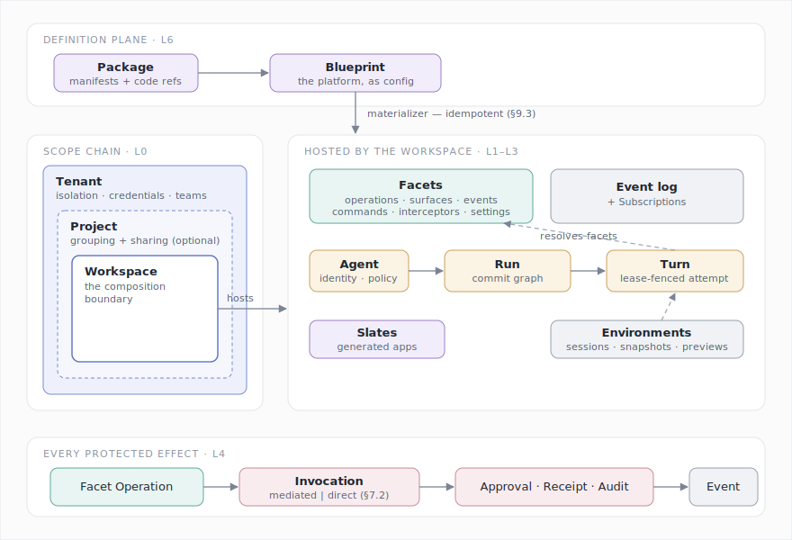
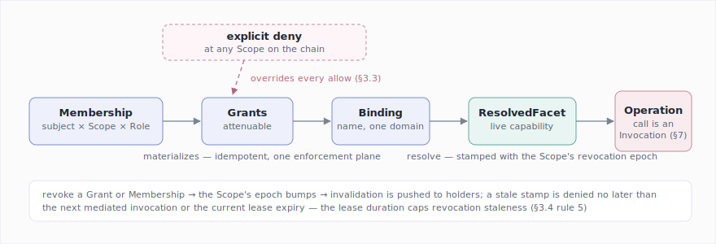
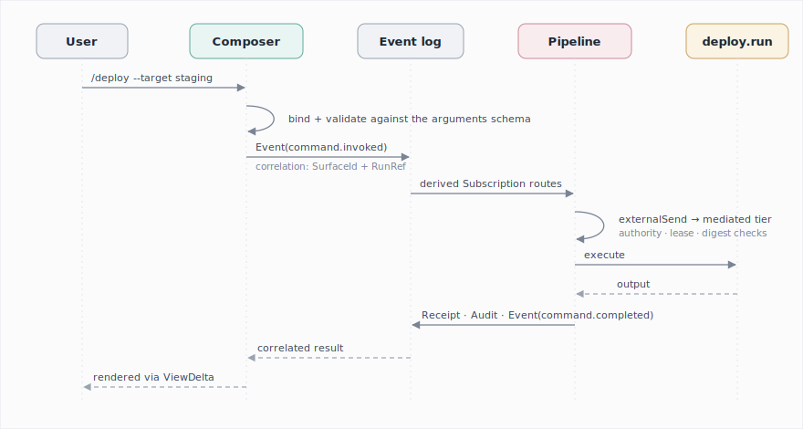
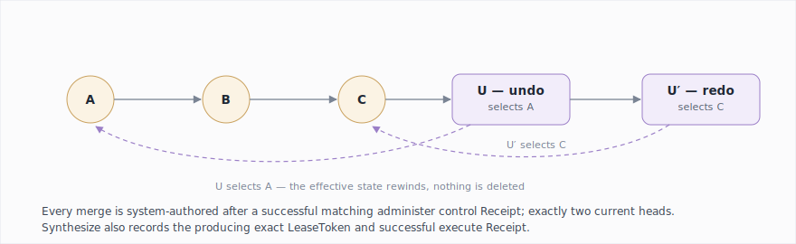
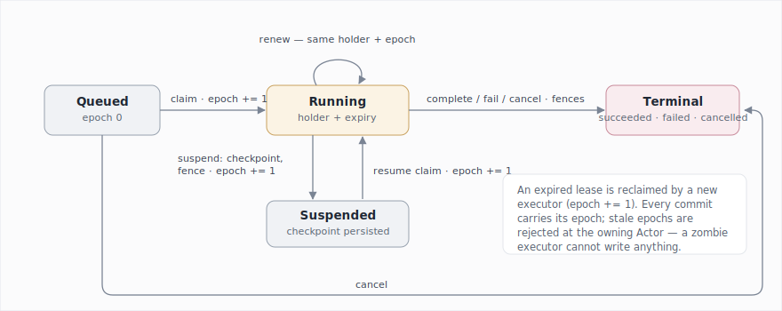
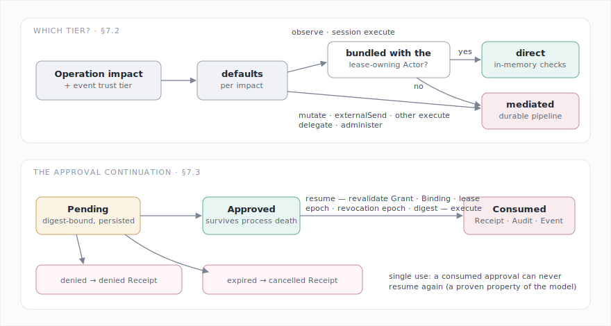
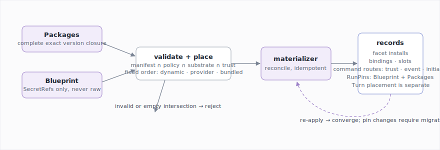
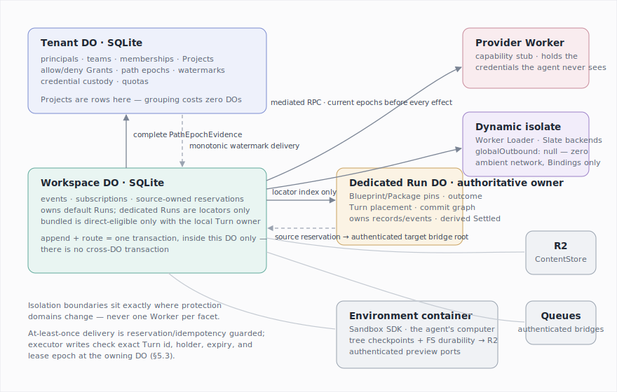

# Agent Core

**A specification for building agent platforms.**

*AI tools have been used to shape parts of this document and the project. The ideas and concepts presented here are of my own, and they may change as I ideate further.*

---

## 1. Introduction

### 1.1 Why this exists

I have built the same platform several times now. An agent that survives restarts. A
place to put its conversations, its tools, its files. A way for a webhook, a schedule,
a chat message, and a button press to all end up in front of the same agent loop. A
per-user vault so the agent can act on someone's behalf without ever holding their
credentials. A sandbox with a preview URL. An approval card for the scary actions. A
way to share all of it with a team.

Every platform re-solves these problems, couples the solutions to its own product, and
then can't reuse them for the next one. The frameworks that exist don't help at the
right layer: agent SDKs give you the loop and stop there; the hosted platforms give you
a control plane you don't own, shaped like their product rather than yours. Nobody
gives you the Lego blocks.

Agent Core is that box of blocks. It defines a small set of primitives — sixteen of
them — that compose into complete agent platforms: multi-tenant or personal, chat-first
or headless, exploratory or transactional. And it defines a **definition plane** above
them, so that an entire platform is a validated configuration document — a Blueprint —
materialized onto a substrate. The first substrate is Cloudflare Durable Objects. The
model doesn't depend on it.

The design rests on a few core ideas:

**Authority works like a capability.** The idea is that nothing in the system should
act because of *who it is* — things act because of *what they hold*. A Grant records
authority, a Binding gives it a name inside one isolation domain, and resolving a
binding produces a live capability that can be narrowed, delegated, and revoked. Roles
and memberships exist so humans can reason about access, but they materialize *into*
Grants, so there is only one enforcement path to get right; revoking a Grant disables
everything derived from it. This is the object-capability model (the ideas go back to
Mark Miller's work), and the reason it matters here is prompt injection: an agent
reads untrusted content all day, and if it also holds broad ambient authority,
injected instructions will eventually find something to do with it. Capabilities keep
the blast radius of any single compromise small and revocable.

**Everything durable is a record with a single owner, and every input is an event.**
A conversation is stored as an append-only commit graph with named branches, so
branching a conversation, undoing a step, and exploring in parallel are just graph
operations. An execution attempt is a Turn holding a lease with a fencing epoch,
which means a crashed executor that comes back later simply cannot write anything —
its writes carry a stale epoch and get rejected. And a webhook, a cron tick, a slash
command, and a button press are all the same thing — an Event, routed by a
Subscription — so automation becomes configuration rather than extra plumbing.

**Enforcement is tiered by impact.** Every protected action is an Invocation, but an
agent loop makes thousands of small read calls per session, and writing several
durable records for every file read would make the whole system unusable. At the same
time, an external send with no receipt is a real liability. So the operation's
declared impact decides how it is enforced: reading a file inside the agent's own
sandbox is an in-memory call, while sending an email goes through a durable pipeline
of intent, approval, receipt, and audit. Policy can always tighten this, never the
other way around.

The rest is composition. Facets bundle operations, UI, events, and prompt text into
one installable capability. Contributions let any facet add commands, automations, and
settings to a platform *as data* — a slash command is a manifest entry, not a code
change. A Slate is an application the agent builds for you, running with no ambient
authority at all. A Lean model checks a documented abstract subset of these semantics;
§14 states its exact boundary and makes no implementation-refinement claim.

### 1.2 What this specifies — and what it leaves to you

Agent Core specifies the platform layer: identity and tenancy, authority, durable
execution, input routing, mediated actions, UI contributions, environments, generated
applications, and the definition plane. It deliberately does **not** specify the agent
loop — model choice, prompting, streaming, tool-call parsing. The loop lives behind the
Turn executor seam (§5.6), so you can drive Runs with the Claude Agent SDK, Pydantic
AI, a bespoke loop, or whatever comes next. Think of Agent Core as everything *around*
the loop.

### 1.3 How to read this document

Sections 2–10 are normative; §11–§12 define profiles and sketches; §13–§14 cover
conformance and the formal model. MUST, SHOULD, and MAY are RFC 2119 keywords.
Behavioral contracts appear as abstract TypeScript classes; pure data shapes as
interfaces. Sections marked *(informative)* explain; everything else binds. Short
*why* paragraphs record the reasoning behind the less obvious choices, so the
reasoning itself can be checked and challenged, not just the rules.

### 1.4 Notation and type vocabulary

Identifiers ending in `Id` or `Name` (`PrincipalId`, `SurfaceId`, `BindingName`,
`SlotName`) are opaque, codec-stable identifier types, as are the simple reference
types `ContentRef`, `OperationRef`, `FacetRef`, `RunRef`, and `TurnRef`. Three `Ref`
types are structured records: `PrincipalRef`, `SecretRef` (§3.5), and
`ForeignPrincipalRef` (§3.3). `PrincipalRef` is always tenant-qualified:
`{ tenant: TenantId, id: PrincipalId }`. Every caller, authority initiator or delegate, lease
holder, route initiator, and cross-Actor permit carries this canonical form; an
unqualified id or mismatched tenant rejects rather than being inferred. This maps to
**C13-AUTH-PRINCIPAL-REF**. Types ending in `Schema`, `Spec`, `Policy`, `Template`,
`Mapping` (declarative field maps: `FieldMapping`, `PayloadMapping`,
`ProvenanceMapping`), `Selector` (predicate sets over descriptors:
`OperationSelector`), `Entry` (`SlotEntry` — a validated contribution instance plus its
contributor), or `Requirement` (`BindingRequirement` — a named capability a facet needs
bound before start) are JSON-Schema-validated records. The unions the prose depends
on:

```ts
type Impact          = "observe" | "mutate" | "externalSend" | "execute" | "delegate" | "administer";
type TrustTier       = "owner" | "authenticated" | "external" | "self";      // §6.1
type EnforcementTier = "mediated" | "direct";                                 // §7.2
type IsolationMode   = "bundled" | "provider" | "dynamic";                    // §1.5, §10.2
type CutPoint        = "operation.before" | "operation.after" | "prompt.assemble"
                     | "input.submitted" | "turn.step";                       // §4.4
type Contributions   = { readonly [slot: SlotName]: readonly unknown[] };     // validated against
                                                                              // the slot's schema (§4.2)
```

Core value types (fields, not primitives): `Digest` — a collision-resistant content
digest, SHA-256 or stronger; `ContentRef` — resolvable through a ContentStore (§8.2);
`SecretRef` (§3.5); `Revision` — a per-record optimistic-concurrency counter.

A `FacetRef` *identifies* a facet instance; a `Binding` *names* a Grant-backed instance
in one protection domain; a `ResolvedFacet` is the *live capability* returned by
resolution. The W3-owned canonical serialized `FacetRef` is exactly
`<scope>:<instance>`. It contains one and only one `:` separator, and each segment
matches `^[a-z][a-z0-9]*(?:[.-][a-z0-9]+)*$`; empty, noncanonical, or additionally
separated forms reject rather than normalize. The order is always the same: identify,
then name, then resolve. This clause maps to **C13-FACET-REF-CANONICAL**.

### 1.5 Protection domains

A **protection domain** is an isolation boundary. Inside one, calls are plain
in-process calls and carry no security cost. Across one, nothing passes except
explicitly delegated capabilities and asynchronous Events. Platform policy places
facet code into a domain (§9.2, §10.2) using three isolation modes: `bundled`
(in-process with the hosting Actor), `provider` (a separate service behind a capability
stub), and `dynamic` (loaded code in a fresh isolate with zero ambient authority).

---

## 2. The model at a glance

Agent Core has **sixteen primitives**. Everything else is a constituent record of a
primitive, a value type (§1.4), a contribution kind (§4.2), a substrate contract (§8),
or a profile (§11). I try hard to keep this count from growing: a concept becomes a
primitive only when at least two real platforms need it and it cannot be built by
composing the others.

| Layer | Primitive | Constituents |
| --- | --- | --- |
| L0 Identity & authority | **Principal** | Team (a named principal set; a Tenant record) |
| | **Scope** — the chain Tenant ⊇ Project ⊇ Workspace | Membership, Role |
| | **Grant** | — |
| | **Binding** | ResolvedFacet |
| L1 Composition | **Facet** | FacetManifest, Contribution, Slot |
| | **Operation** | OperationDescriptor |
| | **Interceptor** | — |
| | **Environment** | Session, tree Checkpoint |
| | **Slate** | versions, deployments |
| L2 Execution | **Agent** | AgentProfile |
| | **Run** | RunBranch, RunCommit, run Checkpoint |
| | **Turn** | TurnLease |
| L3 Interaction | **Event** | provenance, TrustTier |
| | **Subscription** | PayloadMapping, DedupePolicy |
| | **Surface** | View, ViewDelta |
| L4 Mediation | **Invocation** | PreparedInvocation, Approval, EffectAttempt, Receipt, AuditRecord |

Substrate contracts (L5): **Actor**, **ContentStore**, **RecordCodec**, and the command
protocol dispatcher (§8.5). The definition plane (L6) adds two artifacts: **Package**
and **Blueprint** — eighteen nouns in total.



Three paths describe almost every interaction in the system:

```text
ACTIVE       Facet → Invocation(tier) → direct return | mediated PreparedInvocation → [Approval] → [EffectAttempt] → Receipt → Audit → Event
INTERACTION  input → Event → RouteReservation → Subscription target → PreparedInvocation
AUTHORITY    Role allow/deny rules ⇒ Grants → Binding resolver + path epochs → ResolvedFacet
```

These three paths are worth internalizing before reading further — every feature in
the assembly sketches of §12 is just a composition of them.

---

## 3. Identity and authority (L0)

### 3.1 Principal and Team

A **Principal** is an accountable actor: a human, a service account, a CI bot, or an
independently accountable Agent. Principals authenticate; Scopes own resources.

A **Team** is a named set of Principals recorded in a Tenant. Teams are Membership
subjects, not a separate primitive: wherever a Membership names a subject, the subject
is `Principal | Team`, and a Principal's effective access derives from the union of its
direct and team Memberships under the precedence rule of §3.3.

### 3.2 The Scope chain

**Scope** is one primitive with three roles forming a fixed chain
`Tenant ⊇ Project ⊇ Workspace`, with Project optional:

- a **Tenant** is the ownership and isolation boundary. It owns Projects, Workspaces,
  Teams, credentials, installed Packages, quotas, and retention. A single-user
  installation still has a Tenant — one Principal, one personal Tenant.
- a **Project** groups Workspaces for organization, policy, and sharing. It is a
  record owned by the Tenant's Actor, not a coordination unit of its own (§8.1,
  §10.1) — grouping your workspaces costs nothing at runtime.
- a **Workspace** is the composition boundary. It hosts Facet installs, Bindings,
  Events, Subscriptions, Agents, Runs, and Slates, and enforces workspace policy.

*Why a fixed chain rather than arbitrary nesting:* two container levels are what most
mature resource hierarchies converged on (cloud providers, code forges), they cover
the sharing shapes that actually come up, and they keep policy resolution bounded at
three steps. Recursive workspaces would turn policy resolution, the UI, and the
substrate mapping into graph problems, and I have yet to see a platform that needed
them.

### 3.3 Membership, roles, and sharing

A **Membership** binds a subject (`Principal | Team`) to a Scope with a **Role**. A
**Role** is a named, declared set of authority rules:

```ts
interface Role {
  readonly name: RoleName;                         // "owner", "editor", "reader", …
  readonly rules: readonly RoleRule[];
}

interface RoleRule {
  readonly effect: "allow" | "deny";
  readonly capability: CapabilitySpec;
}
```

A `CapabilitySpec` describes one grantable authority: a Facet or Facet pattern, the
Operations (or Operation impacts) it covers, and any argument constraints. Rule order
is stable for materialization but does not alter precedence: any matching deny
overrides every matching allow. Roles are
declared in a Blueprint (`policies.roles`) or supplied by a Package; the spec fixes
three built-in roles every platform provides — `owner` (all capabilities at the scope,
including `administer`), `editor` (everything except `administer`), and `reader`
(`observe`-impact capabilities only) — each as allow rules, and platforms MAY declare
more rules including denies. A Role is a template; it becomes authority only when a
Membership assigns it.

**Roles materialize Grants.** A Membership is not itself callable authority. Assigning
a Role at a Scope materializes — idempotently, exactly as a Blueprint materializes
records (§9.3) — one durable allow- or deny-Grant per Role rule, identified by
`(membership, rule ordinal)`, for that subject at that Scope. Reapplying the same Role
reconciles those Grants rather than adding authority. Downward flow, attenuation, and
revocation operate only on Grants. The enforcement plane resolves only Grants and
Bindings; Roles and Memberships have no second path. Revoking or changing a Membership
revokes its obsolete materialized Grants and advances the affected path epoch (§3.4).
A guest Membership materializes the same way after removing all allow rules that could
grant `delegate` or `administer`; deny rules are retained.

*Why:* the moment roles and grants are two separate enforcement systems, they drift
apart, and that kind of drift tends to be discovered during an incident rather than
before it. With one plane, the question "what can this subject actually do" always has
exactly one answer, computed one way.

**Precedence.** Effective authority exists exactly when at least one live matching
allow-Grant reaches the target Scope and no live matching deny-Grant exists on the
ordered Tenant-to-target path. Direct and team Grants are considered together. A
descendant allow cannot re-widen an ancestor deny. Example: Team A holds `reader` on
Project P, so its members read every Workspace in P; a deny-Grant for W2 removes W2
without touching W1.

**Sharing** is Membership issuance — there is no second mechanism. Sharing a Project
with a user is a Membership at that Project; a team owning a Project is a Team
Membership at that Project, and every member inherits access by default. Cross-tenant
sharing uses a **guest Membership** whose subject is a `ForeignPrincipalRef
{ homeTenant, principalId, verifiedVia }`. Guest-materialized Grants are always
attenuated, MUST NOT carry `delegate` or `administer` capability, and MUST NOT resolve
the host Tenant's credentials. Credential custody never leaves the owning Tenant. The
same Grant precedence and Binding resolver apply to guests.

**Verifying a guest.** `verifiedVia` names how the host Tenant establishes that a
request actually comes from the foreign principal. It is one of three schemes, in
increasing order of coupling:

- `token` — the host and home Tenants share an out-of-band trust configuration (a
  signing key or an OIDC issuer URL registered in the host Tenant's policy). The guest
  presents a token issued by the home Tenant; the host verifies its signature and the
  `{ homeTenant, principalId }` claims against the registered issuer. This is the
  default and needs no live contact between tenants.
- `callback` — the host holds no key; at authorization time it asks the home Tenant's
  declared verification endpoint "is this token yours, and is this principal active?"
  and caches the answer for the token's lifetime. Used when the home Tenant will not
  share a key but will answer queries.
- `handshake` — for a first-time link, the two Tenants perform a one-time exchange (the
  home Tenant's owner approves the link, the host records the resulting trust
  configuration) that downgrades all future verifications to `token`. `handshake` is
  the bootstrap; steady state is always `token` or `callback`.

Whichever scheme is used, the host verifies provenance *before* materializing any guest
Grant, and a verification failure denies. The wire protocol for a token or a callback
is a substrate/profile concern — the host Tenant's policy declares the issuer or
endpoint; this document fixes the three schemes and the before-materialization ordering.

### 3.4 Grant, Binding, resolution, revocation

A **Grant** is a durable authority rule: subject, Scope, `allow | deny` effect,
capability, origin, attenuation lineage, and revocation state. An allow may be
delegated only to an equal or narrower capability; a deny is not callable or
delegable. A **Binding** associates a subject-local name with an allow-Grant-backed
Facet instance in one protection domain. Binding resolution evaluates all matching
allow and deny Grants through §3.3 precedence. There is no deny list or role check
beside this plane. Callable access requires a **ResolvedFacet** produced by that
resolver; identifiers alone confer nothing.



```ts
interface PathEpochEvidence {
  readonly path: readonly [ScopeEpoch, ...ScopeEpoch[]]; // exact Tenant→target path
}

interface ScopeEpoch {
  readonly scope: ScopeRef;
  readonly epoch: number;
}

interface ResolutionStamp {
  readonly pathEpochs: PathEpochEvidence;
  readonly lease: LeaseToken;
  readonly originalLeaseExpiresAt: Date;
  readonly resolvedAt: Date;
  readonly resolutionDeadline: Date; // immutable; renewal cannot extend it
}

interface InvalidationWatermark {
  readonly holder: PrincipalRef;
  readonly delivered: readonly ScopeEpoch[]; // unique Scope keys; missing means epoch 0
}

abstract class AuthorityService {
  abstract assignMembership(scope: ScopeRef, subject: SubjectRef, role: RoleSpec): Promise<Membership>;
  abstract revokeMembership(membership: MembershipId): Promise<void>;   // revokes materialized grants, bumps epoch
  abstract grant(scope: ScopeRef, subject: SubjectRef, capability: CapabilitySpec,
                  attenuationOf?: GrantId): Promise<Grant>;
  abstract deny(scope: ScopeRef, subject: SubjectRef, capability: CapabilitySpec): Promise<Grant>;
  abstract revoke(grant: GrantId): Promise<void>;                       // disables descendants, bumps epoch
  abstract bind(domain: ProtectionDomain, name: BindingName, grant: GrantId,
                facet: FacetRef): Promise<Binding>;
  abstract resolve(domain: ProtectionDomain, name: BindingName): Promise<ResolvedFacet>;
  abstract memberships(principal: PrincipalId): Promise<readonly Membership[]>;
}
```

Authority rules:

1. Missing authority denies.
2. Child authority is always attenuated — delegation can only narrow.
3. Raw credentials remain in Tenant custody; delegation moves capability stubs, not
   secrets.
4. Discovery is policy-controlled: a Turn receives a redacted view of installed Facets
   under the same policy that governs direct reads.
5. **Path evidence is complete.** Each Scope carries a monotonically increasing
   authority epoch. Every ResolvedFacet carries a `ResolutionStamp` whose
   `PathEpochEvidence` is the exact ordered
   Tenant-to-target Scope path and the current epoch of every Scope on it. It contains
   each path Scope exactly once, in order, with no omissions, duplicates, or extra
   Scopes. Evidence is
   fresh only if the path is still exact and every recorded epoch equals the current
   epoch. Creating, revoking, or changing any allow or deny advances the epoch of its
   Scope.
6. **Direct revocation has one bounded window.** Each holder has one Scope → epoch
   delivered invalidation map shared by all its resolutions. Delivery and observation
   join maps pointwise with `max`; entries never decrease. A direct-capable resolution
   records the expiry of the stamp's exact LeaseToken at issuance as
   `originalLeaseExpiresAt` and sets
   `resolutionDeadline = min(originalLeaseExpiresAt, resolvedAt +
   policy.maxDirectRevocationWindow)` at resolution; renewal never extends that
   immutable deadline. The configured window is finite and nonnegative. After a relevant epoch advances, let `deliveredAt` be invalidation
   delivery to the holder and `observedAt` be the first mediated check by that holder
   that observes any stale path epoch; an absent time is infinity. The resolution
   ceases to authorize direct calls at
   `min(deliveredAt, observedAt, resolutionDeadline)`. A direct call requires the
   stamp's exact Turn id, holder, and lease epoch to be current, current time strictly before the
   immutable deadline, and, for every Scope on its path, holder watermark ≤ recorded
   epoch.
7. **Mediated authority has one final admission point.** Actor-local mediation compares
   canonical authority and current path epochs in the guarded transaction that admits
   its EffectAttempt. Cross-Actor mediation performs that final comparison in the
   authoritative Tenant Actor only after the exact target claim, target fence,
   reservation epoch, item key, ordinal, arguments digest, and whole intent are known;
   issuing the §10.3 `AuthorityPermit` is the final authority-admission linearization
   point immediately before target attempt admission. Permit issuance linearizes
   against Grant, Binding-generation, and path-epoch mutation. Revocation committed
   before issuance blocks the permit; revocation committed after issuance cannot cancel
   the already admitted attempt, but blocks every not-yet-issued permit. Before permit
   issuance, or during Actor-local admission, a stale comparison atomically joins the
   current path Scope epochs into the holder map, invalidates the cached resolution,
   and records `deniedPreEffect` without an EffectAttempt. The target does not perform
   a contradictory second authoritative Grant/epoch decision; it validates and consumes
   the exact permit under `C13-CLOUDFLARE-AUTHORITY-PERMIT-CONSUMPTION`. This rule maps
   to **C13-AUTH-MEDIATED-ADMISSION** and **C13-AUTH-MEDIATED-STALE**.
8. Resolved-facet lifetime follows the isolation mode: `bundled` resolutions last no
   longer than their exact Turn and deadline; `provider`/`dynamic` resolutions last one
   Turn step and are mediated with current path epochs (§10.2).

*Why bounded-window rather than instantaneous:* no distributed substrate can update
every live holder atomically. Rules 6–7 give direct calls a safety bound without a
delivery-liveness assumption and require current evidence for mediated effects.
Eventual delivery and reconciliation use only the external liveness assumptions in
§14.

### 3.5 SecretRef

A **SecretRef** `{ source, provider, id }` names a credential held in Tenant custody.
Configuration, manifests, and Blueprints carry SecretRefs, never raw credential
values. A SecretRef is custody delegation, not process isolation: if plaintext is
readable in an agent-visible filesystem, the ref does not protect it. Substrates
SHOULD provide credential-injecting seams — proxy-injected headers, masked environment
variables — so raw values never enter agent-visible domains at all.

---

## 4. Facets and composition (L1)

### 4.1 The manifest / runtime split

A **Facet** is a live, named, typed capability exposed to a protection domain. It is
defined in two halves:

- the **FacetManifest** — declarative, schema-validated, inspectable *without executing
  code*: identity, version, compatibility range, config-schema fragment, binding
  requirements, isolation requirement, and contributions;
- the **runtime class** — the behavior: operation handlers, surface rendering,
  interceptors, lifecycle, child facets.

```ts
interface FacetManifest {
  readonly id: FacetPackageId;                 // e.g. "core.fs", "acme.deploy"
  readonly version: SemVer;
  readonly compat: CompatRange;                // spec + host compatibility
  readonly isolation: readonly [IsolationMode, ...IsolationMode[]]; // unique admissible modes (§9.2)
  readonly bindings: readonly BindingRequirement[];
  readonly configSchema?: JsonSchema;          // merged into the platform config schema
  readonly contributions: Contributions;       // open map keyed by SlotName (§4.2)
}

abstract class Facet {
  abstract readonly manifest: FacetManifest;
  abstract operation(name: OperationName): Operation<unknown, unknown>;
  abstract surface(id: SurfaceId): Surface;
  abstract interceptor(id: InterceptorId): Interceptor;
  abstract children(): FacetSet;
  abstract start(ctx: OperationContext): Promise<void>;   // idempotent
  abstract stop(ctx: OperationContext): Promise<void>;    // stops children first
}

abstract class Operation<I, O> {
  abstract readonly descriptor: OperationDescriptor<I, O>; // name, impact, schemas, help
  abstract execute(ctx: OperationContext, input: I): Promise<O>;
}
```

The host verifies at install time that the runtime provides every implementation the
manifest declares and refuses contributions the manifest does not declare. Placement
uses the deterministic admissible-set rule in §9.2. A manifest can exclude modes but
cannot admit itself to `bundled`; platform trust policy remains an independent
constraint.

Facet lifecycle hooks are idempotent from the caller's perspective. Protected
invocation requires an active, undisposed Facet whose Grant, Binding, lease, and
revocation state are valid per §3.4. Turns dispose resolved Facets on completion,
failure, cancellation, suspension, or authority loss.

*Why the split:* everything a host, a registry, or the Blueprint validator needs to
know about a facet is data it can read without running anything. This is the property
that makes a config-defined platform possible at all — and it is the shape that both
VS Code extensions and the most successful open agent platforms independently arrived
at.

### 4.2 Contributions and slots

A **Contribution** is a typed, schema-validated manifest entry targeting a **Slot** —
the extension points of a platform. The spec defines the core slots; the `slots`
meta-contribution declares new ones. Contributions are data that compiles down to
existing primitives, and a conforming host materializes them through the same paths it
offers imperatively, so declared and programmatic behavior cannot diverge.

| Core slot | Entry | Materializes as |
| --- | --- | --- |
| `operations` | OperationDescriptor | catalog entry (runtime must implement) |
| `surfaces` | SurfaceDescriptor | renderable Surface |
| `events` | EventDeclaration | accepted Event kinds + visibility |
| `ingress` | IngressDeclaration (§6.1) | verified external endpoint minting Events |
| `prompt` | PromptContribution | prompt-assembly section |
| `commands` | Command (§4.3) | catalog entry + derived Subscription |
| `automations` | SubscriptionTemplate | Subscription |
| `interceptors` | InterceptorDeclaration (§4.4) | ordered sync hook |
| `settings` | JSON-schema fragment | merged platform config schema |
| `slots` | SlotDeclaration | a new slot others may target |

```ts
interface SlotDeclaration {
  readonly name: SlotName;                  // e.g. "dashboard.card"
  readonly entrySchema: JsonSchema;
  readonly authority: SlotAuthorityPolicy;  // who may contribute; who may see entries
}
```

**Reading slots.** Hosts expose a query API — the data source for composers, palettes,
and dashboards:

```ts
abstract class SlotCatalog {
  abstract query(slot: SlotName, viewer: SubjectRef): Promise<readonly SlotEntry[]>;
}
```

`query` filters by the slot's visibility policy; the materializer (§9.3) rejects
contributions that violate the slot's contribute-authority. Core slots carry an
implicit default policy: contribute = any installed Facet in scope; visibility = the
same policy as direct reads (§3.4 rule 4).

Slot entries come in two flavors: *declarative* (the entry is data validated against
`entrySchema`; the reading Surface renders it) and *surface-backed* (the entry carries
a `SurfaceId`; an aggregating platform Surface embeds the referenced child Views —
refs, never live stubs, per §6.3). A `dashboard.card` slot is the canonical
surface-backed case: the platform's dashboard Surface queries the slot and composes
the contributed cards' Views.

### 4.3 Commands

A **Command** is the general form of slash commands, palette entries, and CLI verbs —
a user-invocable, parameterized shortcut to an Operation. It is a contribution kind,
not a primitive: it compiles entirely to catalog entries plus a derived Subscription,
which means installing a command changes *no code anywhere* and the full authority,
approval, and audit machinery applies to it automatically.

```ts
interface Command {
  readonly name: string;                    // canonical id is `${facetId}:${name}`
  readonly title: string;                   // localizable (string or i18n key)
  readonly help?: string;
  readonly arguments: JsonSchema;           // validation + autocomplete
  readonly operation: OperationRef;         // target
  readonly binding: BindingName;             // target capability for initiator authority
  readonly mapping?: FieldMapping;          // arguments → operation input (see below)
  readonly acceptedTrust?: readonly [TrustTier, ...TrustTier[]];
  readonly completion?: OperationRef;       // optional observe-impact completion provider
  readonly surfaces: readonly SlotName[];   // where discoverable (chat.composer, cli, palette)
}

interface SubscriptionTemplate {
  readonly source: EventPattern;
  readonly target: OperationRef;
  readonly binding: BindingName;
  readonly mapping?: PayloadMapping;
  readonly dedupe?: DedupePolicy;
  readonly authority?: "initiator" | "delegated";
}
```

Materialization is deterministic. A Command first applies `mapping`, or identity when
absent, and emits `command.invoked` with the validated Operation input at `/input`. Its
derived Subscription is exactly:

```ts
{
  source: {
    kind: "command.invoked",
    source: `${facetId}:${command.name}`,
    acceptedTrust: command.acceptedTrust ?? ["owner", "authenticated", "self"],
  },
  target: command.operation,
  mapping: [{ from: "/input", to: "" }],
  dedupe: "event",
  authority: { kind: "initiator", binding: command.binding },
}
```

An automation template defaults `mapping` to root-to-root identity, `dedupe` to
`event`, and `authority` to initiator using its `binding`. Delegated automation MUST be
explicit. Its `source.acceptedTrust` is always explicit and nonempty.

The lifecycle, end to end:

1. **Install.** The materializer registers the command in each declared surface slot.
   Command `name` MUST be unique per surface slot per Scope; a collision rejects the
   later contribution unless the Scope configures an alias. Per-Scope visibility
   policy (§9.2) MAY disable individual commands.
2. **Discovery.** Surfaces render catalogs via `SlotCatalog.query`. For dynamic
   argument completion beyond schema enums, the host MAY call the command's
   `completion` Operation (`observe` impact) with the partial argument context.
3. **Argument binding.** A Surface owns its input grammar and produces a `FacetData`
   value that validates against `arguments` before any Event is emitted. CLI token
   ordering, quoting, and flags belong to the CLI Surface profile, not this core
   contract. With no `mapping`, the validated value is passed through unchanged;
   otherwise the declared pure mapping produces the Operation input. The resulting
   value MUST validate against the Operation input schema at install and execution.
4. **Invocation.** The surface emits `Event(command.invoked)` whose correlation MUST
   carry the originating `SurfaceId` and, when invoked from a conversation, the
   `RunRef`/branch. The derived Subscription routes it to the target Operation.
   The derived Subscription uses exactly the fixed defaults above; no inferred
   compatibility relation or alternate authority source is permitted.
5. **Result.** The host MUST emit `Event(command.completed)` correlated to the
   invoking Event's id, carrying the Operation's output reference (or the failure).
   Surfaces that render a `commands` slot MUST subscribe to `command.completed` for
   their own invocations and render results via ViewDelta (§6.3). A command whose
   effect belongs in the conversation appends a RunCommit to the correlated Run under
   the invoker's authority.

A worked example — a deploy facet adds `/deploy` to a chat platform:

```ts
contributions: {
  operations: [{ name: "deploy.run", impact: "externalSend", input: DeployArgs }],
  commands: [{
    name: "deploy", title: "Deploy the current slate",
    arguments: DeployArgs, operation: "deploy.run", binding: "deploy",
    surfaces: ["chat.composer", "cli"],
  }],
}
```

Installing the facet makes `/deploy` discoverable wherever the `commands` slot renders.
`/deploy --target staging` binds, validates, emits `command.invoked` with the Run
correlation, routes through a mediated Invocation (`externalSend`), and the receipt and
result flow back to the composer through `command.completed`. Adding a whole new
affordance category — composer suggestions, dashboard cards — is a `slots` declaration,
not a spec change.



### 4.4 Interceptors

An **Interceptor** is an ordered, synchronous, in-process hook at a spec-defined cut
point that can observe, block, or rewrite the value in flight. Every serious local
agent runtime converged on this mechanism independently, because it is the one thing
asynchronous events cannot express: a veto or a transform has to return a value *now*.
The value in flight at each cut point:

| Cut point | Value in flight | May |
| --- | --- | --- |
| `operation.before` | (descriptor, input) | block; rewrite input |
| `operation.after` | (descriptor, output) | rewrite output |
| `prompt.assemble` | assembled prompt sections | reorder, add, remove sections |
| `input.submitted` | user input | transform; block |
| `turn.step` | step context | annotate; request stop |

```ts
interface InterceptorDeclaration {
  readonly id: InterceptorId;
  readonly cutPoint: CutPoint;
  readonly appliesTo: OperationSelector;    // DEFAULT: the contributing facet's own operations
  readonly priority: number;                // total order: (priority, facetId, id)
}

abstract class Interceptor {
  abstract intercept(ctx: InterceptContext, value: unknown): InterceptResult;
}

// The value's type at each cut point is fixed by the table above; `unknown` is
// narrowed by `ctx.cutPoint`. An OperationSelector is a set of Operation patterns —
// `own(...)` for the facet's own operations, or a `{ facet, operation }` pattern
// (each field a literal or "*"-terminated prefix) for a declared-interceptable target.
interface InterceptContext {
  readonly cutPoint: CutPoint;              // which point fired (narrows `value`)
  readonly operation?: OperationDescriptor; // present at operation.before/after
  readonly turn?: TurnRef;                  // required only for Turn-bound cut points
  readonly interceptor: InterceptorId;      // self, for attributable rewrites (rule 5)
}

type InterceptResult =
  | { readonly proceed: true; readonly value: unknown }   // pass through or rewrite
  | { readonly proceed: false; readonly reason: string }; // block, scoped to appliesTo
```

Rules:

1. Interceptors run only within one protection domain; cross-domain interception MUST
   use asynchronous Events.
2. `appliesTo` defaults to the contributing facet's own operations. Intercepting
   another facet's operations requires that facet to declare the operation
   `interceptable` and the interceptor's facet to hold a Grant for it. Sharing a
   domain confers no interception rights.
3. Ordering is total and deterministic: ascending `(priority, facetId, interceptorId)`;
   interceptor ids MUST be unique within a Facet. Hosts record
   which interceptor last rewrote a value.
4. A thrown error blocks — scoped to the interceptor's `appliesTo`, surfaced as a
   typed operation error, never as a silent global veto.
5. Mutating interceptions are attributable: the host records interceptor identity plus
   before/after value digests through the invocation's tier-appropriate audit channel
   (§7.2).
6. `operation.before` completes before preparation. Its final rewritten input is what
   the PreparedInvocation freezes and structurally digests. No interceptor may rewrite
   a PreparedInvocation, Approval, EffectAttempt, or effect arguments afterward.
7. The host persists the ordered `operation.before` transformation trace, including
   each interceptor identity and before/after digest, with the PreparedInvocation. A
   replay reuses the persisted transformed input and trace and does not rerun mutating
   pre-effect interceptors. A new interceptor pass creates a new InvocationId and
   whole-intent digest.
8. `operation.after` may rewrite only the returned presentation value; it cannot alter
   the effect, Receipt, or audit lineage. The host persists its ordered transformations
   and trace with the returned invocation evidence. Replaying the same invocation
   presentation reuses that persisted post-effect value and trace and does not rerun
   `operation.after`. These replay clauses map to **C13-INTERCEPTOR-REPLAY**.

Example: a policy facet contributes `{ cutPoint: "operation.before",
appliesTo: own("web.fetch"), priority: 10 }` that rewrites outbound URLs onto an
allowlisted proxy — its own operation, no opt-in needed, and the rewrite is
digest-logged.

### 4.5 Environment and Session

An **Environment** is an execution endpoint that opens live **Sessions**; a Session
exposes session-scoped child Facets (`env.fs`, `env.shell`, `env.ports`, `env.proc`).
An Environment is essentially the agent's computer.

Rules: stale Sessions fail; closing a Session disposes its child Facets; rotation
changes future Sessions without retargeting open ones. Environment profiles further
define **snapshot/restore** (boot from a known image — the reliability lever every
production platform converged on), **ephemeral-filesystem durability** (backup and
restore for container-backed environments), **preview exposure** (how a port becomes an
authenticated URL), and the **credential-isolation seam** (secrets injected by proxy,
never present inside the environment).

A **device environment** (§11) is an Environment behind a reverse-connection
transport — the user's laptop or phone. Its profile adds pairing (key exchange plus
operator approval), transport-attached consent (per device × agent, fail-closed), and
typed device command surfaces. These are Environment-profile concerns, not new
primitives.

### 4.6 Slate

A **Slate** is a programmable, user-facing application produced inside the platform —
the thing your agent builds for you: a **source document** (content-addressed; a
git-shaped history is a permitted canonical representation), **immutable versions**,
and **deployments**. A Slate composes with the other primitives rather than
duplicating them:

- live preview *is* an Environment Session — a running process with ports — not a
  rendered View;
- the Slate backend executes in the `dynamic` isolation mode with zero ambient
  authority; capabilities arrive only through explicitly passed Bindings;
- publishing or embedding a Slate contributes Surfaces; app-private data is owned by
  the Slate's Actor.

Operations: `update`, `commit`, `fork`, `publish`, `deploy`, `rollback`.

---

## 5. Execution (L2)

### 5.1 Agent

An **Agent** is durable identity, profile, and policy: instructions, model policy (a
ModelPolicy seam — providers are out of scope), ambient and bound Facet specs, memory
and task relationships, Run history. A model call happens only inside a Turn.

### 5.2 Run, RunBranch, RunCommit

A **Run** is a branchable, durable work session and conversation lineage. It owns
input history, RunBranches (named movable heads), RunCommits (immutable records:
root, message, checkpoint, invocation, event delivery, result, merge, verdict, undo,
migration), status, an optional parent Run, and results. There is no separate
conversation primitive — conversation state *is* the Run's branch/commit graph, which
is why branching a conversation, undoing a step, and running parallel attempts are
graph operations here rather than product features bolted on later.

```ts
interface RunPins {
  readonly blueprint: { readonly id: BlueprintId; readonly version: SemVer;
      readonly digest: Digest };
  readonly packages: readonly PackagePin[]; // complete transitive closure, unique by id
  readonly agent: { readonly id: AgentId; readonly revision: Revision;
      readonly digest: Digest };
  readonly effectivePolicy: { readonly id: PolicySetId; readonly revision: Revision;
      readonly digest: Digest };
  readonly modelPolicy: { readonly id: ModelPolicyId; readonly revision: Revision;
      readonly digest: Digest };
  readonly environment: { readonly id: EnvironmentId; readonly revision: Revision;
      readonly digest: Digest };
}

interface PackagePin {
  readonly id: PackageId;
  readonly version: SemVer;                  // exact, never a range
  readonly manifestDigest: Digest;
  readonly codeDigest: Digest;
}

interface TurnPlacementSnapshot {
  readonly turn: TurnId;
  readonly pins: RunPins;
  readonly placements: readonly PlacementPin[]; // every resolved Facet, unique by ref
}

interface PlacementPin {
  readonly facet: FacetRef;
  readonly manifest: readonly IsolationMode[];
  readonly policy: readonly IsolationMode[];
  readonly substrate: readonly IsolationMode[];
  readonly trust: readonly IsolationMode[];
  readonly selected: IsolationMode;
}

type RunLifecycle =
  | { readonly kind: "active" }
  | { readonly kind: "terminal"; readonly outcome: "succeeded" | "failed" | "cancelled";
      readonly terminalCommit: RunCommitId; readonly obligation: SettlementObligation };

type RunObligation =
  | { readonly kind: "approval"; readonly approval: ApprovalId }
  | { readonly kind: "invocationItem"; readonly invocation: InvocationId;
      readonly itemIndex: number; readonly itemKey: string }
  | { readonly kind: "route"; readonly reservation: RouteReservationId }
  | { readonly kind: "reconciliation"; readonly attempt: EffectAttemptId }
  | { readonly kind: "systemCommit"; readonly commit: RunCommitId };

interface RunAdmissionRegistry {
  readonly run: RunId;
  readonly epoch: number;
  readonly open: boolean;
  readonly reserved: readonly RunObligation[];  // unique canonical identities
  readonly completed: readonly RunObligation[]; // subset of reserved
}

interface RunAdmissionReservation {
  readonly run: RunId;
  readonly registryEpoch: number;
  readonly obligation: RunObligation;
}

interface SettlementObligation {
  readonly registryEpoch: number;
  readonly obligations: readonly RunObligation[];
  readonly requiredAudits: readonly SettlementAuditObligation[];
}

interface ForcedTurnCancellation {
  readonly run: RunId;
  readonly terminalTurn: TurnId;
  readonly turn: TurnId;
  readonly priorLeaseEpoch: number;
  readonly fencedLeaseEpoch: number;
  readonly controlReceipt: ReceiptId;
  readonly controlAudit: AuditRecordId;
  readonly cancellationEvent: EventId;       // token-scoped turn.cancel inbox evidence
  readonly cancellationAudit: AuditRecordId;
}

interface SettlementAuditObligation {
  readonly audit: AuditRecordId;
  readonly evidence:
    | { readonly kind: "receipt"; readonly invocation: InvocationId;
        readonly receipt: ReceiptId }
    | { readonly kind: "delivery"; readonly reservation: RouteReservationId }
    | { readonly kind: "commit"; readonly id: RunCommitId };
}
```

`PackagePin.id` identifies the distributable Package release, not a contained
`FacetManifest.id`. `PackageId` and `FacetPackageId` are distinct opaque identities and
MUST NOT be converted or compared by string value. One Package may contain multiple
independently identified FacetManifests.

- Starting a Run creates one root RunCommit and immutable **RunPins** fixing the exact
  Blueprint id, version, and digest; complete transitive Package version closure; Agent
  id, revision, and digest; effective PolicySet id, revision, and digest; ModelPolicy
  id, revision, and digest; and Environment id, revision, and digest. `Run.agent` MUST
  equal `RunPins.agent.id`, and the complete Package closure MUST be nonempty and unique
  by `PackagePin.id`. Package ranges never appear in RunPins.
  Every referenced source record and Package release remains resolvable while any Run,
  Turn, Session, tree checkpoint, or Snapshot pins it. These exact identities map to
  **C13-RUN-PINS-SOURCES**, **C13-RUN-PINS-ENVIRONMENT**, and
  **C13-RUN-PINS-VALIDITY**.
  Every commit names its RunPins. Every non-root, non-migration unary commit inherits
  its exact parent's pins; a merge requires equal pins on both parents. **Run migration** is
  an `administer`-impact Operation that appends a unary migration commit naming exact
  `from` and `to` RunPins; its parent uses `from` and the migration commit uses `to`.
  Before installation, the target `to` pins MUST satisfy the same
  `RunPins.Valid(Run.agent)` constraints as Run creation; invalid Agent identity,
  empty/duplicate Package closure, or malformed source identity rejects without
  appending or installing the migration commit.
  A Turn retains the pins captured at its start; only Turns
  started from the migration commit or its descendants use the new pins. Migration is
  never implicit, and branches with different pins cannot merge until explicitly
  migrated to equal pins. Parent inheritance maps to
  **C13-RUN-PARENT-PIN-INHERITANCE**.
- Each Turn separately captures one immutable **TurnPlacementSnapshot** after §9.2
  selection. RunPins do not encode placement, and later policy or substrate changes do
  not retarget that Turn. Terminalization requires the terminal Turn's snapshot pins to
  equal the Run's current pins and its terminal commit to inherit those exact pins from
  the current head. A Turn retained across migration keeps its old pins and MUST be
  rejected as terminalizer after the Run migrates. These pin-validity clauses map to
  **C13-RUN-MIGRATED-TURN-REJECTION**.
- Before any Run-associated Approval, Invocation item, RouteReservation,
  reconciliation, or required system commit is admitted locally or remotely, the
  Run-owning Actor MUST reserve its canonical `RunObligation` in the durable
  `RunAdmissionRegistry` transaction. Reservation uses only identities known before
  remote work: ApprovalId; InvocationId plus item index and item key;
  RouteReservationId; EffectAttemptId for reconciliation; or planned RunCommitId.
  Receipt, delivery, projection, and Audit ids are never reserved. Duplicate canonical
  keys reuse the existing reservation. Completion atomically adds that exact reserved
  identity to `completed`; an unreserved identity cannot complete. Every remote actor
  validates the exact `RunAdmissionReservation` identity, Run, and registry epoch before
  admission; a substituted identity or closed/changed epoch rejects. This maps to
  **C13-RUN-ADMISSION-REGISTRY** and **C13-RUN-RESERVATION-EPOCH**.
- **Terminalization** is one Run-owner transaction: close the admission registry,
  advance its epoch, snapshot exactly `reserved − completed`, append the
  terminal result commit under the exact current Turn token, fence that Turn, record the
  Run outcome, and capture one finite SettlementObligation. Every sibling Turn MUST
  already be both terminal and unheld, or, only while this terminalization is open, the
  system MUST force-cancel it through the closed §5.3 rows. The sibling MUST be a
  distinct Turn in the same Run. One exact successful `administer` control Receipt and
  its matching AuditRecord authorize the sequence. Each cancellation fences the
  sibling, appends token-scoped `turn.cancel` inbox and Audit evidence, and records
  `ForcedTurnCancellation` with both fence epochs and the exact control evidence.
  Forced cancellation appends no sibling result commit and never presents or
  impersonates the sibling's LeaseToken or `CommitWriter.turn`.
  Terminalization commits only after every sibling is both terminal and unheld. No
  running sibling retains admission. This maps to **C13-RUN-FORCED-CANCELLATION**. Once closed, the Run rejects new routes,
  preparations, Turns, migrations, merges, undo, and other control writes; system
  writers may complete only captured evidence obligations.
- The terminal snapshot is exactly the just-closed registry's reserved-minus-completed
  set, not a remote discovery
  query: all pending Approvals, admitted Invocation items without a terminal current
  Receipt, RouteReservations without terminal delivery, EffectAttempts requiring
  reconciliation, and required system commits. It
  contains no completed or unreserved work. The finite registry MAY honestly be empty
  when no reservation was admitted; empty does not mean discovery was skipped. This
  maps to **C13-RUN-FRONTIER-COMPLETE** and
  **C13-RUN-FRONTIER-EMPTY**.
- Terminal does not assert all asynchronous evidence has arrived. **Settled** is
  derived, never assigned: a Run is Settled exactly when every captured Invocation item
  has a terminal current Receipt, no indeterminate Receipt is current, every captured
  RouteReservation has delivery or terminal rejection evidence, and every captured
  system RunCommit exists. Every required audit obligation must resolve to an existing
  AuditRecord of the stated evidence kind whose typed causal chain reaches that exact
  terminal Receipt, route delivery, or commit. Every captured Approval must resolve for
  its exact Invocation as consumed, denied, or expired. Every captured reconciliation
  must resolve the exact captured indeterminate Receipt to one final Receipt for the
  same EffectAttempt with the required `receiptSuperseded` lineage. BatchOutcome is available when every item has
  a current Receipt; its terminal form additionally requires non-indeterminate outcome.
  This maps to **C13-RUN-SETTLED-DERIVED**.
- `spawn` creates a child Run under attenuated authority (`delegate` impact, §11 Self
  profile).
- The commit graph is **append-only**. An `undo` appends an undo RunCommit `U` whose
  parent is the current head and whose `selects` field names an ancestor commit; the
  branch head advances to `U`, and the branch's **effective state** becomes the
  selected commit. Redo appends another undo commit selecting the prior effective
  commit. The interval until the next non-undo commit is the **pending revert**: it is
  durable and reversible. Prior heads remain reachable; ancestry
  queries are unaffected.
- Undo targeting a branch whose Turn holds an unexpired lease MUST first fence that
  Turn (§5.3); an undo that would orphan an in-flight Turn is rejected until the Turn
  is fenced or completes.
- `merge` is binary: it appends one RunCommit whose ordered parents are exactly the
  target branch's current head followed by the distinct source branch's current head.
  Multiway merge is a deterministic left fold of binary merges in caller-supplied
  branch order. A merge records one of the three content resolutions in §5.2.1; the
  graph records lineage and does not compute content.
- Conforming stores support ancestry and reachability queries, not merely head moves.

The **canonical graph** has one root with zero parents; every non-root, non-merge commit
has exactly one parent equal to its branch head at append; every merge has exactly the two
parents above; and no other parent arity is valid. Appending atomically advances only
the target branch head. Commit records and parent order never change.

#### 5.2.1 Merge resolution and tree conflicts

Two things can be in conflict at a merge: the *conversation* and the *filesystem tree*.
They are handled separately, because §5.4 already separates their checkpoints.

**Conversation resolution.** A merge's `resolution` names one of three kinds over its
ordered pair of parents:

- `pick` — the content is one parent's content verbatim (the chosen branch wins). The
  resolution records which parent was picked.
- `concat` — the content is the parent-order concatenation of their contents (used
  when the branches contributed to disjoint parts of the answer).
- `synthesize` — the content is produced by an aggregating Turn that read the parent
  heads. The resolution records its exact LeaseToken and a successful `execute`
  Receipt whose PreparedInvocation binds that token and whose result is the synthesized
  content. A separate successful `administer` control Receipt authorizes the system
  writer to append the merge.

Because these are the only three kinds, a reader can tell how merge content relates to
its parents without re-running anything. `synthesize` is the mixture-of-agents case
(§12).

**Tree conflicts.** Tree merge is defined only for the same binary parent pair, over
the same Environment and one common-ancestor tree. The platform MUST resolve the tree
separately and record the outcome on the merge commit's `treeCheckpoint`. A merge with
more than two tree inputs is invalid rather than implementation-defined. The
`policies.treeMerge` policy has three settings and MUST NOT pick silently:

- `ours` / `theirs` — take one side's tree wholesale (the resolution records which);
- `perPath` — take, per path, the side that changed it relative to the common ancestor;
  paths changed on **both** sides are conflicts and are surfaced, not guessed. No merge
  commit is appended while any conflict is unresolved. The operator or an
  `administer`-impact Operation supplies an explicit side for every conflict; the final
  merge records those path resolutions.

A platform that never merges over a shared tree (each branch owns a disjoint
Environment, the Cognition read/write-split pattern) never encounters tree conflicts
and MAY omit `policies.treeMerge`.



```ts
interface RunCommit {
  readonly id: RunCommitId;
  readonly branch: RunBranchId;
  readonly kind: "root" | "message" | "checkpoint" | "invocation" | "eventDelivery"
               | "result" | "merge" | "verdict" | "undo" | "migration";
  readonly parents: readonly RunCommitId[];
  readonly pins: RunPins;
  readonly writer: CommitWriter;
  readonly subjectTurn?: TurnId;
  readonly content?: ContentRef;
  readonly selects?: RunCommitId;                 // undo/redo only
  readonly treeCheckpoint?: ContentRef;           // §5.4 — associated tree snapshot, if any
  readonly resolution?: MergeResolution;          // merge only (§5.2.1)
  readonly treeResolution?: TreeMergeResolution;  // merge only (§5.2.1)
  readonly invocation?: InvocationId;                 // invocation only (§7.3)
  readonly receipt?: ReceiptId;                   // invocation or control effect
  readonly reservation?: RouteReservationId;      // eventDelivery only
  readonly migration?: { readonly from: RunPins; readonly to: RunPins }; // migration only
}

type CommitWriter =
  | { readonly kind: "root" }
  | { readonly kind: "turn"; readonly token: LeaseToken }
  | { readonly kind: "system"; readonly cause: SystemCause };

type SystemCause =
  | { readonly kind: "receipt"; readonly audit: AuditRecordId; readonly receipt: ReceiptId }
  | { readonly kind: "delivery"; readonly audit: AuditRecordId;
      readonly reservation: RouteReservationId }
  | { readonly kind: "control"; readonly audit: AuditRecordId; readonly receipt: ReceiptId };

type MergeResolution =
  | { readonly kind: "pick"; readonly parent: RunCommitId }
  | { readonly kind: "concat" }
  | { readonly kind: "synthesize"; readonly token: LeaseToken;
      readonly receipt: ReceiptId };

type TreeMergeResolution =
  | { readonly policy: "ours" | "theirs"; readonly side: RunCommitId }
  | { readonly policy: "perPath"; readonly resolutions: readonly PathResolution[] };

interface PathResolution {
  readonly path: string;
  readonly side: RunCommitId;
}

```

Every SystemCause names exact evidence and a preexisting compatible AuditRecord. The
commit-kind matrix is closed:

| CommitWriter | Permitted kinds | Additional requirement |
| --- | --- | --- |
| `root` | `root` | atomic with Run creation |
| `turn(token)` | `message`, `checkpoint`, `result`, `verdict` | exact current LeaseToken; `subjectTurn = token.turn` |
| `system(receipt)` | `invocation` | exact Receipt for any outcome and matching Receipt audit |
| `system(delivery)` | `eventDelivery` | exact terminal RouteDelivery and matching delivery audit |
| `system(control)` | `merge`, `undo`, `migration` | exact successful `administer` Receipt and matching audit |

No other pair commits. Root, Turn-authored content, Receipt evidence, and delivery
evidence do not require a successful Invocation. Only control effects do. A system
writer may append Receipt or delivery evidence after the originating Turn is fenced;
it gains no Turn authority. Every merge is system-authored by its successful matching
control Receipt. A `synthesize` merge additionally records a LeaseToken and a successful
`execute` Receipt whose PreparedInvocation binds that exact token and content.

*Why selection instead of head-rewind:* an append-only graph means nothing is ever
lost, undo is itself undoable, ancestry queries stay simple, and two observers can
never disagree about history — they can only disagree about which commit is currently
selected, which is one field.

### 5.3 Turn: lease-fenced execution attempts

A **Turn** is one lease-fenced execution attempt inside a Run: input, status, lease,
branch, immutable TurnPlacementSnapshot, resolved FacetSet, checkpoints, Invocations,
result.

```ts
interface LeaseToken {
  readonly turn: TurnId;
  readonly holder: PrincipalRef;
  readonly epoch: number;
}

abstract class TurnLease {
  abstract readonly turn: TurnId;                                     // exact, immutable
  abstract readonly holder: PrincipalRef | undefined;
  abstract readonly epoch: number;                                   // monotonic
  abstract readonly expiresAt: Date | undefined;
  abstract claim(holder: PrincipalRef, now: Date, expiresAt: Date): TurnLease;
  abstract renew(holder: PrincipalRef, epoch: number, now: Date, expiresAt: Date): TurnLease;
  abstract reclaim(holder: PrincipalRef, now: Date, expiresAt: Date): TurnLease;
  abstract fence(): TurnLease;                                       // epoch += 1, holder cleared
}
```

A Turn starts `queued` with an unheld exact-Turn lease at epoch 0. The only lifecycle
transitions are:

| From | Operation | To | Lease rule |
| --- | --- | --- | --- |
| `queued` | claim | `running` | set holder and expiry; epoch + 1 |
| `running` | renew | `running` | same holder and epoch, unexpired lease, later expiry |
| `running` with expired lease | reclaim | `running` | replace holder and expiry; epoch + 1 |
| `running` | suspend | `suspended` | persist checkpoint, then fence; epoch + 1 |
| `suspended` | claim | `running` | set holder and expiry; epoch + 1 |
| `running` | succeed | `succeeded` | commit result, then fence; epoch + 1 |
| `running` | fail | `failed` | commit result, then fence; epoch + 1 |
| `running` | cancel | `cancelled` | fence; epoch + 1 |
| `queued` | cancel | `cancelled` | clear holder; epoch + 1 |
| `suspended` | cancel | `cancelled` | remain unheld; epoch + 1 |
| `queued` sibling | system force-cancel during terminalization | `cancelled` | exact administer control evidence; fence epoch + 1; token-scoped cancellation inbox/audit |
| `running` sibling | system force-cancel during terminalization | `cancelled` | exact administer control evidence; fence epoch + 1; token-scoped cancellation inbox/audit |
| `suspended` sibling | system force-cancel during terminalization | `cancelled` | exact administer control evidence; fence epoch + 1; token-scoped cancellation inbox/audit |

Terminal Turns never transition. A lease never changes its `turn` and cannot authorize
a write for another Turn. Every executor-authored RunCommit, Invocation intent,
EffectAttempt, child-Run spawn, callback, checkpoint, and terminal result presents that
exact Turn id and the current lease epoch; mismatch, expiry, or stale epoch rejects it.
A system writer may append only the evidence and control kinds allowed by the §5.2
CommitWriter matrix.
Every claim, renew, or reclaim requires `expiresAt > now`; reclaim additionally
requires the recorded expiry to be at or before `now`.

For running success, failure, or cancellation, the terminal result commit is validated
with the current LeaseToken and the fence is applied in the same transition, with the
result logically before the fence. Queued and suspended cancellation produces no Turn
result commit unless Run terminalization records it as a captured system obligation.



The point of all this machinery is that a crashed executor which comes back later
cannot corrupt anything: every write it attempts carries a stale epoch and gets
rejected. The lease is also deliberately application-visible — your code can hand the
epoch to an external system and ask it to check, and that check is the only kind of
fencing that still works across a network partition.

### 5.4 Checkpoints

Two checkpoint kinds are distinct and MUST NOT be conflated: **run checkpoints**
(conversation and executor state, recorded as RunCommits) and **tree checkpoints**
(filesystem state of an Environment, content-addressed snapshots). Undoing a
conversation and undoing files are separate operations — a RunCommit MAY carry
`treeCheckpoint` (§5.2) naming the tree snapshot current at that commit, which is what
makes *coordinated* undo expressible as two explicit steps, never one implicit one.

### 5.5 Cache lineage

A Turn MAY carry an advisory `cacheLineage` hint identifying the Turn and prompt
prefix it descends from, so executors can preserve provider-side prefix caches across
forked or parallel attempts. Purely advisory; no correctness semantics. The savings
are real — systems that exploit prefix-cache sharing across forks have measured
roughly a quarter of inference cost saved — which is why it is worth a dedicated
field.

### 5.6 The executor seam

```ts
abstract class TurnExecutor {
  abstract execute(turn: TurnContext): Promise<TurnOutcome>;
  // TurnContext: resolved facets, operation catalog, prompt assembly, inbox,
  // lease commit handle, checkpoint handle, tiered invocation gateway (§7.2),
  // cancellation signal
}
```

Existing harnesses — the Claude Agent SDK, Pydantic AI, the Vercel AI SDK, bespoke
loops — are hosted behind this seam. Prompt assembly derives from platform rules,
Agent instructions, Workspace/Run context, the branch's **effective state** (§5.2 —
not the raw head, which may be an undo marker), `prompt` contributions, and operation
help, and is interceptable at `prompt.assemble`.

Mid-turn input uses `turn.deliverEvent`: a lease-fenced operation appending an Event
to the running Turn's inbox; hosts MAY implement delivery as "the durable log is the
queue" — re-read the inbox each step. **Cancellation** is the reserved inbox Event
`turn.cancel`: fencing a Turn (undo, takeover, timeout) delivers it, and a conforming
executor observes the cancellation signal between steps and stops committing.

The Turn lifecycle above is closed. There is no normative `retryTurn` transition and a
failed or cancelled Turn is never resurrected. A product may request another execution
through ordinary Run/Turn admission, but no retry linkage or inherited authority is
created by this specification. Conforming runtime, protocol command, package export,
and record registries MUST contain no Turn-retry operation, command family, public
symbol, durable record, or migration/upcast that can recreate it. Later W5 integration
must delete such extension surfaces rather than adapt them. This maps to
**C13-TURN-NO-RETRY**, **C13-TURN-NO-RETRY-RUNTIME**,
**C13-TURN-NO-RETRY-PROTOCOL**, **C13-TURN-NO-RETRY-EXPORT**, and
**C13-TURN-NO-RETRY-RECORD**.

---

## 6. Interaction (L3)

### 6.1 Events, provenance, ingress

An **Event** is an immutable occurrence record: scope, source (Facet or Actor),
category, payload reference and digest, idempotency key, correlation and causation,
**provenance**, derived **TrustTier**, and visibility policy. A webhook, a schedule
firing, a chat message, a button press, and a command invocation are all Events. The
benefit of unifying them is that there is one input model, one routing mechanism, and
one audit trail for everything that enters the system.

**Trust tiers are host-derived, never facet-asserted.** A Facet supplies raw
provenance — authenticated identity, channel, group, transport verification result —
and the host derives the tier from that provenance and the Blueprint's trust-tier
policy:

- `owner` — the authenticated owning Principal of the scope;
- `authenticated` — a verified non-owner principal;
- `external` — unauthenticated or third-party origin;
- `self` — emitted by a Turn executor under a valid lease. Assignable only by the
  host for lease-fenced emissions.

TrustTier is categorical, not ordered. Consumers declare an explicit accepted set;
there is no minimum-tier comparison.

An Event whose tier was set by a non-host source is rejected. The reason for this
rule: if a channel adapter could stamp its own trust tier, then a compromised adapter
could mark an attacker's message as `owner` and defeat every policy keyed on the tier.
Deriving the tier in the host closes that hole.

**Ingress.** External input enters through `ingress` contributions:

```ts
interface IngressDeclaration {
  readonly path: string;                       // or transport binding
  readonly verification: { scheme: "hmac" | "signature" | "oauth" | "mtls"; secret: SecretRef };
  readonly provenance: ProvenanceMapping;      // verified identity → provenance fields
}
```

The host exposes declared endpoints, verifies per `verification`, and mints Events
with derived provenance; unverified requests never mint Events. This is how a
messaging channel's inbound webhook becomes a trusted Event stream.

The standard source actions enter through ordinary mediated host Operations and the
closed Receipt-to-Event causal edge; they do not create a WriteRecord-to-Event edge or
another audit root. The exact mapping is:

| Source Event | Host Operation | Required source outcome |
| --- | --- | --- |
| `task.actionSubmitted` | `host.task.submitAction` (`mutate`) | successful AttemptReceipt |
| `command.invoked` | `host.command.submit` (`mutate`) | successful AttemptReceipt |
| verified ingress Event | `host.ingress.accept` (`mutate`) | successful AttemptReceipt after transport verification |
| scheduler Event | `host.schedule.fire` (`mutate`) | successful AttemptReceipt for the exact `(subscription, fireTime)` key |

The successful Receipt's AuditRecord causes the Event AuditRecord, after which routing
continues `Event → RouteReserved`. A denied, cancelled, failed, indeterminate, or
unverified source action emits no source Event. `command.completed` is similarly caused
by the target Operation's terminal Receipt. This maps to
**C13-PROFILE-SOURCE-EVENT-CAUSALITY**.

**Ownership.** An Event is owned by the Actor that accepts it (§8.4). Appending and
routing are transactional within that owning Actor; routing over Events owned by a
different Actor is an asynchronous, at-least-once, idempotency-keyed projection
(§10.1).

### 6.2 Subscription

A **Subscription** is a durable route from matching Events to an Operation:

```ts
type DedupePolicy = "none" | "event" | "causation" | "payload";

interface Subscription {
  readonly source: EventPattern;             // which Events match
  readonly target: OperationRef;
  readonly mapping: PayloadMapping;          // event payload → operation input
  readonly dedupe: DedupePolicy;             // "none" | "event" | "causation" | "payload"
  readonly authority: AuthoritySource;
}

type AuthoritySource =
  | { readonly kind: "initiator"; readonly binding: BindingName }
  | { readonly kind: "delegated"; readonly binding: BindingName };

type TenantRelation =
  | { readonly kind: "same"; readonly tenant: TenantId }
  | { readonly kind: "cross"; readonly source: TenantId; readonly target: TenantId;
      readonly authority: BindingName };

interface RouteReservation {
  readonly id: RouteReservationId;
  readonly invocation: InvocationId;          // stable across every delivery retry
  readonly event: EventId;
  readonly sourceAuditCause: AuditRecordId;
  readonly sourceActor: ActorRef;
  readonly targetActor: ActorRef;
  readonly tenants: TenantRelation;
  readonly subscription: SubscriptionId;
  readonly dedupeKey: string;
  readonly operation: OperationRef;
  readonly authority: AuthoritySource;
  readonly projection: RouteProjectionId;
  readonly projectionRef: ContentRef;
  readonly projectionDigest: Digest;
  readonly trust: TrustTier;
  readonly initiator?: PrincipalRef;
}

interface RouteProjection {
  readonly id: RouteProjectionId;
  readonly reservation: RouteReservationId;
  readonly content: ContentRef;
  readonly digest: Digest;
  readonly authenticated: true;
}

interface RouteDelivery {
  readonly reservation: RouteReservationId;
  readonly outcome: "delivered" | "rejected";
  readonly targetAudit: AuditRecordId;
  readonly reason?: string;                  // required exactly when rejected
}

// An EventPattern matches on kind and source, each a literal or a "*"-terminated
// prefix wildcard, and an explicit nonempty accepted-tier set. All fields must match.
interface EventPattern {
  readonly kind: string;                     // "task.*" matches "task.statusChanged"
  readonly source?: string;                  // Facet/Actor id, prefix-wildcarded
  readonly acceptedTrust: readonly [TrustTier, ...TrustTier[]]; // unique; no tier ordering
}

// A PayloadMapping (and the FieldMapping used by Commands, §4.3) is an ordered list of
// moves from source JSON-pointer paths into target paths, with optional literals.
// It is pure data — no code — so it is validated at install and inspectable.
type PayloadMapping = readonly FieldMove[];
interface FieldMove {
  readonly to: string;                       // JSON Pointer into the operation input
  readonly from?: string;                    // JSON Pointer into the event payload
  readonly literal?: FacetData;              // used instead of `from` for a constant
}
```

Routing is at-least-once with deduplication on the subscription's dedupe key: `event`
dedupes on the Event id, `causation` on its cause, `payload` on its payload digest, and
`none` assigns each delivery a distinct key. Before delivery, the Event-owning source
Actor authenticates the Event and mapping, derives trust, validates it is in
`acceptedTrust`, maps the payload, and appends the authoritative **RouteReservation**.
The reservation's projection and digest are immutable; the target never remaps source
data or accepts an unauthenticated projection.

`initiator` uses the authenticated initiating Principal recorded by the source Actor in
the reservation through exactly its named Binding; an Event without one cannot use that
source. The target copies that Principal into InvocationAuthority and cannot substitute
another principal. The complete PrincipalRef, including tenant, MUST exact-match the
source Event, RouteReservation tenant relation, PreparedInvocation authority, optional
LeaseToken holder, and any AuthorityPermit; matching `PrincipalId` values in different
Tenants are different principals.
`delegated` uses the named Binding independently of the initiator. A same-tenant reservation prohibits cross-tenant authority. A cross-tenant
reservation requires the `TenantRelation.cross.authority` Binding in addition to the
Subscription's AuthoritySource; absence or tenant mismatch denies delivery.

For a deduplicating policy, `(subscription, dedupeKey)` identifies one reservation and
one stable InvocationId; redelivery reuses both and cannot prepare another intent.
One terminal RouteDelivery is recorded at most once. `sourceAuditCause` MUST be the
preexisting source-Actor Event AuditRecord for `event` and causes the source-local
reservation audit entry. The source-owned reservation is the only cross-Actor causal
bridge. Its authenticated projection admits a cause-free, target-local
`routeProjected` bridge root; that root is not caused by any source AuditRecord.
Target-local delivery and preparation cite the bridge root. A scheduled automation is a Subscription from a
scheduler Event (idempotency key derived from `(subscription, fireTime)`); a webhook
automation is a Subscription from a verified ingress Event. Example:
`{ source: { kind: "schedule.daily-report", acceptedTrust: ["self"] },
target: "report.generate", dedupe: "event",
authority: { kind: "delegated", binding: "daily-report" } }`.

### 6.3 Surface, View, ViewDelta

A **Surface** is a stable UI contribution from a Facet; a **View** is one rendered
snapshot of it.

```ts
interface View {
  readonly surface: SurfaceId;
  readonly revision: Revision;               // §6.3 replay is keyed on this
  readonly body: ViewBody;                   // JSON data only — no live handles
  readonly actions: readonly ActionDescriptor[];
  readonly cursor: EventCursor;              // opaque resume position in the Event log
}

// ViewBody is arbitrary JSON: the rendered, data-only snapshot a client displays.
// It contains ContentRefs and SurfaceIds, never live Facets, stubs, or credentials.
type ViewBody = FacetData;

// An ActionDescriptor declares a user action the View offers and the Event it emits
// when invoked; the platform routes that Event to an Operation via a Subscription.
interface ActionDescriptor {
  readonly id: string;                       // stable within the Surface
  readonly label: string;                    // localizable (string or i18n key)
  readonly emits: EventKind;                 // the Event kind this action produces
  readonly arguments?: JsonSchema;           // shape of the action's payload
}

// An EventCursor is an opaque, codec-stable position in the owning Actor's Event log.
// A reconnecting client presents its last cursor to resume ViewDelta replay (§10.3).
```

A View carries no live Facets, stubs, credentials, or hidden state — refs only.
Surfaces stream via **ViewDelta** events: RFC 6902 JSON Patches against a View
revision (compatible with AG-UI's `STATE_DELTA` convention), so clients update
without re-snapshotting. Surface actions emit Events; Subscriptions route them to
Operations. Aggregating surfaces — dashboards — compose slot-contributed child Views
per §4.2. Token-level model-output streaming is an executor and transport concern
(§5.6), not Events.

---

## 7. Mediation (L4)

### 7.1 Impact taxonomy

The six impacts are defined in §1.4. Boundary rule: an operation whose request crosses
the trust boundary is `externalSend` regardless of data direction; reading the
response is `observe`. A web fetch is `externalSend`; listing its cached result is
`observe`.

### 7.2 Enforcement tiers

Every protected call is an **Invocation**; enforcement is tiered. Workspace policy
maps `(facet, operation, impact, event trust tier)` to an `EnforcementTier`:

- **mediated** — the durable pipeline: resolve initiator or delegated-Binding authority → durably record intent →
  reserve the Run obligation when Run-associated → evaluate policy → Approval when
  required (§7.3) → establish the exact item claim → perform the final Actor-local
  authority admission or issue the cross-Actor §10.3 permit → pre-effect Receipt
  **or** EffectAttempt → invoke under stable operation identity →
  attempted Receipt → AuditRecord → Event.
- **direct** — an in-process call. Authority, exact current Turn lease, delivered
  watermark, PathEpochEvidence, and immutable §3.4 deadline are checked in memory; no durable
  writes occur on the call path; telemetry MAY be sampled. The `direct` tier
  REQUIRES the facet to be `bundled` in the Actor that owns the Turn lease; a
  provider- or dynamic-mode facet is never `direct`, because its authority check would
  cross an isolate boundary.

Enforcement is a floor, not a bidirectional override. The floor is: `observe` → direct;
Turn-owned session `execute` → direct; every other `execute`, plus `mutate`,
`externalSend`, `delegate`, and `administer` → mediated. Policy MAY raise a direct floor
to mediated and MAY add approval. It MUST NOT lower a mediated floor or remove an
approval required by a profile, Operation, Package, or ancestor policy. Lack of bundled
co-location also raises direct to mediated. These tightenings are monotone.

Every mediated effect, including an internal mutation or execution, uses the one final
authority-admission linearization point in §3.4 rule 7. Actor-local admission performs
the comparison in the attempt-admission transaction. Cross-Actor admission performs it
when the Tenant Actor issues the exact-claim permit; target consumption validates local
claim, fence, reservation epoch, watermark, single use, and expiry but does not reopen
the Grant decision. This rule is not limited to external sends and maps to
**C13-POLICY-EPOCH-RECHECK**.



*Why tiers at all:* an agent loop makes thousands of `observe` calls per session, and
several durable writes per file read would make the platform unusable — every fast
agent runtime treats hot-path tool calls as plain function calls, for good reason. On
the other hand, an external send with no receipt leaves you unable to answer basic
questions like "did we actually email that customer?". Tiering keeps one uniform
model — everything is an Invocation — while matching the cost of each call to its
consequences.

### 7.3 PreparedInvocation and Approval

Preparation freezes the whole effect intent before policy or approval:

```ts
interface PreparedInvocationHeader {
  readonly id: InvocationId;
  readonly operation: OperationRef;
  readonly impact: Impact;
  readonly domain: ProtectionDomain;
  readonly target: FacetRef;
  readonly actor: ActorRef;
  readonly authority: InvocationAuthority;
  readonly lease?: LeaseToken;
  readonly placement: PlacementPin;
  readonly pathEpochs: PathEpochEvidence;
  readonly route?: RouteReservationId;
  readonly projectionDigest?: Digest;        // required exactly when route is present
  readonly auditCause: AuditRecordId;
  readonly requestKey: OperationRequestKey;
  readonly idempotencySeed: string;
}

type InvocationAuthority =
  | { readonly kind: "initiator"; readonly principal: PrincipalRef;
      readonly binding: BindingName }
  | { readonly kind: "delegated"; readonly principal: PrincipalRef;
      readonly binding: BindingName };

interface OperationRequestKey {
  readonly caller: CommandCaller;
  readonly key: string;
}

interface InterceptorTrace {
  readonly interceptor: InterceptorId;
  readonly before: Digest;
  readonly after: Digest;
}

interface InterceptorTransformation {
  readonly interceptor: InterceptorId;
  readonly input: FacetData;
  readonly output: FacetData;
  readonly trace: InterceptorTrace;
}

interface ReplayItem {
  readonly itemIndex: number;
  readonly rawPayloadIdentity: Digest;
  readonly before: readonly InterceptorTransformation[];
  readonly preparedArguments: FacetData;
  readonly after?: readonly InterceptorTransformation[];
  readonly presentation?: FacetData;
}

interface MediatedReplayRecord {
  readonly requestKey: OperationRequestKey;
  readonly target: FacetRef;
  readonly operation: OperationRef;
  readonly package: PackagePin;
  readonly lease?: LeaseToken;
  readonly route?: RouteReservationId;
  readonly invocation: InvocationId;
  readonly items: readonly [ReplayItem, ...ReplayItem[]];
}

interface PreparedItem {
  readonly arguments: FacetData;
  readonly idempotencyKey: string;
}

type PreparedPayload =
  | { readonly kind: "single"; readonly item: PreparedItem }
  | { readonly kind: "batch"; readonly items: readonly [PreparedItem, ...PreparedItem[]] };

interface PreparedInvocation {
  readonly header: PreparedInvocationHeader;
  readonly payload: PreparedPayload;
  readonly intentDigest: Digest;
}

interface InvocationContinuation {
  readonly invocation: InvocationId;
  readonly intentDigest: Digest;
  readonly approval: ApprovalId;
  readonly firstAttempt: EffectAttemptId;
  readonly firstItemIndex: number;
  readonly firstOrdinal: number;
  readonly firstClaim: ItemClaimId;
  readonly firstClaimOwner: ItemClaimOwner;
  readonly firstItemKey: string;
  readonly admittedAt: Date;
}
```

A PreparedInvocation has exactly one shared header. A batch is nonempty and ordered;
homogeneity is structural because operation, impact, target, authority, optional exact
LeaseToken, and evidence occur only in that header. Every item validates against the shared
Operation input schema. A single is not encoded as a one-item batch, item order is part
of identity, and a batch is not atomic.

The host derives, never accepts, each item key from the complete tuple
`("agent-core.item.v1", structuralDigest(completeSharedHeaderIdentity), payloadShape,
itemIndex, structuralDigest(arguments), header.idempotencySeed)`. The shared-header
identity commits every header field, not merely InvocationId; payload shape is `single`
or `batch(itemCount)`. The derivation is domain-separated and collision resistant;
index is zero for a single. `intentDigest` covers the canonical structural
encoding of the complete header and payload, including shape, order, exact optional
LeaseToken, authority, evidence, arguments, and every derived key. Invocation identity
therefore explicitly binds both InvocationId and exact lease epoch. It is not byte
concatenation and omits no field. Format, derivation, and digest algorithm are
codec-versioned (§8.3).

Before any mutating interceptor runs, the host atomically looks up the
`MediatedReplayRecord` by authenticated caller plus `OperationRequestKey`. A miss
reserves that key together with the canonical raw structural payload identity, target
Facet/Operation/Package pin, exact optional lease, and exact optional route. A hit with
any changed bound field rejects before interceptors. A matching hit reuses the persisted
per-item `before` transformations and prepared arguments; after completion it also
reuses each item's persisted `after` transformations and presentation. `items` is the
exact payload length and order, every `itemIndex` equals its position, each transformation
chain is ordered and nested (`next.input = previous.output`), and an after chain remains
associated with the output of that same item. Batch replay cannot reorder, merge, or
substitute item traces or presentations. The record is completed atomically as each
phase becomes durable, so process death cannot cause either interceptor phase to rerun.
`direct` Invocations create no durable replay record or trace. These rules map to
**C13-PREPARED-REPLAY-IDENTITY**, **C13-PREPARED-REPLAY-PRE**, and
**C13-PREPARED-REPLAY-POST**.

A routed preparation MUST use its RouteReservation's stable InvocationId, authority,
projection digest, target Actor/domain, and audit bridge. `route` and `projectionDigest`
are either both absent or both present; when present, the digest MUST equal the
reservation's authenticated projection digest and `auditCause` MUST be the target
Actor's `routeProjected` AuditRecord for that reservation. Initiator authority MUST name
exactly the authenticated Principal owned by the source reservation. A local preparation has
neither and allocates one stable InvocationId. The host also assigns the immutable
idempotency seed. If `lease` is present, preparation and every executor effect require
that exact current token and the matching entry in the TurnPlacementSnapshot. If
absent, `actor` MUST be authenticated as the exact owner of `domain`; only that Actor
may prepare or continue the invocation.
In all cases `auditCause` MUST be a preexisting compatible record in that Actor's local
audit chain with matching tenant and correlation.

An **Approval** authorizes exactly one InvocationId and its `intentDigest`; an
Invocation has at most one Approval record. An `InvocationContinuation` MUST be absent
before first consumption. This maps to **C13-PREPARED-APPROVAL-UNIQUE** and
**C13-PREPARED-CONTINUATION-ABSENT**.
The lifecycle is:

```text
intercept → prepare once → evaluate policy → persist pending Approval if required
  → approve | deny | expire
  → resume once: establish exact first claim, perform final authority admission, and check whole-intent digest
  → [EffectAttempt(s)] → Receipt(s) → AuditRecord(s) → Event(s)
```

Approval is invocation-level, single-use, and MAY expire. Pending state survives process death, but resume
requires the exact token only when the header carries one. Denial or authority/digest
mismatch emits one `deniedPreEffect` Receipt per untouched item; expiry, cancellation,
or loss of a required Turn emits `cancelledPreEffect`. Neither creates an EffectAttempt.
Approval consumption, persistence of one `InvocationContinuation`, and admission of the
first EffectAttempt of the invocation are one guarded transition, so concurrent resumes
cannot both execute. The continuation binds the exact first EffectAttempt id, item
index, ordinal, claim id/owner, and item key, and the persisted attempt MUST exact-match
all of them. That EffectAttempt's `invocation` MUST equal the continuation InvocationId,
and its item index/key MUST identify an item in the bound PreparedInvocation. A malformed
or substituted firstAttempt makes the continuation invalid. The Approval is consumed
exactly once, not once per item. Every
later batch item and retry validates the persisted continuation's InvocationId,
whole-intent digest, ApprovalId, and exact persisted first-attempt identity before its own normal
authority, epoch, claim, and effect admission; it neither consumes nor recreates an
Approval. This maps to **C13-PREPARED-APPROVAL-FIRST-ATTEMPT** and
**C13-PREPARED-APPROVAL-CONTINUATION**.

### 7.4 EffectAttempt, Receipt, AuditRecord, reconciliation

An **EffectAttempt** is immutable write-ahead evidence that one item may cross the
effect boundary. Retry appends a new ordinal; pre-effect denial or cancellation never
creates one.

```ts
type ItemClaimOwner =
  | { readonly kind: "executor"; readonly token: LeaseToken }
  | { readonly kind: "system"; readonly actor: ActorRef };

interface ItemClaim {
  readonly id: ItemClaimId;
  readonly invocation: InvocationId;
  readonly itemIndex: number;
  readonly attemptOrdinal: number;
  readonly owner: ItemClaimOwner;
  readonly expiresAt: Date;                  // strictly future at claim or recovery
}

interface EffectAttempt {
  readonly id: EffectAttemptId;
  readonly invocation: InvocationId;
  readonly itemIndex: number;
  readonly ordinal: number;
  readonly claim: ItemClaimId;
  readonly token?: LeaseToken;
  readonly startedAt: Date;
  readonly idempotencyKey: string;
  readonly auditCause: AuditRecordId;
}

type Receipt = PreEffectReceipt | AttemptReceipt;

interface PreEffectReceipt {
  readonly id: ReceiptId;
  readonly invocation: InvocationId;
  readonly itemIndex: number;
  readonly outcome: "deniedPreEffect" | "cancelledPreEffect";
  readonly recordedAt: Date;
  readonly reason: string;
}

interface AttemptReceipt {
  readonly id: ReceiptId;
  readonly attempt: EffectAttemptId;
  readonly outcome: "succeeded" | "failed" | "indeterminate";
  readonly previous?: ReceiptId;
  readonly recordedAt: Date;
  readonly result?: ContentRef;
}

type BatchOutcome = "succeeded" | "partiallySucceeded" | "failed"
  | "denied" | "cancelled" | "indeterminate";

type TerminalBatchOutcome = "succeeded" | "partiallySucceeded" | "failed"
  | "denied" | "cancelled";
```

A PreEffectReceipt is terminal for its item and has no EffectAttempt or supersession.
An AttemptReceipt references one existing EffectAttempt. Its first record has no
`previous`; only an `indeterminate` chain head may be superseded, exactly once, by
`succeeded` or `failed` for the same attempt. No final Receipt may be superseded.
Attempts and Receipts are never updated or deleted. An item's current Receipt is its
PreEffectReceipt, or the chain head for its greatest attempt ordinal. A new ordinal is
allowed only after the prior ordinal is finally `failed`; neither `succeeded` nor
`indeterminate` admits a concurrent retry.

ReceiptId is allocated from one owning-Actor namespace across both Receipt variants and
all items; `previous` and `next` refer to that same namespace. An id is never reused.

Each nonterminal item has at most one live claim. Claiming is an atomic
compare-and-set over `(InvocationId, itemIndex)`; the first claim uses attempt ordinal 0
and requires `expiresAt > now`. Claim ownership and expiry are scheduling state,
separate from attempt ordinal. An abandoned claim may be recovered only when
`expiresAt <= now` and no EffectAttempt exists for that item. Its replacement retains
the same invocation, item index, and ordinal, names a different owner, and requires a
new `expiresAt > now`. Recovery never advances the ordinal; a new ordinal is claimed
only after the prior ordinal has a final `failed` Receipt. An executor claim embeds the
exact LeaseToken; a system claim names its owning Actor. Only the current claim owner
may append the one matching EffectAttempt for that ordinal. Attempted items are not
eligible for abandoned-claim recovery and follow Receipt reconciliation instead.
Pre-effect policy may terminalize an unclaimed item. A final
Receipt clears the claim; `succeeded` terminalizes the item while `failed` permits the
next ordinal. These rules apply to index 0 of a single too, and prevent two executors
from continuing one item. When an EffectAttempt is appended, its invocation, item
index, ordinal, and optional token MUST equal the admitting claim's invocation, item
index, attemptOrdinal, and owner token.

`BatchOutcome` is unavailable until every item has a current Receipt; those Receipts
need not be final, so the derived outcome may be `indeterminate`. A
`TerminalBatchOutcome` is available exactly when the derived BatchOutcome is
non-indeterminate. Neither aggregate is a Receipt or substitutes for item evidence.
Aggregate `denied` and
`cancelled` therefore cannot be confused with the item outcomes `deniedPreEffect` and
`cancelledPreEffect`. Derivation is the first matching rule: any indeterminate →
`indeterminate`; all succeeded → `succeeded`; some succeeded → `partiallySucceeded`;
otherwise any failed → `failed`; otherwise any cancelledPreEffect → `cancelled`;
otherwise → `denied`.

For mediated external effects, intent and EffectAttempt evidence precede the effect.
The call carries the item's idempotency key. If its result is not known, the pipeline
appends `indeterminate`; reconciliation re-queries that same attempt by idempotency key
and appends its superseding final Receipt. A resend after final failure is a new
EffectAttempt through the normal mediated path, never an unrecorded reconciler action. Eventual reconciliation
depends only on the external liveness assumptions stated in §14.

An **AuditRecord** is one immutable entry in an append-only typed causal chain:

```ts
interface AuditRecord {
  readonly id: AuditRecordId;
  readonly actor: ActorRef;
  readonly tenant: TenantId;
  readonly correlation: CorrelationId;
  readonly cause?: AuditRecordId;
  readonly kind: AuditKind;
}

type AuditKind =
  | { readonly kind: "invocation"; readonly id: InvocationId }
  | { readonly kind: "approval"; readonly id: ApprovalId;
      readonly phase: "pending" | "approved" | "denied" | "expired" | "consumed" }
  | { readonly kind: "attempt"; readonly id: EffectAttemptId }
  | { readonly kind: "receipt"; readonly id: ReceiptId;
      readonly outcome: PreEffectReceipt["outcome"] | AttemptReceipt["outcome"] }
  | { readonly kind: "receiptSuperseded"; readonly previous: ReceiptId;
      readonly next: ReceiptId }
  | { readonly kind: "write"; readonly id: WriteRecordId; readonly outcome: WriteRecord["outcome"] }
  | { readonly kind: "event"; readonly id: EventId }
  | { readonly kind: "routeReserved"; readonly id: RouteReservationId }
  | { readonly kind: "routeProjected"; readonly projection: RouteProjectionId;
      readonly reservation: RouteReservationId }
  | { readonly kind: "delivery"; readonly reservation: RouteReservationId }
  | { readonly kind: "commit"; readonly id: RunCommitId };
```

```text
Invocation → Approval(approved) → EffectAttempt → Receipt → Event → RouteReserved
Invocation → EffectAttempt
Invocation or Approval(denied|expired) → pre-effect Receipt
indeterminate Receipt → ReceiptSuperseded
Receipt or ReceiptSuperseded → Commit
source RouteReservation ═ authenticated projection ═> target RouteProjected(root) → Delivery → Commit
```

The permitted local typed edges are exactly: Invocation → Approval, EffectAttempt,
pre-effect Receipt, or WriteRecord; approved Approval → EffectAttempt; denied Approval
→ denied Receipt; expired Approval → cancelled Receipt; EffectAttempt → attempted
Receipt; Receipt → Event or Commit; ReceiptSuperseded → Event or Commit; Event →
RouteReserved; RouteProjected → Delivery; Delivery → Commit. ReceiptSuperseded is a
specialized append caused by its prior indeterminate Receipt and names the final next
Receipt. Every cause MUST exist before append and share tenant and correlation; append
never rewrites an entry.
Invocation records are ordinary roots. A `routeProjected` record is the special
target-local bridge root described below, not an ordinary root. A host-created
command-rejection WriteRecord MAY also be a root only under the §8.5 no-caller-cause
rule.

Cross-Actor causality never points directly into another Audit log. The source-owned
RouteReservation is the authenticated bridge: it cites the preexisting source Event
audit cause and authenticates source Actor, target Actor, tenants, projection,
authority, and stable InvocationId. The target's `routeProjected` entry is a
target-local bridge root with no AuditRecord cause; it is admitted only by authenticating
that reservation projection. Delivery is caused by the target-local projection entry.
Cross-tenant delivery also verifies the reservation's explicit cross-tenant Binding.

Every Receipt outcome has an AuditRecord. Attempted outcomes are caused by their
EffectAttempt audit; pre-effect outcomes are caused by Invocation or terminal Approval
audit. Indeterminate supersession gets a separate `receiptSuperseded` entry linking both
Receipt ids before the final Receipt is observed. Every SystemCause MUST name the exact
preexisting receipt, delivery, or control AuditRecord required by the writer
matrix. Telemetry is diagnostic
and never substitutes for a Receipt, RouteReservation, WriteRecord, or AuditRecord.

---

## 8. Substrates (L5)

### 8.1 Actor

An **Actor** is a durably addressable state machine with one authoritative
coordination unit owning its mailbox, local transaction boundary, lifecycle, recovery,
and fencing state. It serializes conflicting commands, recovers state before serving,
commits at declared linearization points, and rejects stale fences. Actor roles:
Tenant, Workspace, Run (when dedicated), Environment, Slate host.

### 8.2 ContentStore

```ts
abstract class ContentStore {
  abstract put(bytes: Uint8Array, hint?: MediaHint): Promise<{ ref: ContentRef; digest: Digest }>;
  abstract get(ref: ContentRef, range?: ByteRange): Promise<Uint8Array>;
  abstract stat(ref: ContentRef): Promise<ContentStat | undefined>;
}
```

Every `ContentRef` in this specification resolves through a ContentStore — run inputs,
checkpoints, instructions, results, slate sources — so there can never be a reference
that nothing is able to load. Retention and GC follow Tenant policy.

### 8.3 Records and codecs

Durable records are data. Every record type defines a stable serialized form with a
**versioned codec**, used identically for storage, the command protocol, and
export/import. A codec tolerantly reads and upcasts records of any older version
within the same major, and rejects records of an unknown newer major with a typed
error — never a silent truncation. Live behavior wraps records; it never *is* the
record, and durable records never own live substrate resources.

### 8.4 State-ownership rules

1. Every record type names exactly **one owning Actor**.
2. Other actors hold identifiers and rebuildable indexes only. An index maps id →
   locator and is disposable; a Workspace's index over dedicated Runs is constrained
   to `{ runId, actor locator, pins, terminal outcome, settled }` and never carries replayable
   Run state.
3. Caches are derived, versioned, rebuildable; a cache miss is never an error.
4. Cross-actor reads use RPC or explicitly versioned snapshots — never dual writes.
5. Authority resolution returns complete PathEpochEvidence; direct and mediated paths
   enforce §3.4 rules 5–8.
6. Conformance includes an **ownership map** artifact — record type → owning Actor —
   verified against the implementation.

These rules exist because mirrored state is the most expensive class of bug a durable
platform can have: two copies of the truth always eventually disagree, and by the time
they do, both copies have already been read by something.

### 8.5 The command protocol

Protocol **commands** (controller contracts — distinct from the user-facing Commands
of §4.3) are how coordination is implemented. Every mutating command defines
authority, valid lifecycle state, linearization point, durable mutation, emitted
observation, reply, retry, and reconciliation behavior. Reference command families: Tenant,
membership, resource, Grant, Binding, Event, Subscription, Run, Turn, RunBranch,
RunCommit, Invocation, Approval, Environment, and Workspace portability.

A conforming substrate provides a **dispatcher** that enforces the envelope at the
protocol boundary. The families include allow/deny Grant, Binding, RouteReservation,
RunPins migration, PreparedInvocation, Approval consumption, EffectAttempt, Receipt,
and AuditRecord append commands.

```ts
type CommandCaller =
  | { readonly kind: "principal"; readonly principal: PrincipalRef }
  | { readonly kind: "actor"; readonly actor: ActorRef };

interface CommandEnvelope {
  readonly command: string;
  readonly caller: CommandCaller;
  readonly idempotencyKey: string;
  readonly expectedRevision?: Revision;
  readonly lease?: LeaseToken;
  readonly callerCause?: AuditRecordId;
  readonly payload: ContentRef;
  readonly payloadDigest: Digest;
}

type CommandOutcome =
  | "committed"
  | "rejectedMalformed"
  | "rejectedAuthentication"
  | "rejectedAuthority"
  | "rejectedLifecycle"
  | "rejectedRevision"
  | "rejectedLease"
  | "duplicate";

interface WriteRecord {
  readonly id: WriteRecordId;
  readonly actor: ActorRef;
  readonly envelopeDigest: Digest;
  readonly caller?: CommandCaller;            // absent only when malformed before decode
  readonly command?: string;
  readonly at: Date;
  readonly outcome: CommandOutcome;
  readonly audit: AuditRecordId;
  readonly duplicateOf?: WriteRecordId;       // present exactly for duplicate
}
```

The dispatcher evaluates in this order: decode/shape, authenticate exact caller,
duplicate lookup on `(caller, idempotencyKey)`, authority, lifecycle, expected revision,
optional LeaseToken, then mutation. A Turn-owned command requires a token; a supplied
token is always checked for exact Turn, holder, epoch, and non-expiry. Missing required,
unexpected, stale, wrong-Turn, or expired tokens yield `rejectedLease`. Duplicate
returns the original reply and records `duplicateOf` without re-running later gates or
mutation.

Each command family declares whether `expectedRevision` is required and whether a
LeaseToken is required, optional, or forbidden. Missing required envelope fields and
forbidden fields are `rejectedMalformed`, except token-policy violations, which are
`rejectedLease`.

Every request appends exactly one WriteRecord and one linked AuditRecord, including
malformed and rejected requests. A valid `callerCause` must preexist and be a permitted
typed cause. When rejection has no usable caller cause, the host creates an attributable
root `write` AuditRecord; malformed input may omit caller and command. An accepted
request without a caller cause first receives a host-created Invocation root. The
envelope digest covers the raw submitted envelope even when decode fails. WriteRecord
and AuditRecord contain each other's preallocated ids and commit atomically
with the decision. RunCommit commands additionally enforce §5.2. Cross-Actor
observation is post-commit and uses §6.2 reservation bridges.

---

## 9. The definition plane (L6)

### 9.1 Package

A **Package** is the distributable unit: one or more FacetManifests, code references,
version, compatibility range, provenance, config-schema fragments. Packages are
inspectable without execution — hosts, registries, and the Blueprint validator read
manifests as data. Registry governance is out of scope; the package shape is not.

### 9.2 Blueprint

A **Blueprint** declares a platform:

```ts
interface Blueprint {
  readonly meta: { name: string; version: SemVer };
  readonly packages: readonly PackageInstall[];    // package ref + config (SecretRefs only)
  readonly scopes?: ScopeScaffold;                 // default Projects/Workspaces
  readonly agents: readonly AgentProfile[];
  readonly slots?: readonly SlotDeclaration[];
  readonly subscriptions?: readonly SubscriptionTemplate[];
  readonly policies: PolicySet;                    // enforcement tiers, approval rules,
                                                   // trust-tier derivation, placement policy,
                                                   // command visibility, quotas, retention
  readonly environments?: readonly EnvironmentSpec[];
  readonly surfaces?: SurfaceLayout;
}
```

`policies.placement` decides isolation (§1.5) using one explicit preference order.
For each Facet, compute exactly `manifest ∩ policy ∩ substrate ∩ trust`, where each term
is an independently derived admissible-mode set. One preference order applies
everywhere: `dynamic`, then `provider`, then `bundled`. Placement is the first member of
the intersection in that order. An empty intersection rejects the Blueprint; no
fallback is inferred. The trust set excludes `bundled` for untrusted Packages. If
the chosen mode cannot admit a policy-selected direct call, that call escalates to
mediated (§7.2); placement itself does not change.

The composed platform config schema is the spec's base schema plus every installed
package's `settings` fragments, and a Blueprint MUST validate against it **before any
package code loads**.

A skeleton:

```jsonc
{
  "meta": { "name": "support-desk", "version": "1.2.0" },
  "packages": [
    { "ref": "core.chat@^2", "config": {} },
    { "ref": "acme.deploy@^1", "config": { "apiKey": { "$secret": "acme/deploy-key" } } }
  ],
  "agents": [{ "name": "helper", "instructions": "…", "model": { "policy": "balanced" } }],
  "policies": {
    "placement": {
      "trusted": ["core.*"],
      "defaultAllowed": ["provider", "dynamic"]
    },
    "tiers": { "acme.deploy:deploy.run": "mediated" }
  }
}
```

### 9.3 Materialization

A **materializer** projects a Blueprint into records — Facet installs, Bindings,
Subscriptions, slots, policies, scope scaffolding — **idempotently**: re-applying
reconciles (create, update, remove-managed) rather than duplicates. Materialized
records are marked Blueprint-managed; manual edits to managed records are rejected or
adopted explicitly, per policy. The materializer enforces slot contribute-authority
(§4.2), command uniqueness (§4.3), and role→Grant materialization (§3.3) through the
same records the runtime uses. Reconciliation on a live platform orders changes so
existing RunPins remain resolvable (§5.2); removing a pinned Package is deferred until
no Run references it or performed through explicit Run migration — never silent.



This is the control plane, and honestly, the goal of this whole project: a platform
is a Blueprint plus Packages, deployed onto a substrate profile. The same document
that configures your platform is the one a registry can inspect, a reviewer can diff,
and a second substrate can materialize.

---

## 10. The Cloudflare profile (normative)

Cloudflare Durable Objects are the first-class substrate: a DO is very nearly an Actor
already — single-threaded, durably addressed, with private transactional storage — so
the mapping is short. What the profile mostly adds is discipline about the things DOs
do *not* give you: there is no transaction across two DOs, RPC stubs do not outlive an
execution context, and queues deliver at least once. The rules below are written
against those facts.

### 10.1 Topology

| Construct | Hosting |
| --- | --- |
| Tenant Actor | one Durable Object per Tenant (SQLite): principals, teams, memberships, Projects, allow/deny Grants, path epochs and invalidation holders, credential custody, quotas |
| Workspace Actor | one DO per Workspace (SQLite): facet installs, bindings, its event log, subscriptions, runs (default) or run index (dedicated), tasks, slate records |
| Run | Workspace-owned by default; MAY be pinned `dedicated` at start. Its owner retains RunPins, active/terminal outcome, graph, and derived Settled obligations; migration only per §5.2. |
| Turn execution | in the Run-owning DO; each Turn retains a placement snapshot, and offloaded callbacks carry exact Turn, holder, and epoch — delivery is at-least-once and mismatches reject |
| Environment | Sandbox SDK container or session DO; tree checkpoints and filesystem durability via R2 snapshots; preview via authenticated exposed ports |
| Slate | records in the owning DO; frontend on static assets; backend as dynamic-mode code (§10.2) |
| ContentStore | R2, with DO SQLite for small content, content-addressed |
| Events | owned by the accepting Actor. Cross-Actor delivery uses a source-owned authenticated RouteReservation with stable InvocationId and a target-local delivery record; Queues/RPC may redeliver but cannot remap or duplicate intent. |

Projects are records in the Tenant DO — grouping adds zero DOs. Authority resolution
returns complete PathEpochEvidence. The profile MUST monotonically deliver invalidation
watermarks, atomically advance them on mediated stale observation, enforce the exact
Turn lease and immutable deadline for direct calls, perform Actor-local final authority
admission in the attempt transaction, and perform cross-DO final authority admission at
Tenant permit issuance after exact claim identity is known (§3.4, §10.3).



### 10.2 Facet hosting

Placement follows the §9.2 admissible-set intersection and preference order. It is
emphatically **not** one Worker per Facet — isolation boundaries are drawn exactly
where protection domains change, and same-domain separation is fanout and cold-start
tax with no security benefit:

1. **Bundled** — facet code ships in the platform Worker and runs in-process inside
   the hosting Actor. Turn-scoped resolutions; eligible for `direct` (§7.2).
   First-party facets — fs, shell, memory, tasks, chat — live here, by policy grant.
2. **Provider** — a separate Worker or service behind a service binding or
   capability-RPC stub (Workers RPC / Cap'n Web). This is where custody demands
   isolation: third-party integrations and credential-holding approval gateways. RPC stubs
   do not survive execution contexts, hibernation, or isolate eviction, so provider
   resolutions are scoped to a single Turn step and re-resolved with current path
   epochs each step (§3.4 rules 7–8). Revocation drops the stub; so do platform
   lifecycle events; re-resolution is the uniform recovery for both.
3. **Dynamic** — code loaded via Worker Loader into a fresh isolate: agent-generated
   facets and Slate backends. Hosts pass `globalOutbound: null` (or equivalent), so
   dynamic isolates inherit no ambient network; capabilities arrive only as
   explicitly passed Bindings. Worker Loader is in open beta at the time of writing;
   Workers-for-Platforms dispatch namespaces serve as the GA fallback for
   pre-deployed Slate backends, with identical authority semantics.

### 10.3 Implementation constraints

Cross-DO mediated authority uses this profile record:

```ts
interface AuthorityPermit {
  readonly tenant: TenantId;
  readonly issuer: ActorRef;                 // authoritative Tenant Actor
  readonly source: ActorRef;
  readonly target: { readonly actor: ActorRef; readonly fence: number;
      readonly domain: ProtectionDomain };
  readonly principal: PrincipalRef;
  readonly binding: { readonly name: BindingName; readonly generation: Revision };
  readonly facet: FacetRef;
  readonly operation: OperationRef;
  readonly package: PackagePin;
  readonly impact: Impact;
  readonly invocation: InvocationId;
  readonly reservation: RunAdmissionReservation;
  readonly itemIndex: number;
  readonly attemptOrdinal: number;
  readonly claim: ItemClaimId;
  readonly claimOwner: ItemClaimOwner;
  readonly itemKey: string;
  readonly argumentsDigest: Digest;
  readonly intentDigest: Digest;
  readonly pathEpochs: PathEpochEvidence;
  readonly authority: InvocationAuthority;
  readonly lease?: LeaseToken;
  readonly nonce: string;
  readonly issuedAt: Date;
  readonly expiresAt: Date;
}
```

After the target has durably established the exact item claim and Run admission
reservation, the Tenant Actor issues this short-lived permit as the final
authority-admission linearization point immediately before target attempt admission.
Issuance is one Tenant transaction against current Grants, Binding generation, complete
path epochs, qualified PrincipalRef, and optional exact lease. Revocation or epoch
mutation committed before issuance blocks it; mutation after issuance does not cancel
that admitted permit but blocks every later issuance. The target Actor authenticates
issuer and source, exact-matches every bound field to the persisted PreparedInvocation,
Run reservation epoch, local claim id/owner, package pin, and target fence/domain,
requires `issuedAt <= now < expiresAt`, and atomically
consumes the nonce with EffectAttempt admission. A nonce is single-use even after
expiry. A mismatch, substitution, replay, closed or changed reservation epoch, stale
local claim/fence, or expiry records a pre-effect denial and no EffectAttempt. A newer
target-local watermark arriving after issuance MUST NOT reject, cancel, or stale a
valid issued permit: issuance is irreversible authority admission. Target watermark
join and stale-denial evidence occur only when issuance failed, the permit is
expired/substituted/invalid, or an unissued intent is compared. Post-issuance revocation
blocks only future permit issuance. The permit
delegates no ambient authority and creates no cross-DO transaction. These clauses map to
**C13-CLOUDFLARE-AUTHORITY-PERMIT-BINDING** and
**C13-CLOUDFLARE-AUTHORITY-PERMIT-CONSUMPTION**.

- DO SQLite is synchronous; the dispatcher's envelope check plus guarded mutation is
  one synchronous span with no intervening `await` (input-gate hazard, §8.5).
- WebSocket surfaces use hibernation. ViewDelta streaming requires a durable,
  compactable delta/snapshot log keyed by revision in the owning DO, and the
  per-socket last-acked revision cursor in the WebSocket attachment (≤ 16 KB); replay
  cost is bounded by periodic snapshots.
- Alarms drive schedules (idempotency key = `(subscription, fireTime)`) and serve as
  the reconciliation driver (§7.4): an alarm sweep re-queries indeterminate attempts
  and appends final Receipts; retry creates a new mediated EffectAttempt.
  Workflows `step.waitForEvent` MAY serve as the driver for provider-callback flows.
- Queues and Workflows are at-least-once with no platform-fenced DO callback; all
  fencing is the application-level lease epoch (§5.3).
- Platform and Slate-backend deployment uses dispatch namespaces; per-app resources
  (D1, KV) are provisioned at first need and recorded on the owning Slate record.

---

## 11. Profiles

- **P11-BASE-COMPOSITION** A profile is a named, conformance-testable composition of primitives, never a new primitive.
- **P11-BASE-CONTRACT** Each profile specifies its Operations, Events, invariants, and conformance obligations; a profile with no listed Event makes no Event-emission promise.
- **P11-BASE-NAMES** Operation names are conventional; a platform MAY rename them but MUST preserve applicable impacts and invariants.
- **P11-BASE-TESTS** Each claimed profile MUST provide tests for its listed Operations and invariants, plus Event shape and causality where Events are listed.
- **P11-BASE-EVIDENCE** Conformance evidence is governed by §13; this section makes no claim about test implementation status.

### 11.1 Filesystem

- **P11-FILESYSTEM-READ** Operation `read` has `observe` impact.
- **P11-FILESYSTEM-STAT** Operation `stat` has `observe` impact.
- **P11-FILESYSTEM-LIST** Operation `list` has `observe` impact and is paged and stat-inclusive.
- **P11-FILESYSTEM-WRITE** Operation `write` has `mutate` impact and supports create, replace, and upsert modes.
- **P11-FILESYSTEM-REMOVE** Operation `remove` has `mutate` impact.
- **P11-FILESYSTEM-MOVE** Operation `move` has `mutate` impact and is same-filesystem only.
- **P11-FILESYSTEM-MKDIR** Operation `mkdir` has `mutate` impact.
- **P11-FILESYSTEM-RECEIPT** Every mutating Operation returns the canonical mediated Invocation `Receipt`; the profile defines no second Receipt type.
- **P11-FILESYSTEM-PATHS** Paths are normalized and cannot traverse outside the root; escape rejects with stable `path.invalid`, never a silent clamp.
- **P11-FILESYSTEM-RANGES** Reads are byte-ranged.
- **P11-FILESYSTEM-ATOMIC-WRITE** Writes are atomic at path granularity.
- **P11-FILESYSTEM-ERROR-CLOSED** Filesystem errors use one fixed, stable code set.
- **P11-FILESYSTEM-ERROR-CODES** The set is `not-found`, `exists`, `not-a-directory`, `is-a-directory`, `path.invalid`, and `too-large`.
- **P11-FILESYSTEM-ERROR-BRANCHING** Callers branch on stable codes, not messages.
- **P11-FILESYSTEM-SUITE** Conformance uses the parameterized filesystem suite.
- **P11-FILESYSTEM-BACKINGS** The suite runs against every backing store and every observed and mount-composition wrapper.
- **P11-FILESYSTEM-READONLY** A readonly wrapper exposes only the reader contract and no mutating Operations; it does not accept a mutation and synthesize a profile-specific error.
- **P11-FILESYSTEM-CODE-ASSERTIONS** The suite asserts the complete stable code set.
- **P11-FILESYSTEM-ATOMICITY-ASSERTIONS** The suite asserts write atomicity.
- **P11-FILESYSTEM-PAGING-ASSERTIONS** The suite asserts stat-inclusive paging.
- **P11-FILESYSTEM-MOVE-ASSERTIONS** The suite asserts same-filesystem move semantics.

### 11.2 Shell

- **P11-SHELL-RUN** Operation `run` has `execute` impact and is direct-tier eligible only while session-scoped.
- **P11-SHELL-CANCEL** Operation `cancel` has `mutate` impact.
- **P11-SHELL-COMPOSITION** Shell is composed from Filesystem and Environment.
- **P11-SHELL-PARSER** A parser tokenizes the command line.
- **P11-SHELL-REGISTRY** A command registry resolves built-ins and explicitly declared external commands.
- **P11-SHELL-UNKNOWN** Unknown commands reject rather than implicitly handing off.
- **P11-SHELL-STREAMS** Standard input, output, and error are streamed.
- **P11-SHELL-FILESYSTEM** Shell filesystem Operations are the Filesystem profile bound to session `env.fs`.
- **P11-SHELL-SINGLE-AUTHORITY** Shell has no second filesystem authority.
- **P11-SHELL-CANCELLATION** Cancellation is prompt and leaves the Session usable.
- **P11-SHELL-BOUNDARY** A command escaping the Session filesystem boundary fails with the Filesystem code set.
- **P11-SHELL-HANDOFF** External execution handoff is an explicitly declared command, never implicit fallthrough.

### 11.3 Memory

- **P11-MEMORY-REMEMBER** Operation `remember` has `mutate` impact.
- **P11-MEMORY-RECALL** Operation `recall` has `observe` impact.
- **P11-MEMORY-FORGET** Operation `forget` has `mutate` impact.
- **P11-MEMORY-COMPOSITION** Memory is composed from Facet, Operations, and a prompt contribution.
- **P11-MEMORY-CANONICAL** Canonical content is stored once.
- **P11-MEMORY-INDEXES** Full-text, vector, or combined indexes are rebuildable caches over canonical content.
- **P11-MEMORY-PROMPT** The prompt contribution surfaces the most relevant recalled content.
- **P11-MEMORY-DISCOVERY** `recall` never returns content the caller could not read directly under §3.4 rule 4.
- **P11-MEMORY-REBUILD** Indexes are derived and a rebuild is not observable to callers.
- **P11-MEMORY-PRUNE-PAST** Pruning removes only content past retention.
- **P11-MEMORY-PRUNE-WITHIN** Pruning never silently drops content within retention.

### 11.4 Task

- **P11-TASK-CREATE** Operation `create` has `mutate` impact.
- **P11-TASK-UPDATE** Operation `update` has `mutate` impact.
- **P11-TASK-LIST** Operation `list` has `observe` impact.
- **P11-TASK-COMPOSITION** Task is composed from Facet, Operations, and a task-board Surface.
- **P11-TASK-HIERARCHY** Tasks form an acyclic hierarchy.
- **P11-TASK-RUN-RELATION** A Task MAY relate to a Run.
- **P11-TASK-EVENT** The Surface renders the board and emits `task.actionSubmitted` through the §6.1 mediated source Operation and Receipt causality.
- **P11-TASK-CYCLE-REJECTION** A cycle-forming `update` rejects.
- **P11-TASK-RUN-REFERENCE** A Task's Run relation is a reference.
- **P11-TASK-NO-RUN-COPY** A Task never copies Run state.
- **P11-TASK-PRODUCT-LIFECYCLE** Products MAY define a status lifecycle in their Task Facet schema.
- **P11-TASK-NO-BASE-LIFECYCLE** The base profile defines no Task status lifecycle.

### 11.5 Web

- **P11-WEB-FETCH** Operation `fetch` has `externalSend` impact because the request crosses the trust boundary.
- **P11-WEB-SEARCH** Operation `search` has `externalSend` impact.
- **P11-WEB-CACHED** Reading a cached response has `observe` impact.
- **P11-WEB-URL-SAFETY** SSRF and allowlist policy is enforced before the request leaves.
- **P11-WEB-CREDENTIAL-POLICY** Credential policy is enforced before the request leaves.
- **P11-WEB-LIMIT-POLICY** Rate and size limits are enforced before the request leaves.
- **P11-WEB-DISALLOWED** No request reaches a disallowed host.
- **P11-WEB-CREDENTIAL-ATTACHMENT** Credentials attach only under credential policy.
- **P11-WEB-BOUNDS** Response size and rate are bounded.
- **P11-WEB-BLOCK** A blocked request denies rather than truncates.

### 11.6 MCP

- **P11-MCP-ADAPTER** MCP is an adapter Facet.
- **P11-MCP-TOOLS** Discovered MCP tools become Operations.
- **P11-MCP-RESOURCES** Discovered resources become `observe` Operations.
- **P11-MCP-PROMPTS** Discovered prompts become prompt contributions.
- **P11-MCP-SCHEMA-BOUNDARY** Tools, resources, and prompts are schema-validated at discovery.
- **P11-MCP-LIFECYCLE** MCP start, health, and stop are the Facet lifecycle.
- **P11-MCP-REVISION** Agent Core edition 1.0.0 targets exact MCP protocol revision `2025-11-25`; any other negotiated revision rejects discovery.
- **P11-MCP-PROMPT-COUNT** A server contributes at most 32 prompt items per discovery.
- **P11-MCP-PROMPT-BYTES** The canonical UTF-8 encoding of all contributed prompt titles and bodies is at most 262144 bytes per discovery.
- **P11-MCP-POSITIVE-BOUNDS** Both MCP prompt maxima are positive, finite, and enforced before materialization.
- **P11-MCP-INVOCATION** An MCP tool call is an ordinary Invocation.
- **P11-MCP-IMPACT-ANNOTATION** Tool `_meta["io.agent-core/impact"]`, when present, is the exact Agent Core `Impact` annotation.
- **P11-MCP-IMPACT-UNKNOWN** An annotation value outside the closed `Impact` set rejects discovery.
- **P11-MCP-IMPACT-DEFAULT-REMOTE** A remote tool with no impact annotation defaults to `externalSend`.
- **P11-MCP-IMPACT-DEFAULT-LOCAL** A local tool with no impact annotation defaults to `execute`.
- **P11-MCP-MALFORMED-SCHEMA** A malformed tool schema rejects at discovery.
- **P11-MCP-NO-LATE-SCHEMA** Schema rejection does not wait until call time.

### 11.7 Approval gateway

- **P11-APPROVAL-GATEWAY-OBSERVE** Operation `observe` has `observe` impact.
- **P11-APPROVAL-GATEWAY-APPLY** Operation `applyAction` has `externalSend` impact and is always mediated.
- **P11-APPROVAL-GATEWAY-PROVIDER** The gateway is a provider-mode Facet mediating a credential-holding external resource.
- **P11-APPROVAL-GATEWAY-READS** Observations are authorized reads.
- **P11-APPROVAL-GATEWAY-CONTINUATION** Actions are whole-intent-digest-bound Invocations through the invocation-level approval continuation.
- **P11-APPROVAL-GATEWAY-RECEIPTS** The gateway persists canonical Receipts.
- **P11-APPROVAL-GATEWAY-RECONCILIATION** The gateway reconciles indeterminate outcomes under §7.4.
- **P11-APPROVAL-GATEWAY-SURFACE** The gateway contributes an approval Surface.
- **P11-APPROVAL-GATEWAY-CREDENTIAL** Raw credentials never enter the agent domain.
- **P11-APPROVAL-GATEWAY-MATCH** `applyAction` runs only against an approved, matching PreparedInvocation and persisted continuation.

### 11.8 Self

- **P11-SELF-CHECKPOINT** Operation `checkpoint` has `mutate` impact.
- **P11-SELF-COMMIT-MESSAGE** Operation `commitMessage` has `mutate` impact.
- **P11-SELF-SPAWN** Operation `spawn` has `delegate` impact.
- **P11-SELF-FINISH** Operation `finish` has `mutate` impact.
- **P11-SELF-PROPOSE-MIGRATION** Operation `proposeMigration` has `administer` impact.
- **P11-SELF-COMPOSITION** Self is a Facet plus Operations over L2.
- **P11-SELF-SPAWN-MEMBRANE** Spawning child Runs flows through the Invocation membrane.
- **P11-SELF-FINISH-MEMBRANE** Finishing flows through the Invocation membrane.
- **P11-SELF-AUTHORITY** Self lifecycle actions receive normal authority checks.
- **P11-SELF-RECEIPTS** Self lifecycle actions receive canonical Receipts.
- **P11-SELF-AUDIT** Self lifecycle actions receive audit evidence.
- **P11-SELF-ATTENUATION** `spawn` creates a child Run under attenuated Grants.
- **P11-SELF-LEASE** Every Self Operation is lease-fenced.
- **P11-SELF-NO-WIDENING** A spawned child's authority does not exceed its parent's authority.
- **P11-SELF-MEDIATION** No Self Operation bypasses mediation.

### 11.9 Environment

- **P11-ENVIRONMENT-SPECIFICATION** The Environment profile is specified with §4.5.
- **P11-ENVIRONMENT-OPEN** The base Session lifecycle includes open.
- **P11-ENVIRONMENT-USE** The base Session lifecycle includes use.
- **P11-ENVIRONMENT-CLOSE** The base Session lifecycle includes close.
- **P11-ENVIRONMENT-CHILD-FACETS** Child Facets are Session-scoped.
- **P11-ENVIRONMENT-STALE** Stale Session use fails.
- **P11-ENVIRONMENT-ROTATION** Rotation does not retarget open Sessions.
- **P11-ENVIRONMENT-SNAPSHOT** A conforming Environment profile specifies snapshot and restore.
- **P11-ENVIRONMENT-EPHEMERAL-DURABILITY** It specifies ephemeral-filesystem durability.
- **P11-ENVIRONMENT-PREVIEW** It specifies an authenticated preview URL per exposed port.
- **P11-ENVIRONMENT-CREDENTIAL-SEAM** It specifies the credential-isolation seam.
- **P11-ENVIRONMENT-NO-BASE-OPERATIONS** The base profile declares no Operations.
- **P11-ENVIRONMENT-NO-BASE-EVENTS** The base profile declares no Events.
- **P11-ENVIRONMENT-NO-BASE-IMPACTS** Impacts are inapplicable to the base profile.
- **P11-ENVIRONMENT-CHILD-CONTRACTS** Session child Facet profiles declare their own Operations, Events, and impacts.
- **P11-ENVIRONMENT-FAIL-CLOSED** A stale Session fails closed.
- **P11-ENVIRONMENT-DISPOSE** Closing a Session disposes its child Facets.

### 11.10 Device

- **P11-DEVICE-CAMERA** Operation `camera` has the versioned input `{ deviceId: string, arguments: { facing: "front" | "rear" } }` with no additional properties.
- **P11-DEVICE-LOCATION** Operation `location` has the versioned input `{ deviceId: string, arguments: { accuracyMeters?: nonnegative number } }` with no additional properties.
- **P11-DEVICE-SMS** Operation `sms` has the versioned input `{ deviceId: string, arguments: { to: nonempty string, message: nonempty string } }` with no additional properties.
- **P11-DEVICE-SCREEN** Operation `screen` has the versioned input `{ deviceId: string, arguments: { mode: "capture" | "stream" } }` with no additional properties.
- **P11-DEVICE-SYSTEM-RUN** Operation `system.run` has the versioned input `{ deviceId: string, arguments: { command: nonempty string, arguments?: string[] } }` with no additional properties.
- **P11-DEVICE-ENVIRONMENT** Device is an Environment behind a reverse-connection transport.
- **P11-DEVICE-PAIRING** Pairing requires key exchange and operator approval.
- **P11-DEVICE-CONSENT-PAIR** Consent is transport-attached, exact per device and Agent, and fail-closed.
- **P11-DEVICE-TYPED-SURFACE** Device exposes a typed command Surface.
- **P11-DEVICE-LIVE-IMPACT** Every live device request has `externalSend` impact.
- **P11-DEVICE-CACHED-READ** Operation `readCached` has `observe` impact and versioned input `{ deviceId: nonempty string, key: nonempty string }` with no additional properties.
- **P11-DEVICE-NO-PROFILE-EVENTS** The profile declares no profile-specific Events.
- **P11-DEVICE-COMMAND-EVENTS** Command exposure uses standard `command.invoked` and `command.completed` Events with §6.1 Receipt causality.
- **P11-DEVICE-CONSENT-LIVE** A device command executes only under live consent for its exact pair.
- **P11-DEVICE-CONSENT-ABSENT** Absence of consent denies before an EffectAttempt.
- **P11-DEVICE-CONSENT-FINAL-CHECK** The target performs the final exact-pair consent check immediately before EffectAttempt admission.
- **P11-DEVICE-CONSENT-REVOCATION** Consent revocation committed before that final check denies without an EffectAttempt.
- **P11-DEVICE-CONSENT-ADMITTED** Revocation does not cancel an external effect already admitted by an EffectAttempt.
- **P11-DEVICE-CONSENT-ISOLATION** One device's consent never authorizes another device.
- **P11-DEVICE-SCHEMA-VERSION** All six Device Operation input schemas are codec-versioned and reject unknown major versions.

### 11.11 Slate

- **P11-SLATE-UPDATE** Operation `update` has `mutate` impact on the Slate record.
- **P11-SLATE-COMMIT** Operation `commit` has `mutate` impact on the Slate record.
- **P11-SLATE-FORK** Operation `fork` has `mutate` impact on the Slate record.
- **P11-SLATE-PUBLISH** Operation `publish` has `mutate` impact on the Slate record.
- **P11-SLATE-DEPLOY** Operation `deploy` has `externalSend` impact.
- **P11-SLATE-ROLLBACK** Operation `rollback` has `mutate` impact.
- **P11-SLATE-SPECIFICATION** The Slate profile is specified with §4.6.
- **P11-SLATE-SOURCE** Source is content-addressed with immutable version history.
- **P11-SLATE-DYNAMIC** The backend runs in a `dynamic` domain with zero ambient authority.
- **P11-SLATE-PREVIEW** Live preview is an Environment Session.
- **P11-SLATE-IMMUTABLE-PUBLICATION** A published version is immutable.
- **P11-SLATE-MEDIATED-DEPLOY** `deploy` is a mediated Invocation.
- **P11-SLATE-BINDINGS** The backend receives capabilities only through explicitly passed Bindings.
- **P11-SLATE-ROLLBACK-POINTER** `rollback` atomically changes the active pointer to an existing successful deployment owned by the same Slate and does not contact a provider.
- **P11-SLATE-ROLLBACK-NO-DEPLOY** Applying a new or prior version to an external provider is `deploy`, not `rollback`, and retains `externalSend` impact.

### 11.12 Single-tenant

- **P11-SINGLE-TENANT-POLICY** Single-tenant is a policy profile.
- **P11-SINGLE-TENANT-NO-MACHINERY** It introduces no new machinery.
- **P11-SINGLE-TENANT-PRINCIPAL** It has one Principal.
- **P11-SINGLE-TENANT-TENANT** It has one Tenant.
- **P11-SINGLE-TENANT-OWNER** Policy auto-grants an `owner` Membership as a trusted-operator default.
- **P11-SINGLE-TENANT-RECORDS** The ordinary Grant and Binding records still exist.
- **P11-SINGLE-TENANT-PROMOTION** Policy change can promote the platform to multi-tenant without rewriting records.
- **P11-SINGLE-TENANT-ASSEMBLY** A personal assistant is a policy choice rather than a different architecture.
- **P11-SINGLE-TENANT-NO-OPERATIONS** The profile declares no Operations.
- **P11-SINGLE-TENANT-NO-EVENTS** The profile declares no Events and no impacts.

---

## 12. Assembly sketches *(informative)*

Four platforms, assembled from the same box of blocks. These are inspired by real
systems; where the real system does something the primitives don't capture, the sketch
says so.

**An exploration platform** (Proteus-shaped). A Workspace DO per agent workspace;
sibling RunBranches as parallel heads; an orchestration Facet owning search state.
Search statistics — visit counts, value estimates, preference ledgers — are the
orchestration Facet's own records referenced from RunCommits: the commit graph records
lineage and results, not algorithm state. Self-modifying scaffolds are a versioned
Slate-like resource; shadow evaluation runs as child Runs; promotion is a mediated
`administer` Invocation.

**An app generator** (vibesdk-shaped). One Workspace per generated app; the generator
Agent runs in the Workspace DO; the app is a Slate whose source history is git-shaped
content in the ContentStore; live preview is an Environment Session — a container with
an exposed port; deploys are mediated `externalSend` Invocations into a dispatch
namespace; chat arrives as Events.

**A personal assistant** (OpenClaw-shaped). Single-tenant profile. Channel facets
contribute `ingress`, outbound `externalSend` Operations, and `commands`; routing
rules are Subscriptions; per-group trust downgrades are trust-tier policy over ingress
provenance (§6.1); devices are Device-profile Environments; skills are
prompt-contribution Packages. The whole assistant is one Blueprint, and hot-reload is
re-materialization.

**Mixture-of-agents orchestration.** Proposer Turns use sibling branches from one
parent commit; an aggregator Turn reads two sibling heads and produces synthesis
content under an exact LeaseToken and successful `execute` Receipt. After a matching
`administer` control Receipt succeeds, a system writer appends the binary merge. More
proposers are folded in caller-supplied order. A judge Turn writes a verdict commit;
fan-out is `delegate`-impact spawning under attenuated Grants.

---

## 13. Conformance

The bold labels below are the stable atomic conformance map for binding prose in
§§2–10 and §13. Repeated explanations and cross-references map to the same concept
label rather than creating duplicate requirements; modified clauses carry an inline
map where their primary atom would otherwise be ambiguous. Every §11 atom carries its
own authoritative `P11-*` label. Label order has no semantic meaning.

A conforming implementation provides:

- **C13-AUTH-PLANE** One durable allow/deny Grant plane.
- **C13-AUTH-ROLE-MATERIALIZATION** Idempotent Role-rule materialization.
- **C13-AUTH-DENY-PATH** The `AuthorityService.deny` path.
- **C13-AUTH-BINDING-RESOLUTION** Binding-only resolution.
- **C13-AUTH-DENY-PRECEDENCE** Deny-overrides precedence.
- **C13-AUTH-DIRECT-SUBJECT** Direct Principal authority cases.
- **C13-AUTH-TEAM-SUBJECT** Team-derived authority cases.
- **C13-AUTH-GUEST-SUBJECT** Guest authority cases.
- **C13-AUTH-GUEST-ELEVATION** The guest elevation prohibition.
- **C13-AUTH-PRINCIPAL-REF** Security-sensitive Principal references are tenant-qualified and exact-matched.
- **C13-AUTH-PATH-EVIDENCE** Complete Tenant-to-target PathEpochEvidence.
- **C13-AUTH-EPOCH-ADVANCEMENT** Path epoch advancement for allow and deny changes.
- **C13-AUTH-PATH-ORDER** Path evidence in exact order and with no extra Scopes.
- **C13-AUTH-WATERMARK-MONOTONE** Monotonic delivered invalidation watermarks.
- **C13-AUTH-DIRECT-LEASE** Direct admission requires the exact current LeaseToken.
- **C13-AUTH-DIRECT-DEADLINE** Direct admission requires a deadline derived from the original lease expiry.
- **C13-AUTH-DIRECT-WATERMARK** Direct admission requires an unstaled watermark.
- **C13-AUTH-MEDIATED-STALE** A mediated stale comparison atomically advances the watermark before recording pre-effect denial.
- **C13-AUTH-MEDIATED-ADMISSION** Cross-DO permit issuance after exact claim identity is the final authority-admission linearization point.
- **C13-PLACEMENT-INTERSECTION** Deterministic placement by admissible-set intersection over manifest, policy, substrate, and trust sets.
- **C13-PLACEMENT-ORDER** Placement uses the one fixed preference order.
- **C13-PLACEMENT-EMPTY** An empty placement intersection is rejected.
- **C13-PLACEMENT-UNTRUSTED-BUNDLED** Untrusted placement excludes `bundled`.
- **C13-POLICY-DIRECT-COLOCATION** The `direct`-tier co-location requirement is enforced.
- **C13-POLICY-DIRECT-ESCALATION** A direct call that cannot be co-located escalates to `mediated` (§7.2).
- **C13-POLICY-MEDIATION-FLOOR** No policy can make non-session `execute`, `mutate`, `externalSend`, `delegate`, or `administer` direct.
- **C13-POLICY-APPROVAL-FLOOR** No policy can remove mandatory approval.
- **C13-POLICY-EPOCH-RECHECK** Every mediated effect performs the current-epoch check.
- **C13-CONFIG-SECRET-REF** Configuration is SecretRef-only, with no raw credentials in manifests or Blueprints.
- **C13-FACET-MANIFEST** Facet manifests are implemented.
- **C13-FACET-REF-CANONICAL** Every FacetRef uses the one W3-owned canonical `<scope>:<instance>` identity.
- **C13-FACET-CONTRIBUTION-MATERIALIZATION** Facet contributions materialize through the specified primitive paths.
- **C13-FACET-SLOT-AUTHORITY** Slot contribute-authority is enforced.
- **C13-FACET-SLOT-VISIBILITY** `SlotCatalog.query` is viewer-filtered.
- **C13-COMMAND-ARGUMENT-BINDING** The Command lifecycle performs argument binding (§4.3).
- **C13-COMMAND-INSTALL-MAPPING** Command mapping validates at install.
- **C13-COMMAND-SUBSCRIPTION-DEFAULTS** Derived Subscription defaults are deterministic.
- **C13-COMMAND-COLLISION** Command collisions are rejected.
- **C13-COMMAND-RESULT** Command results are delivered as correlated `command.completed` Events.
- **C13-INTERCEPTOR-ORDER** Interceptors order by `(priority, facetId, interceptorId)`.
- **C13-INTERCEPTOR-SELF-SCOPE** Interceptors default to self-scope.
- **C13-INTERCEPTOR-CROSS-FACET** Cross-facet interception is opt-in.
- **C13-INTERCEPTOR-ATTRIBUTION** Pre-preparation rewrites are attributable.
- **C13-INTERCEPTOR-FROZEN-RETRY** Retrying a frozen intent does not rerun mutating interceptors.
- **C13-INTERCEPTOR-REPLAY** Replay persists and reuses both pre-effect and post-effect interceptor transformations and traces.
- **C13-INTERCEPTOR-THROW-BLOCK** A thrown interceptor error is a scoped block.
- **C13-ENVIRONMENT-STALE-SESSION** Environment session lifecycle rejects a stale session.
- **C13-ENVIRONMENT-DISPOSE-CLOSE** Environment session close disposes child Facets.
- **C13-ENVIRONMENT-ROTATION** Environment rotation does not retarget open Sessions.
- **C13-TRUST-HOST-DERIVED** Trust tiers are host-derived.
- **C13-TRUST-ASSERTION-REJECTION** Tier-asserting sources are rejected.
- **C13-TRUST-VERIFIED-INGRESS** Verified ingress mints Events.
- **C13-PROFILE-SOURCE-EVENT-CAUSALITY** Standard profile source Events are caused by the exact successful host-Operation Receipt.
- **C13-SUBSCRIPTION-ACCEPTED-TIERS** Subscriptions have explicit accepted-tier sets.
- **C13-SUBSCRIPTION-AUTHORITY** Subscriptions use initiator or explicit delegated authority.
- **C13-ROUTE-SOURCE-OWNED** RouteReservations are source-owned and authenticated.
- **C13-ROUTE-STABLE-INVOCATION** RouteReservations carry a stable InvocationId.
- **C13-ROUTE-SOURCE-EVENT** RouteReservations name their source Event.
- **C13-ROUTE-AUDIT-CAUSE** RouteReservations name their audit cause.
- **C13-ROUTE-PROJECTION-DIGEST** RouteReservations authenticate their projection digest.
- **C13-ROUTE-TENANT-RELATION** RouteReservations authenticate their tenant relation.
- **C13-ROUTE-CROSS-TENANT-BINDING** Cross-tenant RouteReservations authenticate their Binding.
- **C13-PREPARED-SHARED-HEADER** PreparedInvocation uses one shared header.
- **C13-PREPARED-OPTIONAL-LEASE** The shared header carries an optional exact LeaseToken.
- **C13-PREPARED-PAYLOAD-SHAPE** Payload is exactly single or nonempty ordered homogeneous batch.
- **C13-PREPARED-ITEM-KEYS** Per-item idempotency keys are derived from the complete specified identity.
- **C13-PREPARED-WHOLE-DIGEST** Whole-intent digesting is canonical and structural.
- **C13-PREPARED-REPLAY-IDENTITY** Mediated replay keys bind caller, request key, raw payload identity, target pin, lease, and route before interceptors.
- **C13-PREPARED-REPLAY-PRE** Matching mediated replay reuses exact ordered per-item pre-effect transformations and prepared arguments.
- **C13-PREPARED-REPLAY-POST** Matching batch replay preserves item-indexed output association while reusing exact per-item post-effect transformations and presentations; direct writes no replay record.
- **C13-PREPARED-ROUTED-PROJECTION** Routed preparation obeys the exact projection rules.
- **C13-PREPARED-NO-TURN-OWNER** No-Turn mediation authenticates the domain owner.
- **C13-PREPARED-NO-TURN-AUDIT** No-Turn mediation requires a preexisting local audit cause.
- **C13-PREPARED-APPROVAL-BINDING** Approval binds to the PreparedInvocation.
- **C13-PREPARED-APPROVAL-SINGLE-USE** Approval is invocation-level and single use.
- **C13-PREPARED-APPROVAL-UNIQUE** At most one Approval exists per Invocation.
- **C13-PREPARED-CONTINUATION-ABSENT** Invocation continuation is absent before first Approval consumption.
- **C13-PREPARED-APPROVAL-FIRST-ATTEMPT** Approval consumption is atomic with the first admitted EffectAttempt and persisted continuation.
- **C13-PREPARED-APPROVAL-CONTINUATION** Later batch items and retries validate that the exact first EffectAttempt belongs to the continuation Invocation and PreparedInvocation item without consuming another Approval.
- **C13-RECEIPT-PRE-EFFECT** Terminal pre-effect Receipts are distinct from attempted Receipts.
- **C13-EFFECT-ATTEMPT-IMMUTABLE** EffectAttempts are immutable.
- **C13-RECEIPT-ATTEMPT-CHAIN** Attempted Receipts form the specified attempt chains.
- **C13-RECEIPT-ID-NAMESPACE** All Receipt kinds share one ReceiptId namespace.
- **C13-CLAIM-INITIAL-ATOMIC** Initial item claims are atomic.
- **C13-CLAIM-FUTURE-EXPIRY** Item claims require a future expiry.
- **C13-CLAIM-RECOVERY-NO-ATTEMPT** Recovery is permitted only for an expired claim with no attempt.
- **C13-CLAIM-RECOVERY-NEW-OWNER** Recovery uses a new owner.
- **C13-CLAIM-RECOVERY-FUTURE-EXPIRY** Recovery records a new future expiry.
- **C13-CLAIM-RECOVERY-SAME-ORDINAL** Recovery retains the same attempt ordinal.
- **C13-ATTEMPT-ORDINAL-AFTER-FAILURE** A new attempt ordinal appears only after final failure.
- **C13-RECEIPT-INDETERMINATE-SUPERSESSION** Indeterminate supersession follows the exact lineage rules.
- **C13-BATCH-OUTCOME-COMPLETE** BatchOutcome exists only after every item has a current Receipt.
- **C13-BATCH-OUTCOME-TERMINAL** A terminal aggregate exists only when no current outcome is indeterminate.
- **C13-EFFECT-WRITE-AHEAD** Effect evidence is written before the external effect.
- **C13-EFFECT-IDEMPOTENCY** Idempotency keys propagate to the provider effect.
- **C13-EFFECT-RECONCILIATION** Indeterminate effects reconcile by the specified attempt identity.
- **C13-EFFECT-SUPERSEDING-RECEIPT** Reconciliation obeys superseding Receipt rules.
- **C13-EFFECT-RECONCILIATION-DRIVER** Reconciliation has a named driver.
- **C13-AUDIT-APPEND-ONLY** Typed audit chains are append-only.
- **C13-AUDIT-PREEXISTING-CAUSE** Audit causes preexist.
- **C13-AUDIT-RECEIPT-OUTCOMES** Every Receipt outcome has an AuditRecord.
- **C13-AUDIT-SYSTEM-WRITER** System-writer causes are audited.
- **C13-AUDIT-EDGE-RELATION** Audit chains enforce the exact permitted edge relation.
- **C13-AUDIT-ROUTE-BRIDGE** Source-owned RouteReservation bridges are the only cross-Actor audit bridge.
- **C13-AUDIT-SETTLED-OBLIGATION** Settled audit obligations resolve to their exact captured evidence.
- **C13-RUN-GRAPH-ARITY** The canonical Run graph enforces every parent arity.
- **C13-RUN-BINARY-MERGE** Run merge is binary.
- **C13-RUN-BINARY-TREE-MERGE** Tree merge is binary.
- **C13-RUN-UNDO-REDO** Undo and redo are append-only selection.
- **C13-RUN-ANCESTRY** Run storage supports ancestry queries.
- **C13-WRITER-MATRIX** Run commits enforce the exact root/Turn/system CommitWriter matrix.
- **C13-WRITER-POST-FENCE-EVIDENCE** Receipt and delivery evidence may complete after fencing only as specified.
- **C13-WRITER-SYSTEM-MERGE** Merges are system-authored by successful control Receipts.
- **C13-WRITER-SYNTHESIS** Synthesis records exact-token successful execute evidence.
- **C13-RUN-PINS-IMMUTABLE** RunPins are immutable.
- **C13-RUN-PINS-BLUEPRINT** RunPins include the exact Blueprint version and digest.
- **C13-RUN-PINS-PACKAGES** RunPins include the complete Package closure.
- **C13-RUN-PINS-SOURCES** RunPins identify exact Blueprint, Agent, effective PolicySet, and ModelPolicy source identities and digests.
- **C13-RUN-PINS-ENVIRONMENT** RunPins identify exact Environment id, revision, and digest and keep every pinned source resolvable.
- **C13-RUN-PINS-VALIDITY** RunPins bind Run.agent and a nonempty Package closure unique by PackageId.
- **C13-RUN-PARENT-PIN-INHERITANCE** Every non-migration unary commit inherits exact parent pins.
- **C13-RUN-MIGRATED-TURN-REJECTION** A Turn retaining pre-migration pins cannot terminalize a migrated Run.
- **C13-RUN-PLACEMENT-SNAPSHOT** Each Turn has a separate immutable placement snapshot.
- **C13-RUN-EQUAL-PIN-MERGE** Merge admission requires equal pins.
- **C13-RUN-EXPLICIT-MIGRATION** Run migration is explicit, durably evidenced, and rejects invalid target RunPins before installation.
- **C13-RUN-ADMISSION-REGISTRY** Every Run-associated asynchronous obligation uses canonical pre-remote identity reserve, completion, and close transitions in the Run-owner registry.
- **C13-RUN-RESERVATION-EPOCH** Remote admission validates the exact reserved identity and open Run registry epoch.
- **C13-RUN-TERMINAL-SIBLINGS** Run terminalization closes only after every sibling Turn is terminal and unheld.
- **C13-RUN-FORCED-CANCELLATION** Forced cancellation is terminalization-only, distinct-sibling, administer-authorized fencing and cancellation evidence without Turn impersonation.
- **C13-RUN-TERMINAL-OBLIGATIONS** Run terminalization captures a finite obligation set.
- **C13-RUN-FRONTIER-COMPLETE** The terminal snapshot captures exactly reserved-minus-completed obligations with no omissions or extras.
- **C13-RUN-FRONTIER-EMPTY** An honestly empty admitted unfinished frontier is valid.
- **C13-RUN-SETTLED-DERIVED** Settled is derived from captured obligations, including exact Approval and reconciliation lineage discharge.
- **C13-TURN-EXACT-LEASE** Turn leases are exact-Turn.
- **C13-TURN-LIFECYCLE** Turns implement the complete lifecycle table.
- **C13-TURN-NO-RETRY** The closed Turn lifecycle contains no retry transition.
- **C13-TURN-NO-RETRY-RUNTIME** Runtime integration contains no Turn retry operation.
- **C13-TURN-NO-RETRY-PROTOCOL** Protocol integration contains no Turn retry command family.
- **C13-TURN-NO-RETRY-EXPORT** Package integration exposes no Turn retry symbol.
- **C13-TURN-NO-RETRY-RECORD** Record and migration registries contain no Turn retry record or upcast.
- **C13-TURN-RUN-COMMIT-WRITER** Executor-authored RunCommit writes reject stale, expired, wrong-Turn, wrong-holder, and terminal-transition leases.
- **C13-TURN-INVOCATION-WRITER** Invocation intent writes reject stale, expired, wrong-Turn, wrong-holder, and terminal-transition leases.
- **C13-TURN-EFFECT-ATTEMPT-WRITER** EffectAttempt writes reject stale, expired, wrong-Turn, wrong-holder, and terminal-transition leases.
- **C13-TURN-CHILD-RUN-WRITER** Child-Run spawn writes reject stale, expired, wrong-Turn, wrong-holder, and terminal-transition leases.
- **C13-TURN-CALLBACK-WRITER** Callback writes reject stale, expired, wrong-Turn, wrong-holder, and terminal-transition leases.
- **C13-TURN-CHECKPOINT-WRITER** Checkpoint writes reject stale, expired, wrong-Turn, wrong-holder, and terminal-transition leases.
- **C13-TURN-TERMINAL-RESULT-WRITER** Terminal-result writes reject stale, expired, wrong-Turn, wrong-holder, and terminal-transition leases.
- **C13-VIEW-NO-LIVE-STATE** Views satisfy the no-live-state invariant.
- **C13-VIEW-DELTA-REPLAY** ViewDelta supports revision replay.
- **C13-CONTENT-RESOLUTION** Every ContentRef resolves through ContentStore.
- **C13-CODEC-VERSIONING** Every durable record codec satisfies §8.3.
- **C13-PROTOCOL-EXACT-ENVELOPE** The command dispatcher enforces exact caller and optional LeaseToken envelopes.
- **C13-PROTOCOL-OUTCOMES** The command dispatcher produces deterministic complete outcomes.
- **C13-PROTOCOL-DUPLICATE** Duplicate commands return duplicate replies without repeating mutation.
- **C13-PROTOCOL-REJECTION-ROOT** Host rejection roots follow §8.5.
- **C13-PROTOCOL-WRITE-AUDIT-LINK** WriteRecord and AuditRecord evidence are linked.
- **C13-PROTOCOL-ATOMIC-EVIDENCE** Domain decision, WriteRecord, and AuditRecord commit atomically.
- **C13-OWNERSHIP-MAP** Conformance includes the state-ownership map required by §8.4 rule 6.
- **C13-BLUEPRINT-VALIDATE-BEFORE-LOAD** Blueprint validation completes before package code loads.
- **C13-BLUEPRINT-REMATERIALIZE** Blueprint re-materialization is idempotent.
- **C13-BLUEPRINT-RUN-PINS** Re-materialization preserves RunPins (§9.3).
- **C13-CLOUDFLARE-AUTHORITY-PERMIT-BINDING** A Cloudflare cross-DO authority permit binds every specified tenant, source, target, authority, intent, item, claim, pin, epoch, nonce, and time field.
- **C13-CLOUDFLARE-AUTHORITY-PERMIT-CONSUMPTION** The target validates local claim, fence, reservation identity/epoch, single use, and expiry, then irreversibly consumes a valid issued permit regardless of newer post-issuance watermark.
- **C13-ADV-STALE-LEASE** Adversarial tests cover a stale lease.
- **C13-ADV-WRONG-TURN-LEASE** Adversarial tests cover a wrong-Turn lease.
- **C13-ADV-REVOKED-ALLOW** Adversarial tests cover a revoked allow.
- **C13-ADV-NEW-DENY** Adversarial tests cover a newly created deny.
- **C13-ADV-DELAYED-WATERMARK** Adversarial tests cover a delayed watermark.
- **C13-ADV-MEDIATED-STALE** Adversarial tests cover mediated stale observation.
- **C13-ADV-IMMUTABLE-DEADLINE** Adversarial tests cover an immutable direct deadline.
- **C13-ADV-EMPTY-PLACEMENT** Adversarial tests cover every empty placement intersection.
- **C13-ADV-OMITTED-TRUST-SET** Adversarial tests cover an omitted accepted-tier set.
- **C13-ADV-FORGED-INITIATOR** Adversarial tests cover a forged initiator.
- **C13-ADV-UNAUTHENTICATED-PROJECTION** Adversarial tests cover an unauthenticated projection.
- **C13-ADV-SUBSTITUTED-INITIATOR** Adversarial tests cover a substituted initiator.
- **C13-ADV-MISSING-CROSS-TENANT-BINDING** Adversarial tests cover a missing cross-tenant Binding.
- **C13-ADV-DUPLICATE-ROUTE** Adversarial tests cover duplicate route delivery.
- **C13-ADV-EMPTY-BATCH** Adversarial tests cover an empty batch.
- **C13-ADV-NONHOMOGENEOUS-BATCH** Adversarial tests cover a non-homogeneous batch.
- **C13-ADV-COMPETING-CLAIMS** Adversarial tests cover competing item claims.
- **C13-ADV-NONFUTURE-CLAIM** Adversarial tests cover a nonfuture claim expiry.
- **C13-ADV-PREMATURE-RECOVERY** Adversarial tests cover premature recovery.
- **C13-ADV-POST-ATTEMPT-RECOVERY** Adversarial tests cover post-attempt recovery.
- **C13-ADV-STALE-RECOVERY-OWNER** Adversarial tests cover a stale recovery owner.
- **C13-ADV-UNCHANGED-RECOVERY-OWNER** Adversarial tests cover an unchanged recovery owner.
- **C13-ADV-RECOVERY-ORDINAL** Adversarial tests cover recovery that advances an unattempted ordinal.
- **C13-ADV-EARLY-AGGREGATE** Adversarial tests cover an early aggregate.
- **C13-ADV-SUPPLIED-ITEM-KEY** Adversarial tests cover a supplied item key.
- **C13-ADV-CHANGED-ITEM-KEY** Adversarial tests cover a changed item key.
- **C13-ADV-REORDERED-INTENT** Adversarial tests cover a reordered intent.
- **C13-ADV-STRUCTURAL-INTENT-CHANGE** Adversarial tests cover a structurally changed intent.
- **C13-ADV-APPROVAL-REPLAY** Adversarial tests cover approval replay.
- **C13-ADV-RECEIPT-DENIED** Adversarial tests cover denied pre-effect Receipt lineage.
- **C13-ADV-RECEIPT-CANCELLED** Adversarial tests cover cancelled pre-effect Receipt lineage.
- **C13-ADV-RECEIPT-SUCCEEDED** Adversarial tests cover successful attempted Receipt lineage.
- **C13-ADV-RECEIPT-FAILED** Adversarial tests cover failed attempted Receipt lineage.
- **C13-ADV-RECEIPT-INDETERMINATE** Adversarial tests cover indeterminate attempted Receipt lineage.
- **C13-ADV-RECEIPT-SUPERSESSION** Adversarial tests cover Receipt supersession lineage.
- **C13-ADV-RECEIPT-AGGREGATE** Adversarial tests cover every aggregate outcome case.
- **C13-ADV-POST-FENCE-SYSTEM-EVIDENCE** Adversarial tests cover post-fence system evidence.
- **C13-ADV-TURN-MERGE** Adversarial tests cover a Turn-authored merge.
- **C13-ADV-NONBINARY-MERGE** Adversarial tests cover a non-binary merge.
- **C13-ADV-UNEQUAL-PIN-MERGE** Adversarial tests cover an unequal-pin merge.
- **C13-ADV-INCOMPLETE-PACKAGE-CLOSURE** Adversarial tests cover an incomplete Package closure.
- **C13-ADV-ADMITTED-SIBLING** Adversarial tests cover terminalization with an admitted sibling.
- **C13-ADV-POST-TERMINAL-ROUTE** Adversarial tests cover a post-terminal route.
- **C13-ADV-POST-TERMINAL-PREPARATION** Adversarial tests cover post-terminal preparation.
- **C13-ADV-POST-TERMINAL-CONTROL** Adversarial tests cover a post-terminal control write.
- **C13-ADV-COMMAND-REJECTIONS** Adversarial tests cover every command-envelope rejection.
- **C13-ADV-UNAUTHORIZED-WRITER** Adversarial tests cover an unauthorized commit writer.
- **C13-ADV-NONPREEXISTING-AUDIT** Adversarial tests cover a non-preexisting audit cause.
- **C13-ADV-UNBRIDGED-CROSS-ACTOR-AUDIT** Adversarial tests cover an unbridged cross-Actor audit cause.
- **C13-ADV-CACHE-LOSS** Adversarial tests cover cache loss.
- **C13-ADV-HOSTILE-TIER** Adversarial tests cover a hostile tier assertion.
- **C13-ADV-UNAUTHORIZED-SLOT** Adversarial tests cover an unauthorized slot contribution.
- **C13-ADV-POST-PREPARATION-INTERCEPTOR** Adversarial tests cover an interceptor post-preparation rewrite.

## 14. The formal model

The Lean package models an abstract subset only. `artifacts/traceability.yaml` is the
sole detailed claim ledger: its status and remaining-evidence fields bound every claim.
This section names coverage categories and trace IDs, never inferred theorem names.

| Coverage category | Trace IDs | Boundary |
| --- | --- | --- |
| Structural Invocation identity and View replay | `AC-STRUCTURAL-001` | ideal whole-intent identity and structural replay only; no cryptographic or RFC 6902 claim |
| Grants, Bindings, path epochs, and Role materialization | `AC-AUTH-001`, `AC-AUTH-RESOLUTION-001`, `AC-MATERIALIZE-001` | designated abstract authorization, path-evidence, deadline, holder-join, guest-attenuation, and rematerialization consequences only |
| Placement, trust, and exact-Turn leases | `AC-PLACEMENT-001`, `AC-TRUST-001`, `AC-LEASE-001` | pure four-set selection, one source-tier rejection property, listed LeaseStep consequences over supplied inputs, and an executable step function proven sound and complete for the lease relation (the differential-testing oracle); no complete lifecycle claim |
| Approval, batch effects, and Receipt lineage | `AC-APPROVAL-001`, `AC-EFFECT-001` | designated invocation-level ticket guards, first-attempt consumption, persisted continuation validation, guarded attempts, owner-changing same-ordinal no-attempt claim recovery, disjoint Receipt IDs, failed effect-attempt retry, supersession, and derived aggregates; approval UI, concrete atomicity, normative expiry detection, scheduling, provider effects, and reconciliation liveness are not proved |
| Event routing and typed audit | `AC-EVENT-ROUTING-001`, `AC-ROUTING-001`, `AC-AUDIT-001` | lease-backed self-Event checks, authenticated target projection without a source-audit edge, designated Actor-local audit consequences, and the Subscription routing LTS — at-most-once consumption per (Subscription, event key), declared-target firing, tenant containment, channel-derived trust admission, and fail-closed disable; no reservation uniqueness, transport, storage, or complete-instrumentation claim |
| Run settlement and graph-writer consequences | `AC-RUN-001`, `AC-GRAPH-WRITER-001` | exact source-pin identities, complete admitted unfinished frontier capture including an honest empty frontier, system-fenced forced cancellation, the formal terminal-and-unheld sibling precondition, a constructive Settled witness, unary pin inheritance, equal-pinned current merge heads, matching delivery evidence, and exact-Turn controlled synthesis only; no source-record resolvability, complete runtime lifecycle, closed writer matrix, expected-head CAS, ancestry, migration, undo, or general settlement-preservation claim |
| Integrated admission and settlement | `AC-COMPOSED-001` | designated direct/mediated admission consequences and a constructive exact-obligation settlement witness; no concrete transaction or general preservation refinement |
| Platform mechanism representations | `AC-REP-BROKER-001`, `AC-REP-CONSENT-001`, `AC-REP-REACTION-001`, `AC-REP-MOA-001` | proved component reductions to core modules: broker credential custody with the digest-bound approval gate, per-pair consent epochs, reaction dedup and lease-fenced injection, and aggregation-chain lineage completeness; no profile, product, UX, or implementation-refinement claim |
| Facet manifest/runtime | `NC-FACET-MANIFEST-RUNTIME` | §4.1 correspondence, operation implementation, loading, and declared-impact truth are not modeled |
| Contributions and slots | `NC-CONTRIBUTIONS-SLOTS` | §4.2 validation, ownership, ordering, conflicts, and materialized semantics are not modeled |
| Commands | `NC-COMMANDS` | §4.3 parsing, dispatch, argument validation, authorization, and result semantics are not modeled |
| Interceptors | `NC-INTERCEPTORS` | §4.4 ordering, cut points, rewrite restrictions, persisted pre/post transformation traces, replay reuse, and execution are not modeled |
| Environment and Session | `NC-ENVIRONMENT-LIFECYCLE`, `NC-ENVIRONMENT-TURN-OWNED-DIRECT-EXECUTE` | §4.5 lifecycle/provider behavior and the normative Turn-owned direct-execute exception are not modeled |
| Slate | `NC-SLATE-RUNTIME` | §4.6 versions, deployment, preview, authority, and generated-app behavior are not modeled |
| Surface, profile, and patch semantics | `NC-SURFACE-RUNTIME-ACTIONS`, `NC-PROFILE-RUNTIME`, `NC-RFC6902-PATCH` | explicit non-claims beyond the structural View result |
| Substrate and definition-plane behavior | `NC-CONTENTSTORE`, `NC-CODECS`, `NC-PROTOCOL-DISPATCHER`, `NC-BLUEPRINT-MATERIALIZATION`, `NC-CLOUDFLARE-BEHAVIOR` | specified but not modeled, including concrete command-envelope rejection ordering, audit linkage, and Cloudflare authority-permit issue/authentication/consumption |
| Liveness, cryptography, and concrete refinement | `NC-TEMPORAL-LIVENESS`, `NC-CRYPTOGRAPHIC-COLLISION-RESISTANCE`, `NC-TYPESCRIPT-SUBSTRATE-REFINEMENT` | explicit non-claims; assumptions are listed separately in the ledger |

No structural View result implies RFC 6902 correctness, the no-live-handle runtime
boundary, Surface semantics, or profile behavior. No representation helper implies a
profile implementation is safe or conforming. The ledger claims only the designated
abstract consequences in each row and its narrower per-ID boundary. It does not close
the full Run writer matrix, expected-head CAS, complete lifecycle, item-claim scheduler,
command dispatcher, or any concrete persistence, authentication, timing, network,
provider, resource-bound, or UI implementation.

Operational use relies on these external assumptions, not hidden formal conclusions:

- authentication and provenance map requests to the correct Principal, Actor, and
  Tenant;
- cross-tenant verification authenticates the claimed home Tenant and explicit bridge
  Binding;
- trusted monotonic time enforces lease expiry and immutable resolution deadlines;
- codecs are canonical and chosen digests meet their stated collision assumptions;
- persistence linearizes guarded writes and preserves append-only records;
- loaded Facet code matches its manifest, schemas, declared impact, and placement;
- provider idempotency keys identify the intended effect;
- invalidation transport, cross-Actor delivery, reconciliation, and provider queries
  are eventually scheduled only when an eventual-liveness result is required. Safety
  rules fail closed and do not assume that eventual progress.

Proving that TypeScript, an adapter, or a deployment refines Lean is explicitly not a
goal of this formal package. Implementation conformance comes only from §13 evidence
and tests under the declared operational assumptions.

## 15. Open questions

Two decisions remain:

1. **The public name.** "Agent Core" collides with a shipping AWS product (Bedrock
   AgentCore). Undecided.
2. **Run/Turn vocabulary.** Industry convention uses Run for one execution and
   Session or Thread for the container; Session/Run and Run/Attempt are the candidate
   alternatives. This document keeps the current names until decided.

## Appendix A — Translation table *(informative)*

| Agent Core | Elsewhere |
| --- | --- |
| Facet | MCP server's tools + resources + prompts; plugin; extension; toolset |
| Operation | tool / tool call |
| Command (contribution) | slash command; palette command; CLI verb |
| Run / RunBranch | thread or session with branches; conversation tree |
| Turn | run; execution attempt |
| Environment | sandbox; VM; the agent's computer |
| Slate | canvas; artifact; generated app |
| Blueprint | platform config; manifest; IaC definition |
| Grant / Binding | scoped token; capability; connection |
| mediated Invocation | durable intent/receipt pipeline; approval when policy requires |
| Interceptor | plugin hook; middleware; tool wrapper |
| ingress | webhook endpoint; channel adapter |

## Appendix B — Artifacts

Future machine-readable record and protocol schemas MUST be generated from the
versioned codecs required by §8.3 rather than maintained as a competing source of
truth. The Lean model lives under `formal/`; its claim ledger is
`artifacts/traceability.yaml`. The condensed introduction is the repository's
[README](../../README.md).
